``` r
# Setup -------------------------------------------------------------------

require(dplyr)
require(ggplot2)
require(lme4)
require(lmerTest)
require(sjPlot)
require(magrittr)
require(readr)
library(stringr)


setwd(dirname(rstudioapi::getActiveDocumentContext()$path))

se = function(x) {return(sd(x, na.rm = T) / sqrt(sum(!is.na(x))))}
se.prop = function(x) {return(sqrt(mean(x, na.rm = T) * (1-mean(x, na.rm = T)) / sum(!is.na(x))))}
dodge <- position_dodge(width=0.9)

data <- read.csv('data.csv') %>%
  arrange(subject, task_name) %>%
  mutate(total_time = ifelse(grepl("^total_time", introspect_rating), introspect_rating, NA)) %>%
  mutate(introspect_rating = ifelse(grepl("^total_time", introspect_rating), NA, introspect_rating)) %>%
mutate(introspect_rating = as.numeric(introspect_rating))
head(data)
```

```
##                    subject subject_prolific   version          factor
## 1 572bf2aa34b25a000edd2e73               NA v5_pilot1 Factor-Included
## 2 572bf2aa34b25a000edd2e73               NA v5_pilot1 Factor-Included
## 3 572bf2aa34b25a000edd2e73               NA v5_pilot1 Factor-Included
## 4 572bf2aa34b25a000edd2e73               NA v5_pilot1 Factor-Included
## 5 572bf2aa34b25a000edd2e73               NA v5_pilot1 Factor-Included
## 6 572bf2aa34b25a000edd2e73               NA v5_pilot1 Factor-Included
##            task_name  condition              stimulus   choice auxiliary_info1
## 1          anchoring Low Anchor Antarctic Temperature      -76           Lower
## 2          anchoring Low Anchor          Whale Length       64         Shorter
## 3          anchoring Low Anchor                                               
## 4 associative memory      Sleep                  rest Original        Original
## 5 associative memory   NonSleep                 heart      New             New
## 6 associative memory   NonSleep                bitter      New             New
##                                                                                                                                                                                                                                                                                                                          openq_response
## 1                                                                                                                                                                                                                                                                                                                                      
## 2                                                                                                                                                                                                                                                                                                                                      
## 3 I just tried to estimate what I would think a winter in the arctic and the shortest blue whale would look like. I know the arctic gets deadly cold, and that blue whales are huge, so I just assumed that there might be some slight deviation for blue whales, and that it gets colder than what I was given for the arctic question
## 4                                                                                                                                                                                                                                                                                                                                      
## 5                                                                                                                                                                                                                                                                                                                                      
## 6                                                                                                                                                                                                                                                                                                                                      
##   introspect_rating introspect_open familiarity    rt           timestamp    id
## 1                NA              NA             18739 2024-06-21 20:30:24 76596
## 2                NA              NA             18739 2024-06-21 20:30:24 76597
## 3                79              32          No  4131 2024-06-21 20:32:21 76641
## 4                NA              NA               796 2024-06-21 20:37:42 76765
## 5                NA              NA               920 2024-06-21 20:37:44 76767
## 6                NA              NA               708 2024-06-21 20:37:45 76768
##   total_time
## 1       <NA>
## 2       <NA>
## 3       <NA>
## 4       <NA>
## 5       <NA>
## 6       <NA>
```

``` r
data = data %>%
  filter(familiarity != "Yes") 

#find subjects who need to be excluded
  
attention_exclude <- data %>%
  filter((`task_name` == "attention check 2" & `auxiliary_info1` == "Failure") |
           (`task_name` == "attention check 3" & `auxiliary_info1` == "Incorrect")) %>%
    pull(subject)
    
  events <- read.csv('browser_events.csv') %>%
    arrange(subject) %>%
    filter(version == "v5_pilot1")
  
  tab_away_exclude <- events %>%
    filter(browser_event == "blur") %>%
    group_by(subject) %>%
    summarize(blurs = n(), more_than_twelve = as.numeric(n() > 12))%>%
    filter(more_than_twelve == 1) %>%
    pull(subject)
  
  blur_histogram_data <- events %>%
    filter(browser_event == "blur") %>%
    group_by(subject) %>%
    summarize(blurs = n(), more_than_twelve = as.numeric(n() > 12))
    
  
  #View(attention_exclude)
  #blur histogram
  
  ggplot(blur_histogram_data, aes(x = blurs)) +
    geom_histogram(binwidth = 1, fill = "skyblue", color = "black") +
    labs(title = "Blur Histogram", x = "Number of Blurs", y = "Count") +
    theme_minimal()
```

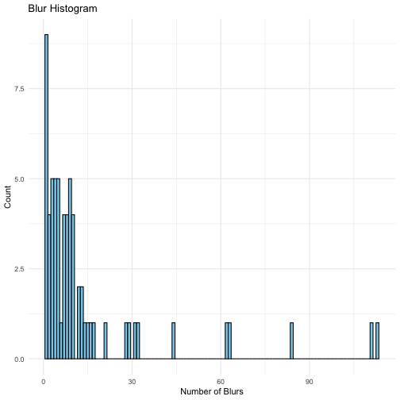

``` r
  time_exclude <- data %>%
    filter(total_time != "") %>%
    mutate(total_time = parse_number(total_time)) %>%
    mutate(total_time = total_time/60000)
 
   View(time_exclude)
  
  ggplot(time_exclude, aes(x = total_time)) +
    geom_histogram(fill = "skyblue", color = "black") +
    labs(title = "Time Histogram", x = "Minutes", y = "Count") +
    theme_minimal()
```

```
## `stat_bin()` using `bins = 30`. Pick better value with `binwidth`.
```

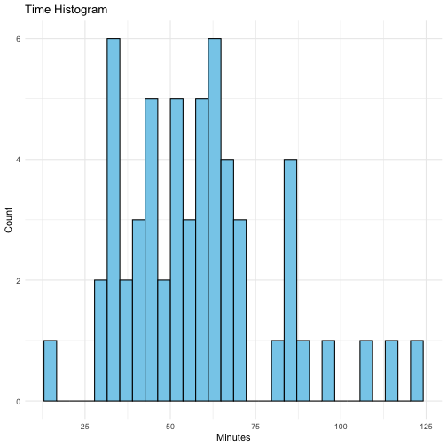

``` r
  to_exclude <- union(attention_exclude, tab_away_exclude)
  
  data <- data %>%
    filter(!subject %in% to_exclude)
  
  

p.vals = c()

# 1 anchoring effect✅  -------------------------------------------------
    ## 1.1 Do we see the effect -----------------------------------------------------------------------

    ### Antarctica -----------------------------------------------------------------------


anchor_antarctica_data <- data %>%
  filter(task_name == "anchoring") %>%
  filter(stimulus == "Antarctic Temperature") %>%
  mutate(choice = as.numeric(choice)) 
  

#violin
ggplot(anchor_antarctica_data, aes(x = condition, y = choice)) +
  geom_violin(trim = FALSE, fill = "skyblue", alpha = 0.5) +
  geom_jitter(width = 0.2, size = 1, alpha = 0.7) +
  labs(title = "Distribution of Estimates by Anchor Presence", x = "Anchor Presence", y = "Estimate") +
  theme_minimal()
```

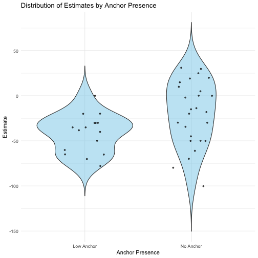

``` r
#bar
summary_anchor_antarctica_data <- anchor_antarctica_data %>%
  group_by(condition) %>%
  summarize(
    mean_choice = mean(choice),
    se_choice = se(choice)
  )


ggplot(summary_anchor_antarctica_data, aes(x = condition, y = mean_choice, fill = condition)) +
  geom_bar(stat = "identity", position = position_dodge(), color = "black") +
  geom_errorbar(aes(ymin = mean_choice - se_choice, ymax = mean_choice + se_choice), width = 0.2, position = position_dodge(0.9)) +
  labs(title = "Mean Estimates by Anchor Presence", x = "Anchor Presence", y = "Mean Estimate") +
  theme_minimal()
```

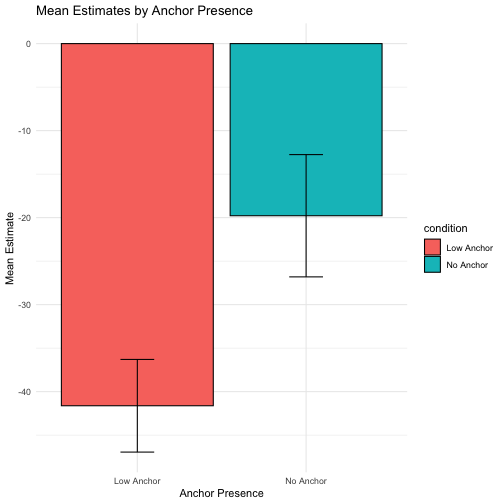

``` r
#analysis

low_anchor <- anchor_antarctica_data %>%
  filter(condition == "Low Anchor") %>%
  pull(choice)

no_anchor <- anchor_antarctica_data %>%
  filter(condition == "No Anchor") %>%
  pull(choice)

t_test_result <- t.test(low_anchor, no_anchor)

print(t_test_result)
```

```
## 
## 	Welch Two Sample t-test
## 
## data:  low_anchor and no_anchor
## t = -2.4771, df = 39.982, p-value = 0.01757
## alternative hypothesis: true difference in means is not equal to 0
## 95 percent confidence interval:
##  -39.660406  -4.020364
## sample estimates:
## mean of x mean of y 
## -41.62500 -19.78462
```

``` r
#p-value = 0.0007

    ### Whale -----------------------------------------------------------------------
anchor_whale_data <- data %>%
  filter(task_name == "anchoring") %>%
  filter(stimulus != "") %>%
  filter(stimulus == "Whale Length")
  
anchor_whale_data$choice <- as.numeric(anchor_whale_data$choice)

summary_anchor_whale_data <- anchor_whale_data %>%
  group_by(condition) %>%
  summarize(
    mean_choice = mean(choice),
    se_choice = sd(choice)
  )


ggplot(anchor_whale_data, aes(x = condition, y = choice)) +
  geom_violin(trim = FALSE, fill = "skyblue", alpha = 0.5) +
  geom_jitter(width = 0.2, size = 1, alpha = 0.7) +
  labs(title = "Distribution of Estimates by Anchor Presence", x = "Anchor Presence", y = "Estimate") +
  theme_minimal()
```

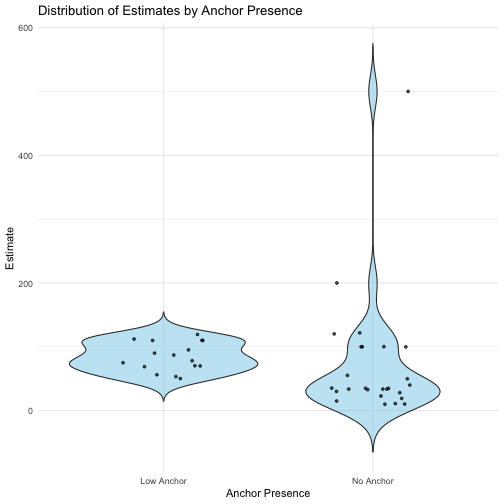

``` r
#analysis

low_anchor <- anchor_whale_data %>%
  filter(condition == "Low Anchor") %>%
  pull(choice)

no_anchor <- anchor_whale_data %>%
  filter(condition == "No Anchor") %>%
  pull(choice)

t_test_result <- t.test(low_anchor, no_anchor)

print(t_test_result)
```

```
## 
## 	Welch Two Sample t-test
## 
## data:  low_anchor and no_anchor
## t = 0.62678, df = 29.185, p-value = 0.5357
## alternative hypothesis: true difference in means is not equal to 0
## 95 percent confidence interval:
##  -28.58262  53.85262
## sample estimates:
## mean of x mean of y 
##    84.625    71.990
```

``` r
#p-value = 0.83

    ## 1.2 introspection -----------------------------------------------------------------------

#did factor included give higher introspection numbers than factor excluded?

summary_anchoring_data <- data %>%
  filter(task_name == "anchoring") %>%
  filter(introspect_rating != "") %>%
  group_by(factor) %>%
  summarize(
    mean_introspect_rating = mean(introspect_rating),
    se_introspect_rating = se(introspect_rating)
  )

ggplot(summary_anchoring_data, aes(x = factor, y = mean_introspect_rating)) +
  geom_bar(stat = "identity", fill = "skyblue") +
  geom_errorbar(aes(ymin = mean_introspect_rating - se_introspect_rating, ymax = mean_introspect_rating + se_introspect_rating), width = 0.2) +
  labs(title = "Anchoring Introspection ratings", x = "Condition", y = "introspection rating") +
  theme_minimal()
```

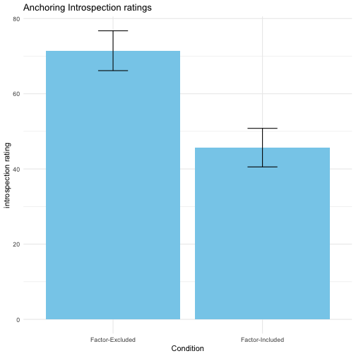

``` r
#"intro_rating(included and lower than mean estimates) 
#> 
#  intro_rating(included and not lower than mean estimates)"

mean_antarctica_estimate <- mean(anchor_antarctica_data$choice[anchor_antarctica_data$factor == "Factor-Excluded"])

anchoring_subjects <- data %>%
  filter(task_name == "anchoring") %>%
  filter(stimulus == "Antarctic Temperature") %>%
  mutate(choice = as.numeric(choice) ) %>%
  select(subject, factor, choice) %>%
  mutate(less_than_mean = ifelse(choice < mean_antarctica_estimate, 1, 0)) %>%
  select(subject, less_than_mean, factor, choice)

#View(anchoring_subjects)

#find subjects who were anchored
subject_list_included_and_anchored = anchoring_subjects %>%
  filter(factor == "Factor-Included") %>%
  group_by(subject) %>%
  filter(less_than_mean == 1) %>%
  pull(subject)

# List of all subjects in "Factor-Included"
all_subjects_included = anchoring_subjects %>%
  filter(factor == "Factor-Included") %>%
  pull(subject) %>%
  unique()

# List of subjects in "Factor-Included" who were not anchored
subject_list_included_and_not_anchored = setdiff(all_subjects_included, subject_list_included_and_anchored)


anchor_data <- data %>%
  filter(task_name == "anchoring") %>%
  filter(any(!is.na(introspect_rating))) %>%
  filter(introspect_rating != "") %>%
  mutate(effect_group = case_when(
    subject %in% subject_list_included_and_anchored ~ "Included and Anchored",
    subject %in% subject_list_included_and_not_anchored ~ "Included Not Anchored",
    factor == "Factor-Excluded" ~ "Excluded"
  )) 


summary_anchor_data <- anchor_data %>%
  group_by(effect_group) %>%
  summarize(
    mean_intro = mean(introspect_rating),
    se_intro = se(introspect_rating)
  )


ggplot(summary_anchor_data, aes(x = effect_group, y = mean_intro)) +
  geom_bar(stat = "identity", fill = "skyblue") +
  geom_errorbar(aes(ymin = mean_intro - se_intro, ymax = mean_intro + se_intro), width = 0.2) +
  labs(title = "Anchor Introspection ratings", x = "Condition", y = "introspection rating") +
  theme_minimal()
```

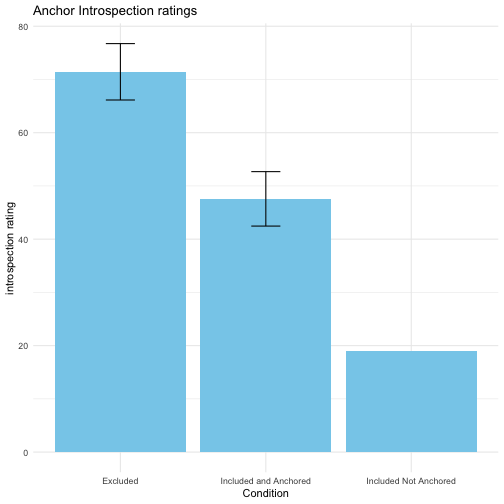

``` r
summary(lm(introspect_rating ~ effect_group, data = anchor_data))
```

```
## 
## Call:
## lm(formula = introspect_rating ~ effect_group, data = anchor_data)
## 
## Residuals:
##     Min      1Q  Median      3Q     Max 
## -67.440 -10.071   2.494  17.060  32.429 
## 
## Coefficients:
##                                   Estimate Std. Error t value Pr(>|t|)    
## (Intercept)                         71.440      4.831  14.787  < 2e-16 ***
## effect_groupIncluded and Anchored  -23.869      8.064  -2.960  0.00534 ** 
## effect_groupIncluded Not Anchored  -52.440     24.635  -2.129  0.04001 *  
## ---
## Signif. codes:  0 '***' 0.001 '**' 0.01 '*' 0.05 '.' 0.1 ' ' 1
## 
## Residual standard error: 24.16 on 37 degrees of freedom
## Multiple R-squared:  0.2445,	Adjusted R-squared:  0.2037 
## F-statistic: 5.989 on 2 and 37 DF,  p-value: 0.005583
```

``` r
# 2 associative memory effect✅ ----
    ## 2.1 do we see the effect? -----------------------------------------------------------------------

#Did subjects for whom some of the new words were sleep-related 
#more often think they were original words than subjects for whom none of the new words were sleep-related? 

associative_data_only_new <- data %>%
  filter(task_name == "associative memory") %>%
  filter(stimulus!= "") %>% 
  filter(auxiliary_info1 == 'New') %>%
  mutate(false_alarm = ifelse(choice == "Original", 1, 0))

#View(associative_data_only_new)

summary_associative_data_only_new <- associative_data_only_new %>%
  group_by(condition) %>%
  summarize(
    mean_choice = mean(false_alarm),
    se_choice = se.prop(false_alarm)
  )

ggplot(summary_associative_data_only_new, aes(x = condition, y = mean_choice)) +
  geom_bar(stat = "identity", fill = "skyblue") +
  geom_errorbar(aes(ymin = mean_choice - se_choice, ymax = mean_choice + se_choice), width = 0.2) +
  labs(title = "Associative Effect", x = "Word Relation", y = "False Alarm Rate") +
  theme_minimal()
```

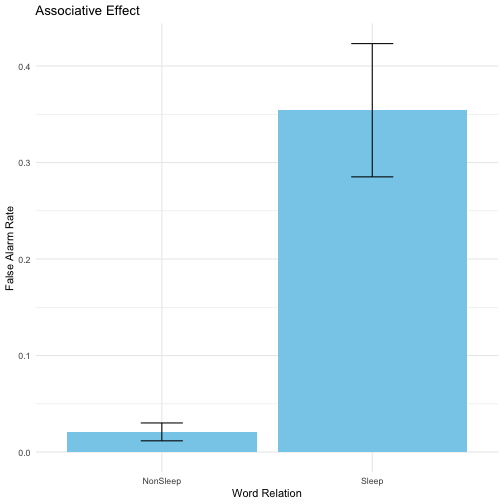

``` r
associative_choices_ex <- associative_data_only_new %>%
  filter(factor == "Factor-Excluded") %>%
  pull(false_alarm)

associative_choices_in <- associative_data_only_new %>%
  filter(factor == "Factor-Included") %>%
  pull(false_alarm)

#analysis -- is there a better way to do this?
prop_ex <- sum(associative_choices_ex) / length(associative_choices_ex)
prop_in <- sum(associative_choices_in) / length(associative_choices_in)

successes <- c(sum(associative_choices_ex), sum(associative_choices_in))
trials <- c(length(associative_choices_ex), length(associative_choices_in))

test_result <- prop.test(successes, trials, alternative = "less")
print(test_result)
```

```
## 
## 	2-sample test for equality of proportions with continuity correction
## 
## data:  successes out of trials
## X-squared = 12.959, df = 1, p-value = 0.0001592
## alternative hypothesis: less
## 95 percent confidence interval:
##  -1.00000000 -0.05640176
## sample estimates:
##     prop 1     prop 2 
## 0.02857143 0.15178571
```

``` r
    ## 2.2 introspection -----------------------------------------------------------------------

#did factor included give lower introspection numbers than factor excluded?

summary_associative_data <- data %>%
  filter(task_name == "associative memory") %>%
  filter(introspect_rating != "") %>%
  group_by(factor) %>%
  summarize(
    mean_introspect_rating = mean(introspect_rating),
    se_introspect_rating = se(introspect_rating)
  )

ggplot(summary_associative_data, aes(x = factor, y = mean_introspect_rating)) +
  geom_bar(stat = "identity", fill = "skyblue") +
  geom_errorbar(aes(ymin = mean_introspect_rating - se_introspect_rating, ymax = mean_introspect_rating + se_introspect_rating), width = 0.2) +
  labs(title = "Associative Introspection ratings", x = "Condition", y = "introspection rating") +
  theme_minimal()
```

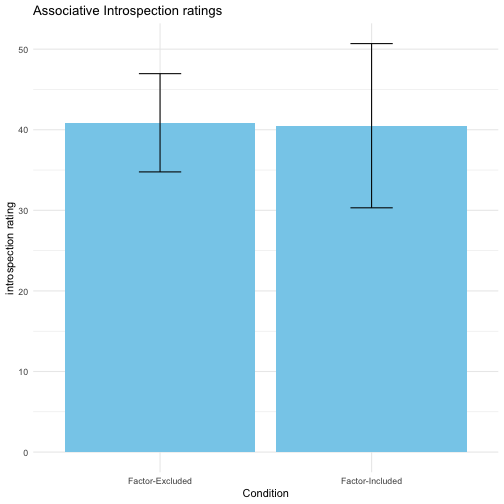

``` r
#"intro_rating(included and more false positives than average)
#<
#  intro_rating(included and not more false positives than average)"


associative_data_by_subject <- associative_data_only_new %>%
  filter(task_name == "associative memory") %>%
  group_by(subject) %>%
  summarize(
    total_false_alarms = sum(false_alarm),
    factor = first(factor)
    )

##View(associative_data_by_subject)

#mean false alarms among excluded
mean_false_alarm_among_excluded <- mean(associative_data_by_subject$total_false_alarms[associative_data_by_subject$factor == "Factor-Excluded"])

#find subjects who had higher than  mean_false_alarm_among_excluded
subject_list_included_and_more_false_alarms = associative_data_by_subject %>%
  filter(factor == "Factor-Included") %>%
  group_by(subject) %>%
  summarize(higher = total_false_alarms > mean_false_alarm_among_excluded) %>%
  filter(higher) %>%
  pull(subject)

# List of all subjects in "Factor-Included"
all_subjects_included = associative_data_by_subject %>%
  filter(factor == "Factor-Included") %>%
  pull(subject) %>%
  unique()

# List of subjects in "Factor-Included" who did not rate all "attractive" faces higher than the mean persuasive score among excluded subjects
subject_list_included_and_not_more_false_alarm_than_mean = setdiff(all_subjects_included, subject_list_included_and_more_false_alarms)


associative_data <- data %>%
  filter(task_name == "associative memory") %>%
  filter(any(!is.na(introspect_rating))) %>%
  filter(introspect_rating != "") %>%
  mutate(effect_group = case_when(
    subject %in% subject_list_included_and_more_false_alarms ~ "Included and More False Alarms",
    subject %in% subject_list_included_and_not_more_false_alarm_than_mean ~ "Included and Not More False Alarms",
    factor == "Factor-Excluded" ~ "Excluded"
  )) 


summary_associative_data <- associative_data %>%
  group_by(effect_group) %>%
  summarize(
    mean_intro = mean(introspect_rating),
    se_intro = se(introspect_rating)
  )

#View(associative_data)
#View(summary_associative_data)

ggplot(summary_associative_data, aes(x = effect_group, y = mean_intro)) +
  geom_bar(stat = "identity", fill = "skyblue") +
  geom_errorbar(aes(ymin = mean_intro - se_intro, ymax = mean_intro + se_intro), width = 0.2) +
  labs(title = "Associative Introspection ratings", x = "Condition", y = "introspection rating") +
  theme_minimal()
```

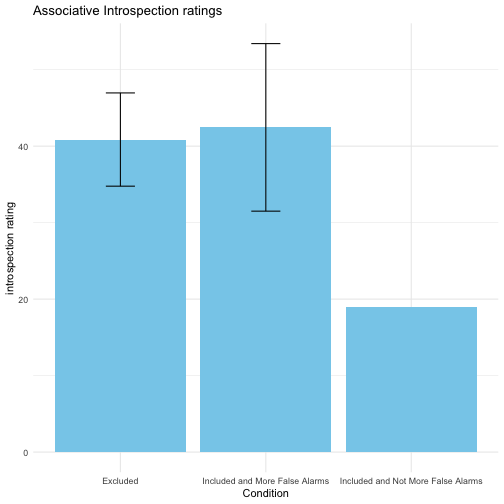

``` r
summary(lm(introspect_rating ~ effect_group, data = associative_data))
```

```
## 
## Call:
## lm(formula = introspect_rating ~ effect_group, data = associative_data)
## 
## Residuals:
##     Min      1Q  Median      3Q     Max 
## -42.455 -25.614   7.545  12.636  58.136 
## 
## Coefficients:
##                                                Estimate Std. Error t value Pr(>|t|)
## (Intercept)                                      40.864      6.673   6.124 8.62e-07
## effect_groupIncluded and More False Alarms        1.591     11.557   0.138    0.891
## effect_groupIncluded and Not More False Alarms  -21.864     32.001  -0.683    0.500
##                                                   
## (Intercept)                                    ***
## effect_groupIncluded and More False Alarms        
## effect_groupIncluded and Not More False Alarms    
## ---
## Signif. codes:  0 '***' 0.001 '**' 0.01 '*' 0.05 '.' 0.1 ' ' 1
## 
## Residual standard error: 31.3 on 31 degrees of freedom
## Multiple R-squared:  0.01637,	Adjusted R-squared:  -0.04709 
## F-statistic: 0.2579 on 2 and 31 DF,  p-value: 0.7743
```

``` r
# 3 availability effect✅  -----------------------------------------------------------------------

    ##3.1 do we see the effect ----

#Did subjects for whom the first list contained famous men say it contained 
#more men more often than subjects for whom the first list contained less famous men? 


availability_data = data %>%
  filter(task_name == "availability") %>%
  mutate(choice_binary = as.numeric(choice == "List 1"))

ggplot(availability_data, aes(x = factor, fill = choice)) +
  geom_bar(position = "dodge") +
  labs(title = "Availability Effect",
       x = "Factor",
       y = "Count",
       fill = "choice") +
  theme_minimal()
```

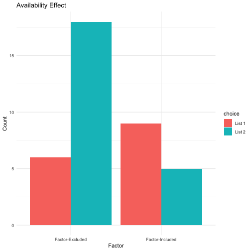

``` r
#analysis

list_one_ex = availability_data %>%
  filter(factor == "Factor-Excluded") %>%
  pull(choice_binary)

list_one_in = availability_data %>%
  filter(factor == "Factor-Included") %>%
  pull(choice_binary)

prop_ex <- sum(list_one_ex) / length(list_one_ex)
prop_in <- sum(list_one_in) / length(list_one_in)

successes <- c(sum(list_one_ex), sum(list_one_in))
trials <- c(length(list_one_ex), length(list_one_in))

test_result <- prop.test(successes, trials, alternative = "less")

print(test_result)
```

```
## 
## 	2-sample test for equality of proportions with continuity correction
## 
## data:  successes out of trials
## X-squared = 4.1858, df = 1, p-value = 0.02038
## alternative hypothesis: less
## 95 percent confidence interval:
##  -1.00000000 -0.08036736
## sample estimates:
##    prop 1    prop 2 
## 0.2500000 0.6428571
```

``` r
#p-value = 0.004

    ## 3.2 introspection  -----------------------------------------------------------------------

#did factor included give lower introspection numbers than factor excluded?

summary_availability_data <- availability_data %>%
  group_by(factor) %>%
  mutate(introspect_rating = as.numeric(introspect_rating)) %>%
  summarize(
    mean_intro = mean(introspect_rating),
    se_intro = se(introspect_rating)
  )

ggplot(summary_availability_data, aes(x = factor, y = mean_intro)) +
  geom_bar(stat = "identity", fill = "skyblue") +
  geom_errorbar(aes(ymin = mean_intro - se_intro, ymax = mean_intro + se_intro), width = 0.2) +
  labs(title = "Availability Introspection ratings", x = "Condition", y = "introspection rating") +
  theme_minimal()
```

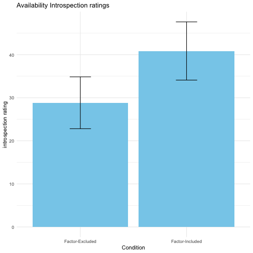

``` r
t.test(introspect_rating ~ factor, data = availability_data)
```

```
## 
## 	Welch Two Sample t-test
## 
## data:  introspect_rating by factor
## t = -1.3287, df = 30.847, p-value = 0.1937
## alternative hypothesis: true difference in means between group Factor-Excluded and group Factor-Included is not equal to 0
## 95 percent confidence interval:
##  -30.483520   6.435901
## sample estimates:
## mean in group Factor-Excluded mean in group Factor-Included 
##                      28.83333                      40.85714
```

``` r
#"intro_rating(included and said first list contained more famous men)
#<
#  intro_rating(included and not said first list contained more famous men)
#"

availability_data <- availability_data %>%
  mutate(effect_group = case_when(
    choice == "List 1" & factor == "Factor-Included" ~ "Included and List 1",
    choice == "List 2" & factor == "Factor-Included" ~ "Included and List 2",
    factor == "Factor-Excluded" ~ "Excluded"
  ))

summary_availability_data <- availability_data %>%
  group_by(effect_group) %>%
  summarize(
    mean_intro = mean(introspect_rating),
    se_intro = se(introspect_rating)
  )

ggplot(summary_availability_data, aes(x = effect_group, y = mean_intro)) +
  geom_bar(stat = "identity", fill = "skyblue") +
  geom_errorbar(aes(ymin = mean_intro - se_intro, ymax = mean_intro + se_intro), width = 0.2) +
  labs(title = "Introspection ratings", x = "Condition", y = "introspection rating") +
  theme_minimal()
```

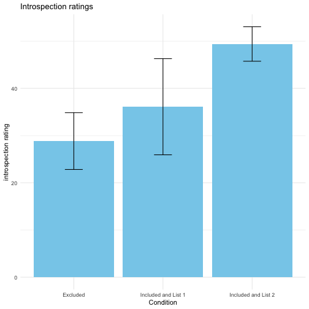

``` r
summary(lm(introspect_rating ~ effect_group, data = availability_data))
```

```
## 
## Call:
## lm(formula = introspect_rating ~ effect_group, data = availability_data)
## 
## Residuals:
##     Min      1Q  Median      3Q     Max 
## -36.111 -23.042  -4.333  14.639  69.167 
## 
## Coefficients:
##                                 Estimate Std. Error t value Pr(>|t|)    
## (Intercept)                       28.833      5.747   5.017 1.52e-05 ***
## effect_groupIncluded and List 1    7.278     11.005   0.661    0.513    
## effect_groupIncluded and List 2   20.567     13.841   1.486    0.146    
## ---
## Signif. codes:  0 '***' 0.001 '**' 0.01 '*' 0.05 '.' 0.1 ' ' 1
## 
## Residual standard error: 28.16 on 35 degrees of freedom
## Multiple R-squared:  0.06238,	Adjusted R-squared:  0.008803 
## F-statistic: 1.164 on 2 and 35 DF,  p-value: 0.3239
```

``` r
# 4. Belief effect✅  ----

    ## 4.1 do we see the effect? -----------------------------------------------------------------------

#Were subjects who saw the plausible version more likely to say the argument was sound?


belief_data <- data %>%
  filter(task_name == "belief") %>%
  filter(!str_detect(stimulus, "Practice")) %>%
  filter(stimulus != "") %>%
  mutate(choice_binary = as.numeric(choice == "Yes"))

summary_belief_data <- belief_data %>%
  group_by(condition) %>%
  summarize(
    mean_choice = mean(choice_binary),
    se_choice = se.prop(choice_binary)
  )
ggplot(summary_belief_data, aes(x = condition, y = mean_choice)) +
  geom_bar(stat = "identity", fill = "skyblue") +
  geom_errorbar(aes(ymin = mean_choice - se_choice, ymax = mean_choice + se_choice), width = 0.2) +
  labs(title = "Belief Effect", x = "Condition", y = "Percent saying acceptible") +
  theme_minimal()
```

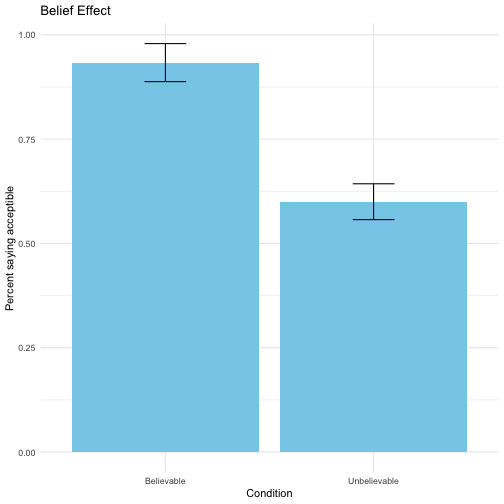

``` r
belief_choices_ex <- belief_data %>%
  filter(factor == "Factor-Excluded") %>%
  pull(choice_binary)

belief_choices_in <- belief_data %>%
  filter(factor == "Factor-Included") %>%
  pull(choice_binary)

#analysis -- is there a better way to do this?
prop_ex <- sum(belief_choices_ex) / length(belief_choices_ex)
prop_in <- sum(belief_choices_in) / length(belief_choices_in)

successes <- c(sum(belief_choices_ex), sum(belief_choices_in))
trials <- c(length(belief_choices_ex), length(belief_choices_in))

test_result <- prop.test(successes, trials, alternative = "less")
print(test_result)
```

```
## 
## 	2-sample test for equality of proportions with continuity correction
## 
## data:  successes out of trials
## X-squared = 1.6771, df = 1, p-value = 0.09765
## alternative hypothesis: less
## 95 percent confidence interval:
##  -1.00000000  0.02325716
## sample estimates:
##    prop 1    prop 2 
## 0.6200000 0.7333333
```

``` r
    ## 4.2 introspection ----

#Did factor included give higher introspection numbers than factor excluded?

summary_belief_data <- data %>%
  filter(task_name == "belief") %>%
  filter(introspect_rating != "") %>%
  group_by(factor) %>%
  summarize(
    mean_introspect_rating = mean(introspect_rating),
    se_introspect_rating = se(introspect_rating)
  )

ggplot(summary_belief_data, aes(x = factor, y = mean_introspect_rating)) +
  geom_bar(stat = "identity", fill = "skyblue") +
  geom_errorbar(aes(ymin = mean_introspect_rating - se_introspect_rating, ymax = mean_introspect_rating + se_introspect_rating), width = 0.2) +
  labs(title = "Belief Introspection ratings", x = "Condition", y = "introspection rating") +
  theme_minimal()
```

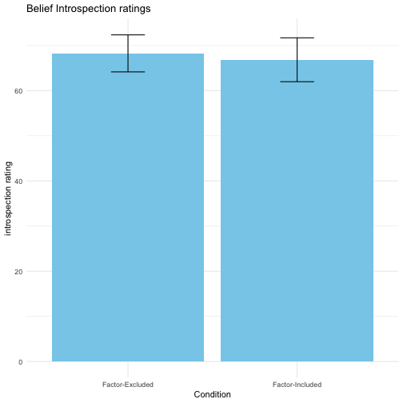

``` r
#"intro_rating(included and more "acceptable"s than average)
#>
#intro_rating(included and not more "acceptable"s than average)"

belief_data <- data %>%
  filter(task_name == "belief") %>%
  filter(stimulus != "") %>%
  mutate(choice = as.numeric(choice))
```

```
## Warning: There was 1 warning in `mutate()`.
## ℹ In argument: `choice = as.numeric(choice)`.
## Caused by warning:
## ! NAs introduced by coercion
```

``` r
#View(belief_data_by_subject)

belief_data_by_subject <- data %>%
  filter(task_name == "belief") %>%
  group_by(subject) %>%
  filter(any(!is.na(introspect_rating))) %>%
  summarize(
    number_total_yes = sum(choice == "Yes"),
    factor = first(factor),
    introspect_rating = first(introspect_rating[!is.na(introspect_rating)])
  )

#mean total_yes among excluded
mean_total_yes_among_excluded <- mean(belief_data_by_subject$number_total_yes[belief_data_by_subject$factor == "Factor-Excluded"])

#find subjects who gave all attractive faces higher than mean persuasive scores
subject_list_included_and_more_yes_than_mean = belief_data_by_subject %>%
  filter(factor == "Factor-Included") %>%
  group_by(subject) %>%
  summarize(higher = number_total_yes > mean_total_yes_among_excluded) %>%
  filter(higher) %>%
  pull(subject)

# List of all subjects in "Factor-Included"
all_subjects_included = belief_data_by_subject %>%
  filter(factor == "Factor-Included") %>%
  pull(subject) %>%
  unique()

# List of subjects in "Factor-Included" who did not rate all "attractive" faces higher than the mean persuasive score among excluded subjects
subject_list_included_and_not_more_yes_than_mean = setdiff(all_subjects_included, subject_list_included_and_more_yes_than_mean)


belief_data <- data %>%
  filter(task_name == "belief") %>%
  filter(any(!is.na(introspect_rating))) %>%
  filter(stimulus == "") %>%
  mutate(effect_group = case_when(
    subject %in% subject_list_included_and_more_yes_than_mean ~ "Included and More Yes Than Mean",
    subject %in% subject_list_included_and_not_more_yes_than_mean ~ "Included and Not More Yes Than Mean",
    factor == "Factor-Excluded" ~ "Excluded"
  )) 

#View(belief_data)

summary_belief_data <- belief_data %>%
  group_by(effect_group) %>%
  summarize(
    mean_intro = mean(introspect_rating),
    se_intro = se(introspect_rating)
  )

ggplot(summary_belief_data, aes(x = effect_group, y = mean_intro)) +
  geom_bar(stat = "identity", fill = "skyblue") +
  geom_errorbar(aes(ymin = mean_intro - se_intro, ymax = mean_intro + se_intro), width = 0.2) +
  labs(title = "Belief Introspection ratings", x = "Condition", y = "introspection rating") +
  theme_minimal()
```

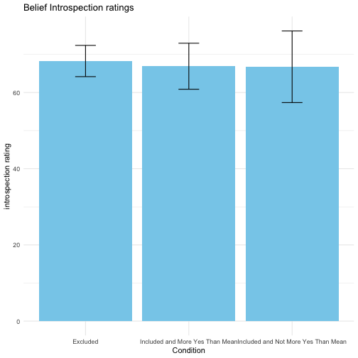

``` r
summary(lm(introspect_rating ~ effect_group, data = belief))
```

```
## Error in h(simpleError(msg, call)): error in evaluating the argument 'object' in selecting a method for function 'summary': object 'belief' not found
```

``` r
# 5. causal inference✅  ----
    ## 5.1 do we see the effect?TO DO ----

#Did subjects who saw only one green ball 
#think it was more casual than subjects who saw many green balls?

causal_data <- data %>%
  filter(task_name == "causal inference") %>%
  mutate(choice = as.numeric(choice))

summary_causal_data <- causal_data %>%
  group_by(condition) %>%
  summarize(
    mean_choice = mean(choice),
    se_choice = se(choice)
  )

ggplot(summary_causal_data, aes(x = condition, y = mean_choice)) +
  geom_bar(stat = "identity", fill = "skyblue") +
  geom_errorbar(aes(ymin = mean_choice - se_choice, ymax = mean_choice + se_choice), width = 0.2) +
  labs(title = "Causal Inference", x = "Condition", y = "Causality") +
  theme_minimal()
```

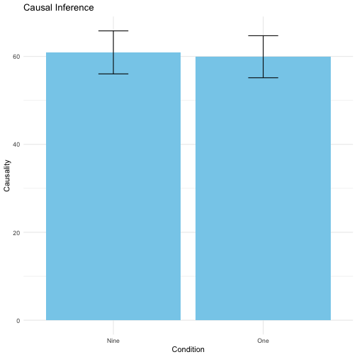

``` r
t.test(choice ~ factor, data = causal_data)
```

```
## 
## 	Welch Two Sample t-test
## 
## data:  choice by factor
## t = 0.14425, df = 35.757, p-value = 0.8861
## alternative hypothesis: true difference in means between group Factor-Excluded and group Factor-Included is not equal to 0
## 95 percent confidence interval:
##  -12.88892  14.86225
## sample estimates:
## mean in group Factor-Excluded mean in group Factor-Included 
##                      60.92000                      59.93333
```

``` r
    ## 5.2 introspection----

#Did factor included give higher introspection numbers than factor excluded?

summary_causal_data <- causal_data %>%
  group_by(factor) %>%
  summarize(
    mean_introspect_rating = mean(introspect_rating),
    se_introspect_rating = se(introspect_rating)
  )

ggplot(summary_causal_data, aes(x = factor, y = mean_introspect_rating)) +
  geom_bar(stat = "identity", fill = "skyblue") +
  geom_errorbar(aes(ymin = mean_introspect_rating - se_introspect_rating, ymax = mean_introspect_rating + se_introspect_rating), width = 0.2) +
  labs(title = "Causal Inference Introspection ratings", x = "Condition", y = "introspection rating") +
  theme_minimal()
```

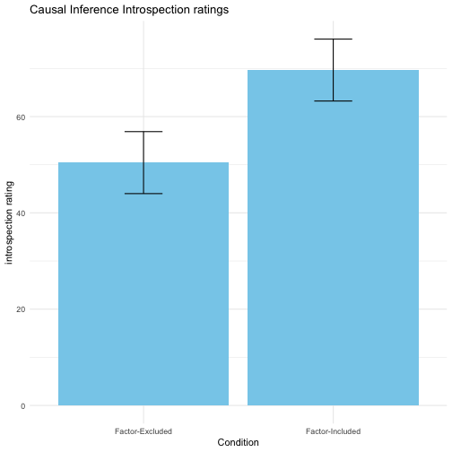

``` r
t.test(introspect_rating ~ factor, data = causal_data)
```

```
## 
## 	Welch Two Sample t-test
## 
## data:  introspect_rating by factor
## t = -2.113, df = 35.391, p-value = 0.04173
## alternative hypothesis: true difference in means between group Factor-Excluded and group Factor-Included is not equal to 0
## 95 percent confidence interval:
##  -37.6921799  -0.7611535
## sample estimates:
## mean in group Factor-Excluded mean in group Factor-Included 
##                      50.44000                      69.66667
```

``` r
#p-value = 0.01214

#"intro_rating(included and higher than mean causality rating)
#>
#  intro_rating(included and not higher than mean causality rating)"

#mean causality rating

mean_causality_rating <- mean(causal_data$choice[causal_data$factor == "Factor-Excluded"])

causal_data <- causal_data %>%
  mutate(effect_group = case_when(
    choice > mean_causality_rating & factor == "Factor-Included" ~ "Included and Higher /n Causality Than Mean",
    choice <= mean_causality_rating & factor == "Factor-Included" ~ "Included and Not Higher /n Causality Than Mean",
    factor == "Factor-Excluded" ~ "Excluded"
  ))

summary_causal_data <- causal_data %>%
  group_by(effect_group) %>%
  summarize(
    mean_intro = mean(introspect_rating),
    se_intro = se(introspect_rating)
  )

ggplot(summary_causal_data, aes(x = effect_group, y = mean_intro)) +
  geom_bar(stat = "identity", fill = "skyblue") +
  geom_errorbar(aes(ymin = mean_intro - se_intro, ymax = mean_intro + se_intro), width = 0.2) +
  labs(title = "Causal Introspection ratings", x = "Condition", y = "introspection rating") +
  theme_minimal()
```

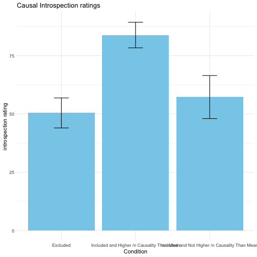

``` r
summary(lm(introspect_rating ~ effect_group, data = causal_data))
```

```
## 
## Call:
## lm(formula = introspect_rating ~ effect_group, data = causal_data)
## 
## Residuals:
##    Min     1Q Median     3Q    Max 
## -50.44 -14.50  -0.44  19.80  49.56 
## 
## Coefficients:
##                                                            Estimate Std. Error t value
## (Intercept)                                                  50.440      5.781   8.726
## effect_groupIncluded and Higher /n Causality Than Mean       33.417     12.360   2.704
## effect_groupIncluded and Not Higher /n Causality Than Mean    6.810     11.741   0.580
##                                                            Pr(>|t|)    
## (Intercept)                                                1.64e-10 ***
## effect_groupIncluded and Higher /n Causality Than Mean       0.0103 *  
## effect_groupIncluded and Not Higher /n Causality Than Mean   0.5654    
## ---
## Signif. codes:  0 '***' 0.001 '**' 0.01 '*' 0.05 '.' 0.1 ' ' 1
## 
## Residual standard error: 28.9 on 37 degrees of freedom
## Multiple R-squared:  0.165,	Adjusted R-squared:  0.1199 
## F-statistic: 3.656 on 2 and 37 DF,  p-value: 0.03557
```

``` r
#6. contact principle✅  ----
    ## 6.1 do we see the effect?----

#Did subjects for whom Frank needed to make physical contact 
#judge his action as less acceptable?

contact_data = data %>% 
  filter(task_name == 'contact principle') %>%
  mutate(choice_binary = as.numeric(choice == "Permissible"))

summary_contact_data <- contact_data %>%
  group_by(condition) %>%
  summarize(
    mean_choice = mean(choice_binary),
    se_choice = se.prop(choice_binary)
  )

ggplot(summary_contact_data, aes(x = condition, y = mean_choice)) +
  geom_bar(stat = "identity", fill = "skyblue") +
  geom_errorbar(aes(ymin = mean_choice - se_choice, ymax = mean_choice + se_choice), width = 0.2) +
  labs(title = "Contact Effect", x = "Condition", y = "Permissibility") +
  theme_minimal()
```

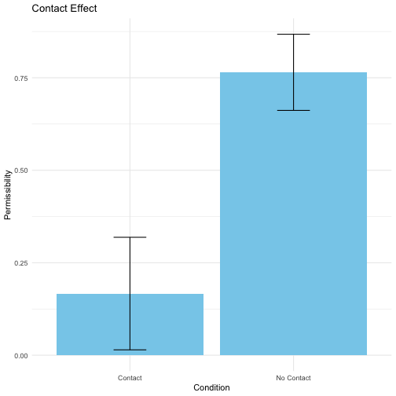

``` r
contact_choices_ex <- contact_data %>%
  filter(factor == "Factor-Excluded") %>%
  pull(choice_binary)

contact_choices_in <- contact_data %>%
  filter(factor == "Factor-Included") %>%
  pull(choice_binary)

#analysis -- is there a better way to do this?
prop_ex <- sum(contact_choices_ex) / length(contact_choices_ex)
prop_in <- sum(contact_choices_in) / length(contact_choices_in)

successes <- c(sum(contact_choices_ex), sum(contact_choices_in))
trials <- c(length(contact_choices_ex), length(contact_choices_in))

test_result <- prop.test(successes, trials, alternative = "less")
```

```
## Warning in prop.test(successes, trials, alternative = "less"): Chi-squared
## approximation may be incorrect
```

``` r
print(test_result)
```

```
## 
## 	2-sample test for equality of proportions with continuity correction
## 
## data:  successes out of trials
## X-squared = 4.385, df = 1, p-value = 0.9819
## alternative hypothesis: less
## 95 percent confidence interval:
##  -1  1
## sample estimates:
##    prop 1    prop 2 
## 0.7647059 0.1666667
```

``` r
    ## 6.2 introspection ----

#Did factor included give higher introspection numbers 
#than factor excluded?

summary_contact_data <- contact_data %>%
  group_by(factor) %>%
  mutate(introspect_rating = as.numeric(introspect_rating)) %>%
  summarize(
    mean_intro = mean(introspect_rating),
    se_intro = se(introspect_rating)
  )

ggplot(summary_contact_data, aes(x = factor, y = mean_intro)) +
  geom_bar(stat = "identity", fill = "skyblue") +
  geom_errorbar(aes(ymin = mean_intro - se_intro, ymax = mean_intro + se_intro), width = 0.2) +
  labs(title = "Contact Introspection ratings", x = "Condition", y = "introspection rating") +
  theme_minimal()
```

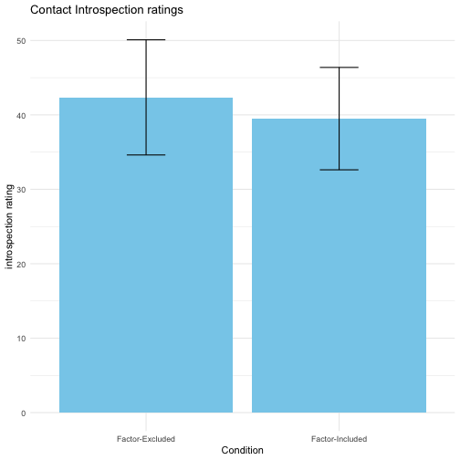

``` r
t.test(introspect_rating ~ factor, data = contact_data)
```

```
## 
## 	Welch Two Sample t-test
## 
## data:  introspect_rating by factor
## t = 0.2756, df = 17.099, p-value = 0.7862
## alternative hypothesis: true difference in means between group Factor-Excluded and group Factor-Included is not equal to 0
## 95 percent confidence interval:
##  -18.97807  24.68395
## sample estimates:
## mean in group Factor-Excluded mean in group Factor-Included 
##                      42.35294                      39.50000
```

``` r
#intro_rating(included and acceptable)
#>
#intro_rating(included and unacceptable)

contact_data <- contact_data %>%
  mutate(effect_group = case_when(
    choice == "Permissible" & factor == "Factor-Included" ~ "Included and Permissible",
    choice == "Impermissible" & factor == "Factor-Included" ~ "Included and Impermissible",
    factor == "Factor-Excluded" ~ "Excluded"
  ))

summary_contact_data <- contact_data %>%
  group_by(effect_group) %>%
  summarize(
    mean_intro = mean(introspect_rating),
    se_intro = se(introspect_rating)
  )

ggplot(summary_contact_data, aes(x = effect_group, y = mean_intro)) +
  geom_bar(stat = "identity", fill = "skyblue") +
  geom_errorbar(aes(ymin = mean_intro - se_intro, ymax = mean_intro + se_intro), width = 0.2) +
  labs(title = "Introspection ratings", x = "Condition", y = "introspection rating") +
  theme_minimal()
```

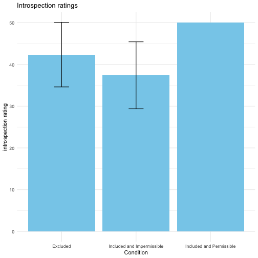

``` r
summary(lm(introspect_rating ~ effect_group, data = contact_data))
```

```
## 
## Call:
## lm(formula = introspect_rating ~ effect_group, data = contact_data)
## 
## Residuals:
##     Min      1Q  Median      3Q     Max 
## -42.353 -24.876   7.647  12.600  57.647 
## 
## Coefficients:
##                                        Estimate Std. Error t value Pr(>|t|)    
## (Intercept)                              42.353      7.188   5.892 9.18e-06 ***
## effect_groupIncluded and Impermissible   -4.953     15.077  -0.329    0.746    
## effect_groupIncluded and Permissible      7.647     30.495   0.251    0.805    
## ---
## Signif. codes:  0 '***' 0.001 '**' 0.01 '*' 0.05 '.' 0.1 ' ' 1
## 
## Residual standard error: 29.64 on 20 degrees of freedom
## Multiple R-squared:  0.009496,	Adjusted R-squared:  -0.08955 
## F-statistic: 0.09587 on 2 and 20 DF,  p-value: 0.909
```

``` r
#7. decoy effect ✅  ----
    ## 7.1 do we see the effect? TO DO----

#Were subjects who saw Brand W more likely to choose brand N?
decoy_data <- data %>%
  filter(task_name == "decoy effect") %>%
  mutate(choice_binary = as.numeric(choice == "Brand N (Target)"))

summary_decoy_data <- decoy_data %>%
  group_by(condition) %>%
  summarize(
    mean_choice = mean(choice_binary),
    se_choice = se.prop(choice_binary)
  )

ggplot(summary_decoy_data, aes(x = condition, y = mean_choice)) +
  geom_bar(stat = "identity", fill = "skyblue") +
  geom_errorbar(aes(ymin = mean_choice - se_choice, ymax = mean_choice + se_choice), width = 0.2) +
  labs(title = "Decoy Effect", x = "Condition", y = "Choosing Brand N") +
  theme_minimal()
```

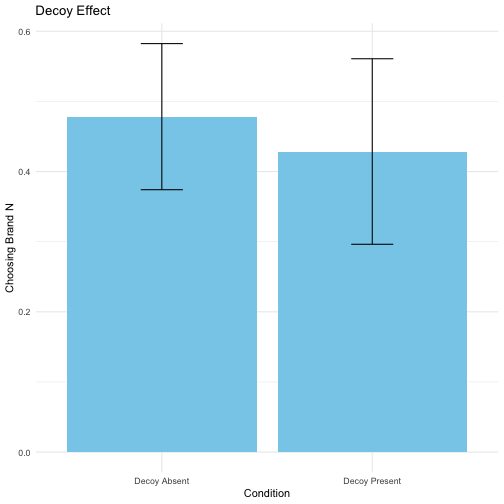

``` r
decoy_choices_ex <- decoy_data %>%
  filter(factor == "Factor-Excluded") %>%
  pull(choice_binary)

decoy_choices_in <- decoy_data %>%
  filter(factor == "Factor-Included") %>%
  pull(choice_binary)

#analysis -- is there a better way to do this?
prop_ex <- sum(decoy_choices_ex) / length(decoy_choices_ex)
prop_in <- sum(decoy_choices_in) / length(decoy_choices_in)

successes <- c(sum(decoy_choices_ex), sum(decoy_choices_in))
trials <- c(length(decoy_choices_ex), length(decoy_choices_in))

test_result <- prop.test(successes, trials, alternative = "less")
print(test_result)
```

```
## 
## 	2-sample test for equality of proportions with continuity correction
## 
## data:  successes out of trials
## X-squared = 3.8025e-31, df = 1, p-value = 0.5
## alternative hypothesis: less
## 95 percent confidence interval:
##  -1.00000  0.37629
## sample estimates:
##    prop 1    prop 2 
## 0.4782609 0.4285714
```

``` r
    ## 7.2 introspection ----

#Did factor included give higher introspection numbers 
#factor excluded?

summary_decoy_data <- decoy_data %>%
  group_by(factor) %>%
  summarize(
    mean_intro = mean(as.numeric(introspect_rating)),
    se_intro = se(introspect_rating)
  )

ggplot(summary_decoy_data, aes(x = factor, y = mean_intro)) +
  geom_bar(stat = "identity", fill = "skyblue") +
  geom_errorbar(aes(ymin = mean_intro - se_intro, ymax = mean_intro + se_intro), width = 0.2) +
  labs(title = "Decoy Introspection ratings", x = "Condition", y = "introspection rating") +
  theme_minimal()
```

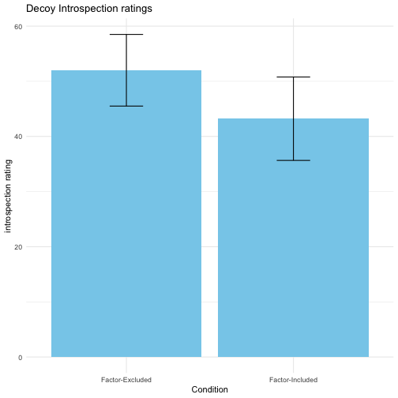

``` r
#"intro_rating(included and chose brand N)
#>
#intro_rating(included and did not choose brand N)"

decoy_data <- decoy_data %>%
  mutate(effect_group = case_when(
    choice == "Brand N (Target)" & factor == "Factor-Included" ~ "Included and Chose Brand N",
    choice != "Brand N (Target)" & factor == "Factor-Included" ~ "Included and Did Not Choose Brand N",
    factor == "Factor-Excluded" ~ "Excluded"
  ))

summary_decoy_data <- decoy_data %>%
  group_by(effect_group) %>%
  summarize(
    mean_intro = mean(introspect_rating),
    se_intro = se(introspect_rating)
  )

ggplot(summary_decoy_data, aes(x = effect_group, y = mean_intro)) +
  geom_bar(stat = "identity", fill = "skyblue") +
  geom_errorbar(aes(ymin = mean_intro - se_intro, ymax = mean_intro + se_intro), width = 0.2) +
  labs(title = "Introspection ratings", x = "Condition", y = "introspection rating") +
  theme_minimal()
```

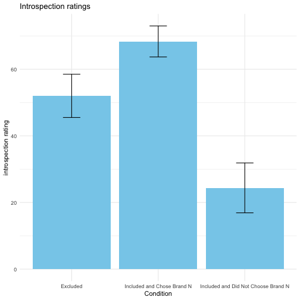

``` r
summary(lm(introspect_rating ~ effect_group, data = decoy_data))
```

```
## 
## Call:
## lm(formula = introspect_rating ~ effect_group, data = decoy_data)
## 
## Residuals:
##    Min     1Q Median     3Q    Max 
##    -52    -13     -2     10     48 
## 
## Coefficients:
##                                                 Estimate Std. Error t value Pr(>|t|)
## (Intercept)                                       52.000      5.669   9.173 1.01e-10
## effect_groupIncluded and Chose Brand N            16.333     12.463   1.311   0.1988
## effect_groupIncluded and Did Not Choose Brand N  -27.625     11.159  -2.476   0.0184
##                                                    
## (Intercept)                                     ***
## effect_groupIncluded and Chose Brand N             
## effect_groupIncluded and Did Not Choose Brand N *  
## ---
## Signif. codes:  0 '***' 0.001 '**' 0.01 '*' 0.05 '.' 0.1 ' ' 1
## 
## Residual standard error: 27.19 on 34 degrees of freedom
## Multiple R-squared:  0.225,	Adjusted R-squared:  0.1794 
## F-statistic: 4.936 on 2 and 34 DF,  p-value: 0.01312
```

``` r
#8. Double effect ✅  ----
    ##8.1 do we see the effect? ----

#Were subjects who saw Peter's killing as means to an end more likely 
#to judge it permissible than those who saw it as a side-effect?

#double_effect_data <- data %>%
#  filter(task_name == "double effect") %>%
#  mutate(choice = as.numeric(choice))

#temporary until we fix why choice is coming up Null 
double_effect_data <- read_csv("double.csv") %>%
  filter(familiarity != "Yes") %>% #only when people are not familiar with a task
  mutate(
    task_name = factor(task_name)  # Convert task_name to a factor
  ) %>%
  mutate(choice_binary = as.numeric(choice == "Permissible"))
```

```
## Rows: 61 Columns: 16
## ── Column specification ───────────────────────────────────────────────────────────────
## Delimiter: ","
## chr  (8): subject, version, factor, task_name, condition, choice, openq_response, f...
## dbl  (4): introspect_rating, introspect_open, rt, id
## lgl  (3): subject_prolific, stimulus, auxiliary_info1
## dttm (1): timestamp
## 
## ℹ Use `spec()` to retrieve the full column specification for this data.
## ℹ Specify the column types or set `show_col_types = FALSE` to quiet this message.
```

``` r
summary_double_effect_data <- double_effect_data %>%
  group_by(condition) %>%
  summarize(
    mean_choice = mean(choice_binary),
    se_choice = se.prop(choice_binary)
  )

ggplot(summary_double_effect_data, aes(x = condition, y = mean_choice)) +
  geom_bar(stat = "identity", fill = "skyblue") +
  geom_errorbar(aes(ymin = mean_choice - se_choice, ymax = mean_choice + se_choice), width = 0.2) +
  labs(title = "Double Effect", x = "Condition", y = "Permissibility") +
  theme_minimal()
```

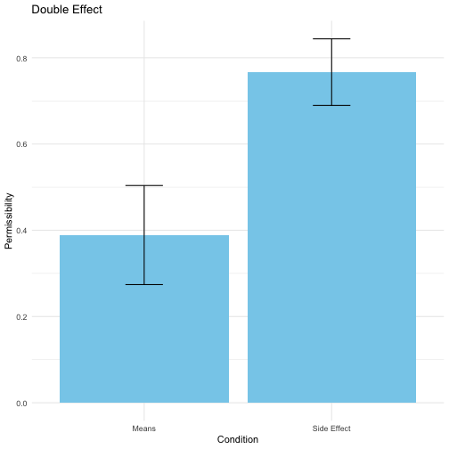

``` r
double_choices_ex <- double_effect_data %>%
  filter(factor == "Factor-Excluded") %>%
  pull(choice_binary)

double_choices_in <- double_effect_data %>%
  filter(factor == "Factor-Included") %>%
  pull(choice_binary)

#analysis -- is there a better way to do this?
prop_ex <- sum(double_choices_ex) / length(double_choices_ex)
prop_in <- sum(double_choices_in) / length(double_choices_in)

successes <- c(sum(double_choices_ex), sum(double_choices_in))
trials <- c(length(double_choices_ex), length(double_choices_in))

test_result <- prop.test(successes, trials, alternative = "less")
print(test_result)
```

```
## 
## 	2-sample test for equality of proportions with continuity correction
## 
## data:  successes out of trials
## X-squared = 5.3333, df = 1, p-value = 0.9895
## alternative hypothesis: less
## 95 percent confidence interval:
##  -1.0000000  0.6499378
## sample estimates:
##    prop 1    prop 2 
## 0.7666667 0.3888889
```

``` r
    ##8.2 introspection----

#Did factor included give higher introspection numbers 
#than factor excluded?

summary_double_effect_data <- double_effect_data %>%
  group_by(factor) %>%
  mutate(introspect_rating = as.numeric(introspect_rating)) %>%
  summarize(
    mean_intro = mean(introspect_rating),
    se_intro = se(introspect_rating)
  )

str(summary_double_effect_data)
```

```
## tibble [2 × 3] (S3: tbl_df/tbl/data.frame)
##  $ factor    : chr [1:2] "Factor-Excluded" "Factor-Included"
##  $ mean_intro: num [1:2] 56.8 45.4
##  $ se_intro  : num [1:2] 4.21 7.51
```

``` r
ggplot(summary_double_effect_data, aes(x = factor, y = mean_intro)) +
  geom_bar(stat = "identity", fill = "skyblue") +
  geom_errorbar(aes(ymin = mean_intro - se_intro, ymax = mean_intro + se_intro), width = 0.2) +
  labs(title = "Double Introspection ratings", x = "Condition", y = "introspection rating") +
  theme_minimal()
```

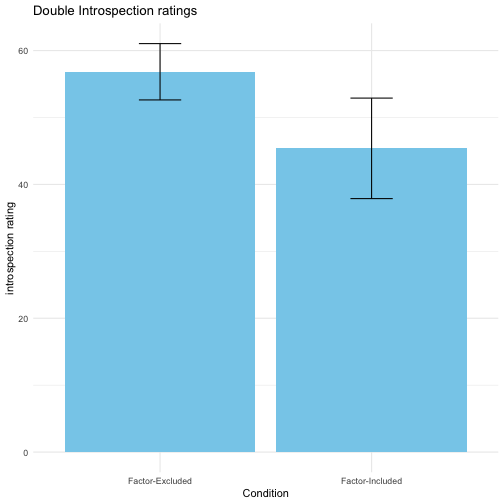

``` r
t.test(introspect_rating ~ factor, data = double_effect_data)
```

```
## 
## 	Welch Two Sample t-test
## 
## data:  introspect_rating by factor
## t = 1.3294, df = 27.746, p-value = 0.1946
## alternative hypothesis: true difference in means between group Factor-Excluded and group Factor-Included is not equal to 0
## 95 percent confidence interval:
##  -6.197495 29.086384
## sample estimates:
## mean in group Factor-Excluded mean in group Factor-Included 
##                      56.83333                      45.38889
```

``` r
#"intro_rating(included and permissible)
#>
#intro_rating(included and not permissible)"

double_effect_data <- double_effect_data %>%
  mutate(effect_group = case_when(
    choice == "Permissible" & factor == "Factor-Included" ~ "Included and Permissible",
    choice == "Impermissible" & factor == "Factor-Included" ~ "Included and Impermissible",
    factor == "Factor-Excluded" ~ "Excluded"
  ))

summary_double_effect_data <- double_effect_data %>%
  group_by(effect_group) %>%
  summarize(
    mean_intro = mean(introspect_rating),
    se_intro = se(introspect_rating)
  )

ggplot(summary_double_effect_data, aes(x = effect_group, y = mean_intro)) +
  geom_bar(stat = "identity", fill = "skyblue") +
  geom_errorbar(aes(ymin = mean_intro - se_intro, ymax = mean_intro + se_intro), width = 0.2) +
  labs(title = "Introspection ratings", x = "Condition", y = "introspection rating") +
  theme_minimal()
```

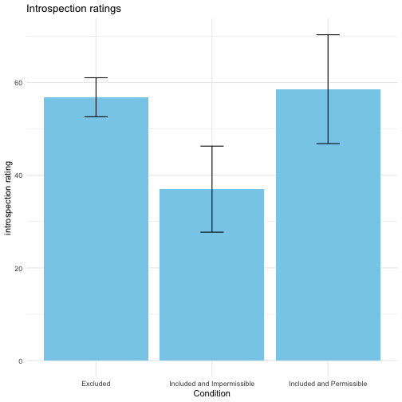

``` r
summary(lm(introspect_rating ~ effect_group, data = double_effect_data))
```

```
## 
## Call:
## lm(formula = introspect_rating ~ effect_group, data = double_effect_data)
## 
## Residuals:
##     Min      1Q  Median      3Q     Max 
## -56.833  -9.458  -6.833  13.042  52.000 
## 
## Coefficients:
##                                        Estimate Std. Error t value Pr(>|t|)    
## (Intercept)                              56.833      4.767  11.923  1.6e-15 ***
## effect_groupIncluded and Impermissible  -19.833      9.203  -2.155   0.0365 *  
## effect_groupIncluded and Permissible      1.738     10.959   0.159   0.8747    
## ---
## Signif. codes:  0 '***' 0.001 '**' 0.01 '*' 0.05 '.' 0.1 ' ' 1
## 
## Residual standard error: 26.11 on 45 degrees of freedom
## Multiple R-squared:  0.1015,	Adjusted R-squared:  0.06153 
## F-statistic: 2.541 on 2 and 45 DF,  p-value: 0.09006
```

``` r
#9. Halo Effect  ✅ ----
    ##9.1 do we see the effect? ----

#Did subjects who were shown some attractive and 
#some attractive faces think the attractive were more persuasive, with the subjects who only saw neutral faces calling in the middle?

halo_bar_data <- data %>%
  filter(task_name == "halo") %>%
  mutate(choice = as.numeric(choice))%>%
  filter(stimulus != "") %>%
  mutate(
    condition = case_when(
      grepl("img/U", stimulus) ~ "unattractive",
      grepl("img/A", stimulus) ~ "attractive",
      grepl("img/M", stimulus) ~ "average",
      TRUE ~ condition
    )
  )
```

```
## Warning: There was 1 warning in `mutate()`.
## ℹ In argument: `choice = as.numeric(choice)`.
## Caused by warning:
## ! NAs introduced by coercion
```

``` r
summary_halo_data <- halo_bar_data %>%
  group_by(condition) %>%
  summarize(
    mean_choice = mean(choice),
    se_choice = se(choice)
  )

ggplot(summary_halo_data, aes(x = condition, y = mean_choice)) +
  geom_bar(stat = "identity", fill = "skyblue") +
  geom_errorbar(aes(ymin = mean_choice - se_choice, ymax = mean_choice + se_choice), width = 0.2) +
  labs(title = "Average Persuasiveness by Attractiveness", x = "Condition", y = "Average Choice") +
  theme_minimal()
```

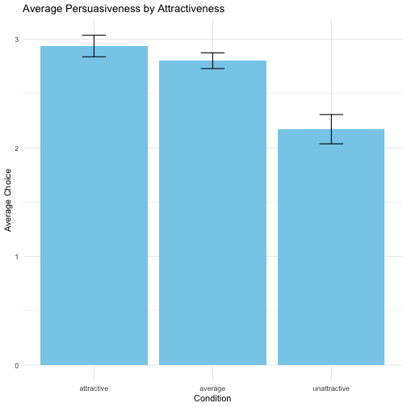

``` r
summary(lm(choice ~ condition, data = halo_bar_data))
```

```
## 
## Call:
## lm(formula = choice ~ condition, data = halo_bar_data)
## 
## Residuals:
##     Min      1Q  Median      3Q     Max 
## -1.9375 -0.8021  0.0625  0.8281  2.8281 
## 
## Coefficients:
##                       Estimate Std. Error t value Pr(>|t|)    
## (Intercept)             2.9375     0.1227  23.945  < 2e-16 ***
## conditionaverage       -0.1354     0.1417  -0.956     0.34    
## conditionunattractive  -0.7656     0.1735  -4.413  1.4e-05 ***
## ---
## Signif. codes:  0 '***' 0.001 '**' 0.01 '*' 0.05 '.' 0.1 ' ' 1
## 
## Residual standard error: 0.9814 on 317 degrees of freedom
## Multiple R-squared:  0.07135,	Adjusted R-squared:  0.06549 
## F-statistic: 12.18 on 2 and 317 DF,  p-value: 8.032e-06
```

``` r
    ##9.2 introspection ----

#Did factor included give higher introspection 
#numbers than factor excluded?

summary_halo_data <- data %>%
  filter(task_name == "halo", stimulus == "") %>% 
  group_by(factor) %>%
  summarize(
    mean_intro = mean(as.numeric(introspect_rating)),
    se_intro = se(introspect_rating)
  )

ggplot(summary_halo_data, aes(x = factor, y = mean_intro)) +
  geom_bar(stat = "identity", fill = "skyblue") +
  geom_errorbar(aes(ymin = mean_intro - se_intro, ymax = mean_intro + se_intro), width = 0.2) +
  labs(title = "Halo Introspection ratings", x = "Condition", y = "introspection rating") +
  theme_minimal()
```

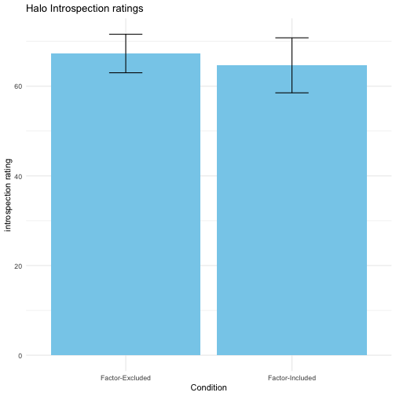

``` r
t.test(introspect_rating ~ factor, data = halo_data)
```

```
## 
## 	Welch Two Sample t-test
## 
## data:  introspect_rating by factor
## t = 0.3516, df = 21.434, p-value = 0.7286
## alternative hypothesis: true difference in means between group Factor-Excluded and group Factor-Included is not equal to 0
## 95 percent confidence interval:
##  -12.92294  18.18961
## sample estimates:
## mean in group Factor-Excluded mean in group Factor-Included 
##                      67.30000                      64.66667
```

``` r
#next question:"intro_rating(included and gave all attractive faces higher than mean persuasive scores)
#>
#  intro_rating(included and did not give all attractive faces higher than mean persuasive scores)"

halo_data <- data %>%
  filter(task_name == "halo") %>%
  filter(stimulus != "") %>%
  mutate(choice = as.numeric(choice)) %>%
  mutate(
    condition = case_when(
      grepl("img/U", stimulus) ~ "unattractive",
      grepl("img/A", stimulus) ~ "attractive",
      grepl("img/M", stimulus) ~ "average",
      TRUE ~ condition
    )
  )


#mean persuasive scores among excluded
mean_persuasive_among_excluded <- mean(halo_data$choice[halo_data$factor == "Factor-Excluded"])

#find subjects who gave all attractive faces higher than mean persuasive scores
subject_list_included_and_higher_than_mean = halo_data %>%
  filter(factor == "Factor-Included" & condition == "attractive") %>%
  group_by(subject) %>%
  summarize(all_choices_higher = all(choice > mean_persuasive_among_excluded)) %>%
  filter(all_choices_higher) %>%
  pull(subject)

# List of all subjects in "Factor-Included"
all_subjects_included = halo_data %>%
  filter(factor == "Factor-Included") %>%
  pull(subject) %>%
  unique()

# List of subjects in "Factor-Included" who did not rate all "attractive" faces higher than the mean persuasive score among excluded subjects
subject_list_included_and_not_higher_than_mean = setdiff(all_subjects_included, subject_list_included_and_higher_than_mean)


halo_data <- data %>%
  filter(task_name == "halo") %>%
  filter(stimulus == "") %>%
  mutate(effect_group = case_when(
    subject %in% subject_list_included_and_higher_than_mean ~ "Included and Higher Than Mean",
    subject %in% subject_list_included_and_not_higher_than_mean ~ "Included and Not Higher Than Mean",
    factor == "Factor-Excluded" ~ "Excluded"
    )) 

#View(halo_data)

summary_halo_data <- halo_data %>%
  group_by(effect_group) %>%
  summarize(
    mean_intro = mean(introspect_rating),
    se_intro = se(introspect_rating)
  )

ggplot(summary_halo_data, aes(x = effect_group, y = mean_intro)) +
  geom_bar(stat = "identity", fill = "skyblue") +
  geom_errorbar(aes(ymin = mean_intro - se_intro, ymax = mean_intro + se_intro), width = 0.2) +
  labs(title = "Halo Introspection ratings", x = "Condition", y = "introspection rating") +
  theme_minimal()
```

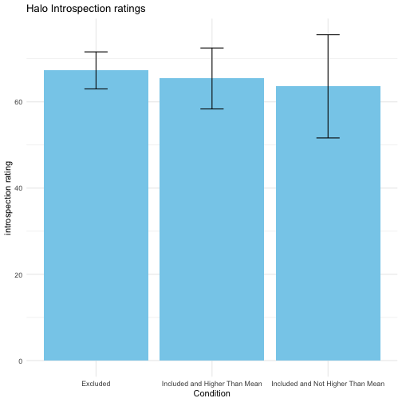

``` r
summary(lm(introspect_rating ~ effect_group, data = halo_data))
```

```
## 
## Call:
## lm(formula = introspect_rating ~ effect_group, data = halo_data)
## 
## Residuals:
##    Min     1Q Median     3Q    Max 
## -35.60 -15.90   0.70  17.07  32.70 
## 
## Coefficients:
##                                               Estimate Std. Error t value Pr(>|t|)    
## (Intercept)                                     67.300      4.542  14.816 4.62e-15 ***
## effect_groupIncluded and Higher Than Mean       -1.871      8.921  -0.210    0.835    
## effect_groupIncluded and Not Higher Than Mean   -3.700     10.157  -0.364    0.718    
## ---
## Signif. codes:  0 '***' 0.001 '**' 0.01 '*' 0.05 '.' 0.1 ' ' 1
## 
## Residual standard error: 20.31 on 29 degrees of freedom
## Multiple R-squared:  0.005134,	Adjusted R-squared:  -0.06348 
## F-statistic: 0.07483 on 2 and 29 DF,  p-value: 0.9281
```

``` r
#10 hindsight bias ----
    ##10.1 do we see the effect? TO DO----
    ##10.2 introspection TO DO----
#11 mere exposure ✅ ----
    ##11.1 do we see the effect? ----

#Were the most seen words the most liked?

mere_exposure_data <- data %>%
  filter(task_name == "mere exposure") %>%
  filter(stimulus != "") %>%
  mutate(choice = as.numeric(choice))

summary_mere_exposure_data <- mere_exposure_data %>%
  group_by(condition) %>%
  summarize(
    mean_choice = mean(choice),
    se_choice = se(choice)
  )

ggplot(summary_mere_exposure_data, aes(x = condition, y = mean_choice)) +
  geom_bar(stat = "identity", fill = "skyblue") +
  geom_errorbar(aes(ymin = mean_choice - se_choice, ymax = mean_choice + se_choice), width = 0.2) +
  labs(title = "Mere Exposure effect", x = "Times seen the word", y = "Average rating of word") +
  theme_minimal()
```

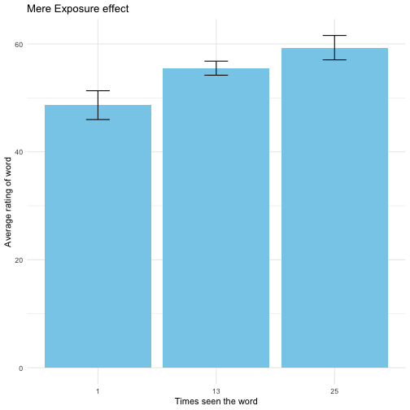

``` r
summary(lm(choice ~ condition, data = mere_exposure_data))
```

```
## 
## Call:
## lm(formula = choice ~ condition, data = mere_exposure_data)
## 
## Residuals:
##    Min     1Q Median     3Q    Max 
## -49.30 -15.50   1.35  14.50  41.35 
## 
## Coefficients:
##             Estimate Std. Error t value Pr(>|t|)    
## (Intercept)   48.650      2.411  20.178  < 2e-16 ***
## condition13    6.850      2.749   2.492  0.01322 *  
## condition25   10.650      3.410   3.123  0.00195 ** 
## ---
## Signif. codes:  0 '***' 0.001 '**' 0.01 '*' 0.05 '.' 0.1 ' ' 1
## 
## Residual standard error: 18.68 on 317 degrees of freedom
## Multiple R-squared:  0.03134,	Adjusted R-squared:  0.02523 
## F-statistic: 5.128 on 2 and 317 DF,  p-value: 0.00643
```

``` r
    ##11.2 introspection----

#Did factor included give higher introspection numbers 
#than factor excluded?

mere_exposure_data <- data %>%
  filter(task_name == "mere exposure") %>%
  filter(stimulus == "") %>%
  mutate(choice = as.numeric(choice))

summary_mere_exposure_data <- mere_exposure_data %>%
  group_by(factor) %>%
  summarize(
    mean_intro = mean(introspect_rating),
    se_intro = se(introspect_rating)
  )

ggplot(summary_mere_exposure_data, aes(x = factor, y = mean_intro)) +
  geom_bar(stat = "identity", fill = "skyblue") +
  geom_errorbar(aes(ymin = mean_intro - se_intro, ymax = mean_intro + se_intro), width = 0.2) +
  labs(title = "Mere Exposure Introspection ratings", x = "Condition", y = "introspection rating") +
  theme_minimal()
```

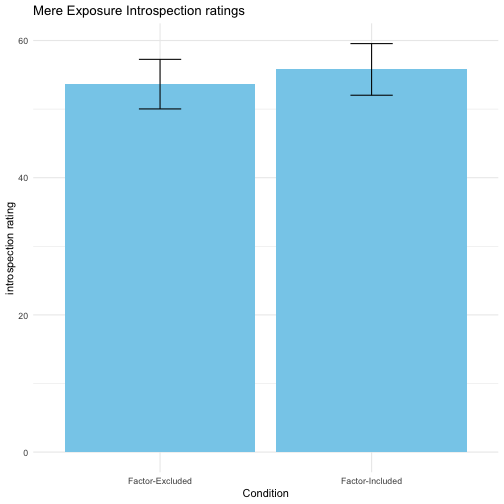

``` r
t.test(introspect_rating ~ factor, data = mere_exposure_data)
```

```
## 
## 	Welch Two Sample t-test
## 
## data:  introspect_rating by factor
## t = -0.41128, df = 32.891, p-value = 0.6835
## alternative hypothesis: true difference in means between group Factor-Excluded and group Factor-Included is not equal to 0
## 95 percent confidence interval:
##  -12.761434   8.470005
## sample estimates:
## mean in group Factor-Excluded mean in group Factor-Included 
##                      53.64000                      55.78571
```

``` r
#next question: "intro_rating(included and their mean rating of how much they liked the words was greater than the mean rating for excluded)
#>
#intro_rating(included and not their mean rating of how much they liked the words was greater than the mean rating for excluded)"


mere_exposure_data <- data %>%
  filter(task_name == "mere exposure") %>%
  filter(stimulus != "") %>%
  mutate(choice = as.numeric(choice))

#mean rating among excluded
mean_rating_excluded = mean(mere_exposure_data$choice[mere_exposure_data$factor == "Factor-Excluded"])

#I do not know why but these two subjects never gave introspection ratings
filtered_data <- data %>%
  filter(!(subject %in% c("58635484a73baa00010db537", "65e29e4514fa80bea57284b7")))

#make new table with subject number, average rating, and introspection rating
subject_data <- filtered_data %>%
  group_by(subject) %>%
  filter(task_name == "mere exposure") %>%
  mutate(choice = as.numeric(choice)) %>%
  summarise(
    average_choice_rating_per_subject = mean(choice, na.rm = TRUE),
    introspect_rating = first(introspect_rating[!is.na(introspect_rating)]),
    factor = first(factor)
  )


#make new column for effect group
subject_data <- subject_data %>%
    mutate(effect_group = case_when(
      average_choice_rating_per_subject > mean_rating_excluded & factor == "Factor-Included" ~ "Included and Rating Higher Than Excluded Mean",
      average_choice_rating_per_subject <= mean_rating_excluded & factor == "Factor-Included" ~ "Included and Rating Not Higher Than Excluded Mean",
    factor == "Factor-Excluded" ~ "Excluded"
  ))


summary_mere_exposure_data <- subject_data %>%
  group_by(effect_group) %>%
  summarize(
    mean_intro = mean(introspect_rating),
    se_intro = se(introspect_rating)
  )

ggplot(summary_mere_exposure_data, aes(x = effect_group, y = mean_intro)) +
  geom_bar(stat = "identity", fill = "skyblue") +
  geom_errorbar(aes(ymin = mean_intro - se_intro, ymax = mean_intro + se_intro), width = 0.2) +
  labs(title = "Mere Exposure Introspection ratings", x = "Condition", y = "introspection rating") +
  theme_minimal()
```

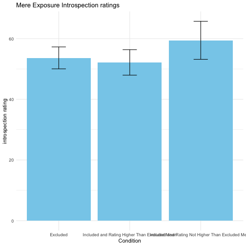

``` r
#12 reference price ✅ ----
    ##12.1 do we see the effect? ----

#When subjects were told the hotel was fancy, were 
#they more likely to give a higher price they'd be willing to pay?

reference_price_data <- data %>%
  filter(task_name == "reference price") %>%
  mutate(choice_parsed = parse_number(choice))

#View(reference_price_data)

summary_reference_price_data <- reference_price_data %>%
  group_by(condition) %>%
  summarize(
    mean_choice = mean(choice_parsed),
    se_choice = se(choice_parsed)
  )

ggplot(summary_reference_price_data, aes(x = condition, y = mean_choice)) +
  geom_bar(stat = "identity", fill = "skyblue") +
  geom_errorbar(aes(ymin = mean_choice - se_choice, ymax = mean_choice + se_choice), width = 0.2) +
  labs(title = "Amount Willing to Pay for Beer", x = "Condition", y = "Average Amount Willing to Pay (Dollars)") +
  theme_minimal()
```

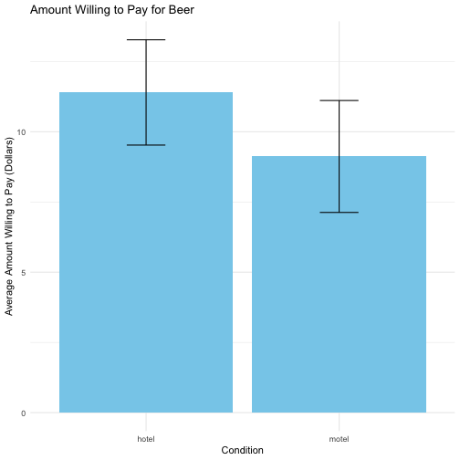

``` r
t.test(choice_parsed ~ factor, data = reference_price_data)
```

```
## 
## 	Welch Two Sample t-test
## 
## data:  choice_parsed by factor
## t = -0.83346, df = 36.406, p-value = 0.41
## alternative hypothesis: true difference in means between group Factor-Excluded and group Factor-Included is not equal to 0
## 95 percent confidence interval:
##  -7.825884  3.265884
## sample estimates:
## mean in group Factor-Excluded mean in group Factor-Included 
##                          9.12                         11.40
```

``` r
# p-value = 0.4913

    ##12.2 introspection----

#Did factor included give lower introspection numbers than 
#factor excluded?

summary_reference_price_data <- reference_price_data %>%
  group_by(condition) %>%
  summarize(
    mean_intro = mean(introspect_rating),
    se_intro = se(introspect_rating)
  )

ggplot(summary_reference_price_data, aes(x = condition, y = mean_intro)) +
  geom_bar(stat = "identity", fill = "skyblue") +
  geom_errorbar(aes(ymin = mean_intro - se_intro, ymax = mean_intro + se_intro), width = 0.2) +
  labs(title = "Reference-Price Introspection ratings", x = "Condition", y = "introspection rating") +
  theme_minimal()
```

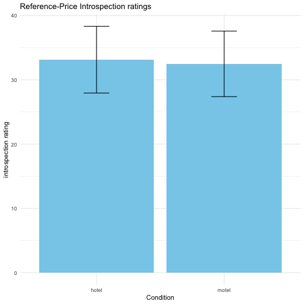

``` r
t.test(introspect_rating ~ factor, data = reference_price_data)
```

```
## 
## 	Welch Two Sample t-test
## 
## data:  introspect_rating by factor
## t = -0.089805, df = 35.038, p-value = 0.929
## alternative hypothesis: true difference in means between group Factor-Excluded and group Factor-Included is not equal to 0
## 95 percent confidence interval:
##  -15.42189  14.11522
## sample estimates:
## mean in group Factor-Excluded mean in group Factor-Included 
##                      32.48000                      33.13333
```

``` r
#p-value = 0.8909

#"intro_rating(included and higher than mean price)
#<
#  intro_rating(included and not higher than mean price)
#"

#mean price among excluded
mean_price_among_excluded <- mean(reference_price_data$choice_parsed[reference_price_data$factor == "Factor-Excluded"])

reference_price_data <- reference_price_data %>%
  mutate(effect_group = case_when(
    choice_parsed > mean_price_among_excluded & factor == "Factor-Included" ~ "Included and Higher Than Mean",
    choice_parsed <= mean_price_among_excluded & factor == "Factor-Included" ~ "Included and Not Higher Than Mean",
    factor == "Factor-Excluded" ~ "Excluded"
  ))

summary_reference_price_data <- reference_price_data %>%
  group_by(effect_group) %>%
  summarize(
    mean_intro = mean(introspect_rating),
    se_intro = se(introspect_rating)
  )

ggplot(summary_reference_price_data, aes(x = effect_group, y = mean_intro)) +
  geom_bar(stat = "identity", fill = "skyblue") +
  geom_errorbar(aes(ymin = mean_intro - se_intro, ymax = mean_intro + se_intro), width = 0.2) +
  labs(title = "Reference Price Introspection ratings", x = "Condition", y = "introspection rating") +
  theme_minimal()
```

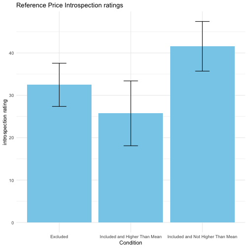

``` r
summary(lm(introspect_rating ~ effect_group, data = reference_price_data))
```

```
## 
## Call:
## lm(formula = introspect_rating ~ effect_group, data = reference_price_data)
## 
## Residuals:
##     Min      1Q  Median      3Q     Max 
## -32.480 -21.003   7.339  17.520  62.520 
## 
## Coefficients:
##                                               Estimate Std. Error t value Pr(>|t|)    
## (Intercept)                                     32.480      4.687   6.930 3.52e-08 ***
## effect_groupIncluded and Higher Than Mean       -6.730      9.520  -0.707    0.484    
## effect_groupIncluded and Not Higher Than Mean    9.091     10.021   0.907    0.370    
## ---
## Signif. codes:  0 '***' 0.001 '**' 0.01 '*' 0.05 '.' 0.1 ' ' 1
## 
## Residual standard error: 23.44 on 37 degrees of freedom
## Multiple R-squared:  0.04414,	Adjusted R-squared:  -0.007523 
## F-statistic: 0.8544 on 2 and 37 DF,  p-value: 0.4338
```

``` r
#13 representativeness  ✅ ----
    ##13.1 do we see the effect ----

#When subjects were given the description about Jack, 
#did more of them say he was an engineer?

representativeness_data <- data %>%
  filter(task_name == "rep") %>%
  mutate(choice = as.numeric(choice))

summary_representativeness_data <- representativeness_data %>%
  group_by(condition) %>%
  summarize(
    mean_choice = mean(choice),
    se_choice = se(choice)
  )

ggplot(summary_representativeness_data, aes(x = condition, y = mean_choice)) +
  geom_bar(stat = "identity", fill = "skyblue") +
  geom_errorbar(aes(ymin = mean_choice - se_choice, ymax = mean_choice + se_choice), width = 0.2) +
  labs(title = "Is Jack an Engineer?", x = "Condition", y = "average likelihood of engineer") +
  theme_minimal()
```

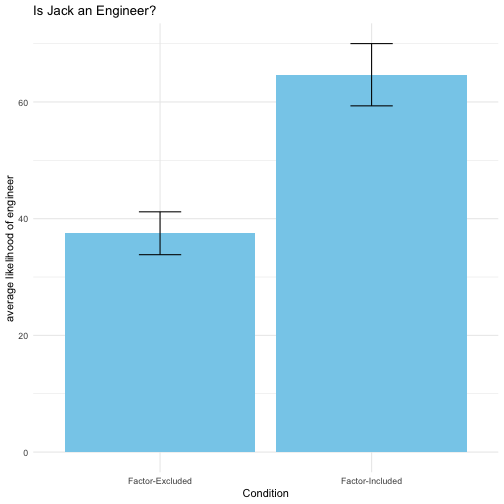

``` r
t.test(choice ~ factor, data = representativeness_data)
```

```
## 
## 	Welch Two Sample t-test
## 
## data:  choice by factor
## t = -4.1949, df = 26.769, p-value = 0.0002676
## alternative hypothesis: true difference in means between group Factor-Excluded and group Factor-Included is not equal to 0
## 95 percent confidence interval:
##  -40.46004 -13.87329
## sample estimates:
## mean in group Factor-Excluded mean in group Factor-Included 
##                      37.50000                      64.66667
```

``` r
# p-value = 7.142e-06

    ##13.2 introspection----

#Did factor included give higher introspection 
#numbers than factor excluded?

summary_representativeness_data <- representativeness_data %>%
  group_by(condition) %>%
  summarize(
    mean_intro = mean(introspect_rating),
    se_intro = se(introspect_rating)
  )

ggplot(summary_representativeness_data, aes(x = condition, y = mean_intro)) +
  geom_bar(stat = "identity", fill = "skyblue") +
  geom_errorbar(aes(ymin = mean_intro - se_intro, ymax = mean_intro + se_intro), width = 0.2) +
  labs(title = "Representativeness Introspection ratings", x = "Condition", y = "introspection rating") +
  theme_minimal()
```

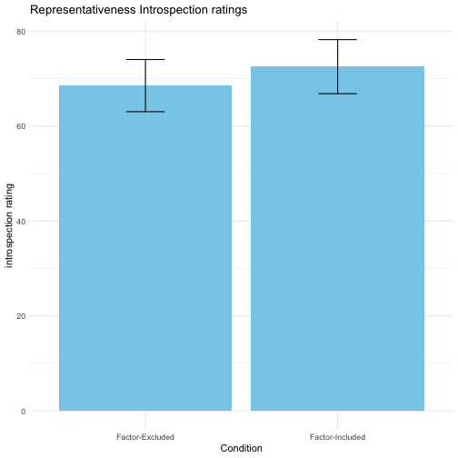

``` r
t.test(introspect_rating ~ factor, data = representativeness_data)
```

```
## 
## 	Welch Two Sample t-test
## 
## data:  introspect_rating by factor
## t = -0.50419, df = 34.17, p-value = 0.6174
## alternative hypothesis: true difference in means between group Factor-Excluded and group Factor-Included is not equal to 0
## 95 percent confidence interval:
##  -20.07803  12.09470
## sample estimates:
## mean in group Factor-Excluded mean in group Factor-Included 
##                      68.54167                      72.53333
```

``` r
#p-value = 0.2962

#next question: "intro_rating(included and said Jack was more likely to be engineer than mean of excluded)
#>
#  intro_rating(included and not said Jack was more likely to be engineer than mean of excluded"

#mean likelihood of engineer among excluded
mean_likelihood_of_engineer <- mean(representativeness_data$choice[representativeness_data$factor == "Factor-Excluded"])
print(mean_likelihood_of_engineer)
```

```
## [1] 37.5
```

``` r
representativeness_data <- representativeness_data %>%
  mutate(effect_group = case_when(
    choice > mean_likelihood_of_engineer & factor == "Factor-Included" ~ "Included and Said Engineer",
    choice <= mean_likelihood_of_engineer & factor == "Factor-Included" ~ "Included and Not Said Engineer",
    factor == "Factor-Excluded" ~ "Excluded"
  ))

summary_representativeness_data <- representativeness_data %>%
  group_by(effect_group) %>%
  summarize(
    mean_intro = mean(introspect_rating),
    se_intro = se(introspect_rating)
  )

ggplot(summary_representativeness_data, aes(x = effect_group, y = mean_intro)) +
  geom_bar(stat = "identity", fill = "skyblue") +
  geom_errorbar(aes(ymin = mean_intro - se_intro, ymax = mean_intro + se_intro), width = 0.2) +
  labs(title = "Introspection ratings", x = "Condition", y = "introspection rating") +
  theme_minimal()
```

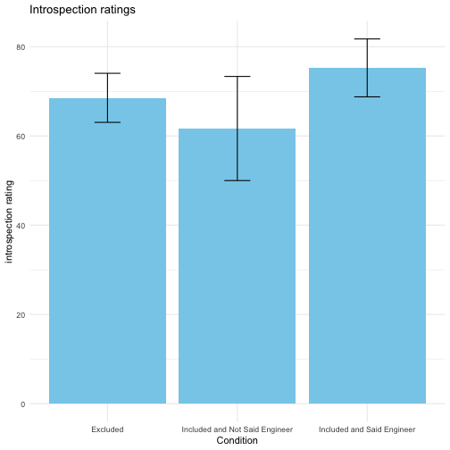

``` r
summary(lm(introspect_rating ~ effect_group, data = representativeness_data))
```

```
## 
## Call:
## lm(formula = introspect_rating ~ effect_group, data = representativeness_data)
## 
## Residuals:
##    Min     1Q Median     3Q    Max 
## -68.54 -18.54  -1.25  21.90  31.46 
## 
## Coefficients:
##                                            Estimate Std. Error t value Pr(>|t|)    
## (Intercept)                                  68.542      5.165  13.269 1.97e-15 ***
## effect_groupIncluded and Not Said Engineer   -6.875     15.496  -0.444    0.660    
## effect_groupIncluded and Said Engineer        6.708      8.947   0.750    0.458    
## ---
## Signif. codes:  0 '***' 0.001 '**' 0.01 '*' 0.05 '.' 0.1 ' ' 1
## 
## Residual standard error: 25.31 on 36 degrees of freedom
## Multiple R-squared:  0.02495,	Adjusted R-squared:  -0.02922 
## F-statistic: 0.4606 on 2 and 36 DF,  p-value: 0.6346
```

``` r
#14 status quo ✅ ----

    ##14.1 do we see the effect ----

#When subjects were told the status quo, 
#were they more likely to recommend the 70/30 allocation?

status_quo_data <- data %>%
  filter(task_name == "status_quo") %>%
  mutate(choice_binary = as.numeric(choice == "70/30"))


summary_status_quo_data <- status_quo_data %>%
  group_by(condition) %>%
  summarize(
    mean_choice = mean(choice_binary),
    se_choice = se.prop(choice_binary)
  )

ggplot(summary_status_quo_data, aes(x = condition, y = mean_choice)) +
  geom_bar(stat = "identity", fill = "skyblue") +
  geom_errorbar(aes(ymin = mean_choice - se_choice, ymax = mean_choice + se_choice), width = 0.2) +
  labs(title = "Choices to continue the status quo", x = "Condition", y = "Percent subjects who recommended the status quo") +
  theme_minimal()
```

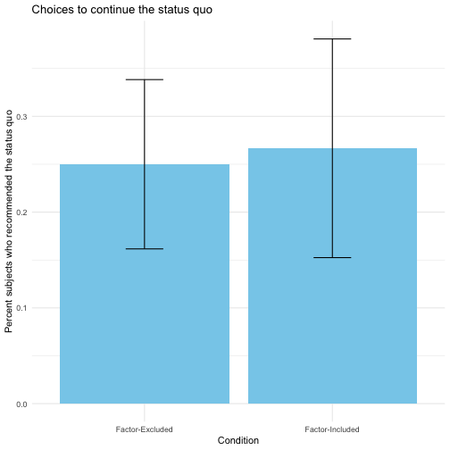

``` r
status_quo_choices_ex <- status_quo_data %>%
  filter(factor == "Factor-Excluded") %>%
  pull(choice_binary)

status_quo_choices_in <- status_quo_data %>%
  filter(factor == "Factor-Included") %>%
  pull(choice_binary)

#analysis -- is there a better way to do this?
prop_ex <- sum(status_quo_choices_ex) / length(status_quo_choices_ex)
prop_in <- sum(status_quo_choices_in) / length(status_quo_choices_in)

successes <- c(sum(status_quo_choices_ex), sum(status_quo_choices_in))
trials <- c(length(status_quo_choices_ex), length(status_quo_choices_in))

test_result <- prop.test(successes, trials, alternative = "less")
```

```
## Warning in prop.test(successes, trials, alternative = "less"): Chi-squared
## approximation may be incorrect
```

``` r
print(test_result)
```

```
## 
## 	2-sample test for equality of proportions with continuity correction
## 
## data:  successes out of trials
## X-squared = 1.1618e-31, df = 1, p-value = 0.5
## alternative hypothesis: less
## 95 percent confidence interval:
##  -1.0000000  0.2375065
## sample estimates:
##    prop 1    prop 2 
## 0.2500000 0.2666667
```

``` r
#p-value = 0.3625
  
    ##14.2 introspection----

#Did factor included give lower introspection 
#numbers than factor excluded?

summary_status_quo_data <- status_quo_data %>%
  group_by(condition) %>%
  summarize(
    mean_intro = mean(introspect_rating),
    se_intro = se(introspect_rating)
  )

ggplot(summary_status_quo_data, aes(x = condition, y = mean_intro)) +
  geom_bar(stat = "identity", fill = "skyblue") +
  geom_errorbar(aes(ymin = mean_intro - se_intro, ymax = mean_intro + se_intro), width = 0.2) +
  labs(title = "Introspection ratings", x = "Condition", y = "introspection rating") +
  theme_minimal()
```

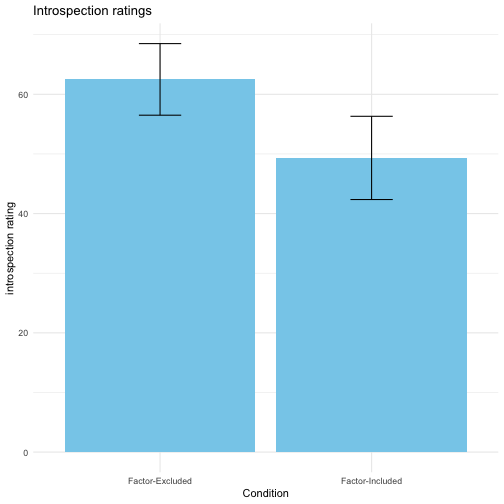

``` r
t.test(introspect_rating ~ factor, data = status_quo_data)
```

```
## 
## 	Welch Two Sample t-test
## 
## data:  introspect_rating by factor
## t = 1.4302, df = 31.783, p-value = 0.1624
## alternative hypothesis: true difference in means between group Factor-Excluded and group Factor-Included is not equal to 0
## 95 percent confidence interval:
##  -5.590284 31.923617
## sample estimates:
## mean in group Factor-Excluded mean in group Factor-Included 
##                      62.50000                      49.33333
```

``` r
#p-value = 0.3647

#next question: "intro_rating(included and said 70/30)
#<
#  intro_rating(included and said 50/50)"


status_quo_data <- status_quo_data %>%
  mutate(effect_group = case_when(
    choice == "70/30" & factor == "Factor-Included" ~ "Included and Status Quo",
    choice == "50/50" & factor == "Factor-Included" ~ "Included and not Status Quo",
    factor == "Factor-Excluded" ~ "Excluded"
  ))

summary_status_quo_data <- status_quo_data %>%
  group_by(effect_group) %>%
  summarize(
    mean_intro = mean(introspect_rating),
    se_intro = se(introspect_rating)
  )

ggplot(summary_status_quo_data, aes(x = effect_group, y = mean_intro)) +
  geom_bar(stat = "identity", fill = "skyblue") +
  geom_errorbar(aes(ymin = mean_intro - se_intro, ymax = mean_intro + se_intro), width = 0.2) +
  labs(title = "Introspection ratings", x = "Condition", y = "introspection rating") +
  theme_minimal()

summary(lm(introspect_rating ~ effect_group, data = status_quo_data))
```

```
## 
## Call:
## lm(formula = introspect_rating ~ effect_group, data = status_quo_data)
## 
## Residuals:
##    Min     1Q Median     3Q    Max 
##  -62.5  -12.5   -6.5   17.7   37.5 
## 
## Coefficients:
##                                         Estimate Std. Error t value Pr(>|t|)    
## (Intercept)                              62.5000     5.2048  12.008 3.77e-14 ***
## effect_groupIncluded and not Status Quo  -0.4091     9.2841  -0.044  0.96510    
## effect_groupIncluded and Status Quo     -48.2500    13.7706  -3.504  0.00125 ** 
## ---
## Signif. codes:  0 '***' 0.001 '**' 0.01 '*' 0.05 '.' 0.1 ' ' 1
## 
## Residual standard error: 25.5 on 36 degrees of freedom
## Multiple R-squared:  0.2621,	Adjusted R-squared:  0.2211 
## F-statistic: 6.394 on 2 and 36 DF,  p-value: 0.004206
```

``` r
#effect_groupIncluded and Status Quo       0.0062 ** 

if (!requireNamespace("knitr", quietly = TRUE)) {
  install.packages("knitr")
}
library(knitr)

setwd(dirname(rstudioapi::getActiveDocumentContext()$path))
```

```
## Error in dirname(rstudioapi::getActiveDocumentContext()$path): a character vector argument expected
```

``` r
# Use the stitch function
knitr::spin("analysis2024.R")
```

```
## 
## 
## processing file: analysis2024.Rmd
```

```
## 
  |                                                                 
  |                                                           |   0%
  |                                                                 
  |....................                                       |  33%                  
  |                                                                 
  |.......................................                    |  67% [unnamed-chunk-3]
  |                                                                 
  |...........................................................| 100%                  
```

```
## output file: analysis2024.md
```

```
## Warning in file.remove(outsrc): cannot remove file 'analysis2024.Rmd', reason 'No such
## file or directory'
```

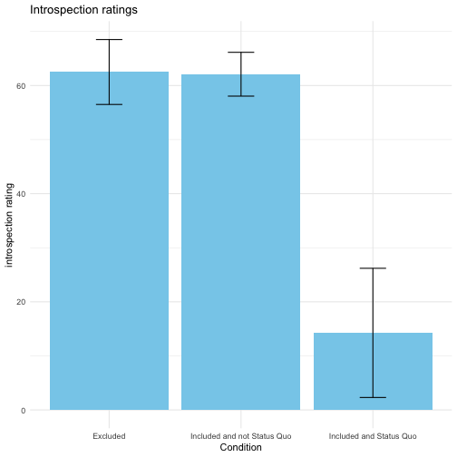

