``` r
# Setup -------------------------------------------------------------------
library(extrafont)
require(dplyr)
require(ggplot2)
require(lme4)
require(lmerTest)
require(sjPlot)
require(magrittr)
require(readr)
library(stringr)
library(RColorBrewer)
library(extrafont)
library(Cairo)
library(tidyr)


setwd(dirname(rstudioapi::getActiveDocumentContext()$path))

se = function(x) {return(sd(x, na.rm = T) / sqrt(sum(!is.na(x))))}
se.prop = function(x) {return(sqrt(mean(x, na.rm = T) * (1-mean(x, na.rm = T)) / sum(!is.na(x))))}
dodge <- position_dodge(width=0.9)

data <- read.csv('data.csv') %>%
  arrange(subject, task_name) %>%
  mutate(total_time = ifelse(grepl("^total_time", introspect_rating), introspect_rating, NA)) %>%
  mutate(introspect_rating = ifelse(grepl("^total_time", introspect_rating), NA, introspect_rating)) %>%
mutate(introspect_rating = as.numeric(introspect_rating))
head(data)
```

```
##                    subject subject_prolific   version          factor          task_name
## 1 572bf2aa34b25a000edd2e73               NA v5_pilot1 Factor-Included          anchoring
## 2 572bf2aa34b25a000edd2e73               NA v5_pilot1 Factor-Included          anchoring
## 3 572bf2aa34b25a000edd2e73               NA v5_pilot1 Factor-Included          anchoring
## 4 572bf2aa34b25a000edd2e73               NA v5_pilot1 Factor-Included associative memory
## 5 572bf2aa34b25a000edd2e73               NA v5_pilot1 Factor-Included associative memory
## 6 572bf2aa34b25a000edd2e73               NA v5_pilot1 Factor-Included associative memory
##    condition              stimulus   choice auxiliary_info1
## 1 Low Anchor Antarctic Temperature      -76           Lower
## 2 Low Anchor          Whale Length       64         Shorter
## 3 Low Anchor                                               
## 4      Sleep                  rest Original        Original
## 5   NonSleep                 heart      New             New
## 6   NonSleep                bitter      New             New
##                                                                                                                                                                                                                                                                                                                          openq_response
## 1                                                                                                                                                                                                                                                                                                                                      
## 2                                                                                                                                                                                                                                                                                                                                      
## 3 I just tried to estimate what I would think a winter in the arctic and the shortest blue whale would look like. I know the arctic gets deadly cold, and that blue whales are huge, so I just assumed that there might be some slight deviation for blue whales, and that it gets colder than what I was given for the arctic question
## 4                                                                                                                                                                                                                                                                                                                                      
## 5                                                                                                                                                                                                                                                                                                                                      
## 6                                                                                                                                                                                                                                                                                                                                      
##   introspect_rating introspect_open familiarity    rt           timestamp    id total_time
## 1                NA              NA             18739 2024-06-21 20:30:24 76596       <NA>
## 2                NA              NA             18739 2024-06-21 20:30:24 76597       <NA>
## 3                79              32          No  4131 2024-06-21 20:32:21 76641       <NA>
## 4                NA              NA               796 2024-06-21 20:37:42 76765       <NA>
## 5                NA              NA               920 2024-06-21 20:37:44 76767       <NA>
## 6                NA              NA               708 2024-06-21 20:37:45 76768       <NA>
```

``` r
data = data %>%
  filter(familiarity != "Yes") %>%
  mutate(factor = factor(factor, levels = c("Factor-Included", "Factor-Excluded"))) %>%
  

#find subjects who need to be excluded
  
attention_exclude <- data %>%
  filter((`task_name` == "attention check 2" & `auxiliary_info1` == "Failure") |
           (`task_name` == "attention check 3" & `auxiliary_info1` == "Incorrect")) %>%
    pull(subject)
```

```
## Error in data %>% filter(familiarity != "Yes") %>% mutate(factor = factor(factor, : could not find function "%>%<-"
```

``` r
  events <- read.csv('browser_events.csv') %>%
    arrange(subject) %>%
    filter(version == "v5_pilot1")
  
  tab_away_exclude <- events %>%
    filter(browser_event == "blur") %>%
    group_by(subject) %>%
    summarize(blurs = n(), more_than_twelve = as.numeric(n() > 12))%>%
    filter(more_than_twelve == 1) %>%
    pull(subject)
  
  blur_histogram_data <- events %>%
    filter(browser_event == "blur") %>%
    group_by(subject) %>%
    summarize(blurs = n(), more_than_twelve = as.numeric(n() > 12))
    
  
  ##View(attention_exclude)
  #blur histogram
  
  ggplot(blur_histogram_data, aes(x = blurs)) +
    geom_histogram(binwidth = 1, color = "black") +
    labs(title = "Blur Histogram", x = "Number of Blurs", y = "Count") +
    theme_custom()
```


``` r
  time_exclude <- data %>%
    filter(total_time != "") %>%
    mutate(total_time = parse_number(total_time)) %>%
    mutate(total_time = total_time/60000)
 
   #View(time_exclude)
  
  ggplot(time_exclude, aes(x = total_time)) +
    geom_histogram(fill = "skyblue", color = "black") +
    labs(title = "Time Histogram", x = "Minutes", y = "Count") +
    theme_custom()
```

```
## `stat_bin()` using `bins = 30`. Pick better value with `binwidth`.
```

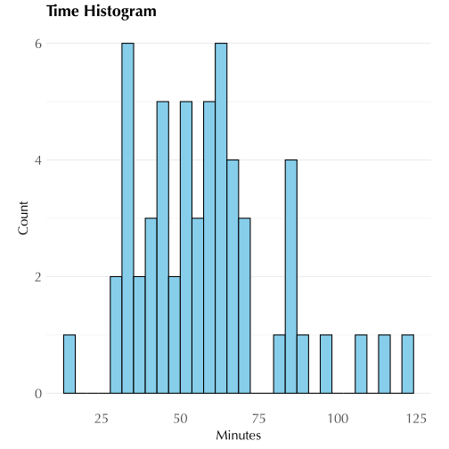

``` r
  to_exclude <- union(attention_exclude, tab_away_exclude)
```

```
## Error in eval(expr, envir, enclos): object 'attention_exclude' not found
```

``` r
  data <- data %>%
    filter(!subject %in% to_exclude)
```

```
## Error in `filter()`:
## ℹ In argument: `!subject %in% to_exclude`.
## Caused by error:
## ! object 'to_exclude' not found
```

``` r
p.vals = c()


# color palettes: hot for included, cool for excluded

#Included vs. Excluded
in_and_ex <- c("#F37121", "#4793AF")

in_neutral_ex <- c("#F37121", "#D3D3D3", "#4793AF")

effect_no <- c("#e74c3c", "#D3D3D3")

#In&Effect, In&NoEffect, Ex&Effect, Ex&NoEffect
four_colors <- c("#f1c40f", "#e74c3c","#9b59b6", "#1abc9c")

#In&Effect, In&NoEffect, Ex
three_colors <- c("#f1c40f", "#e74c3c","#4793AF")

#In&Effect, Ex
two_colors <- c("#f1c40f", "#e74c3c")

theme_custom <- function() {
  theme_minimal(base_family = "Optima") +
    theme(
      axis.text.x = element_text(size = 15, margin = margin(t = 0, r = 0, b = 0, l = 1)), 
      axis.text.y = element_text(size = 15),
      axis.title.x = element_text(size = 15),
      axis.title.y = element_text(size = 15),
      plot.title = element_text(size = 18, face = "bold"),
      legend.text = element_text(size = 15),
      legend.title = element_text(size = 15),
      strip.text = element_text(size = 15),
      aspect.ratio = 1,  # Set the aspect ratio here
      panel.grid.major.x = element_blank(),  # Remove major vertical grid lines
      panel.grid.minor.x = element_blank()   # Remove minor vertical grid lines
    )
}


font_import(pattern = "Optima", prompt = FALSE)
```

```
## Scanning ttf files in /Library/Fonts/, /System/Library/Fonts, /System/Library/Fonts/Supplemental, ~/Library/Fonts/ ...
## Extracting .afm files from .ttf files...
```

```
## Error in data.frame(fontfile = ttfiles, FontName = "", stringsAsFactors = FALSE): arguments imply differing number of rows: 0, 1
```

``` r
loadfonts(device = "pdf")
```

```
## .Keyboard already registered with pdfFont().
## .New York already registered with pdfFont().
## .SF Arabic already registered with pdfFont().
## .SF Arabic Rounded already registered with pdfFont().
## .SF Armenian already registered with pdfFont().
## .SF Armenian Rounded already registered with pdfFont().
## .SF Camera already registered with pdfFont().
## .SF Compact already registered with pdfFont().
## .SF Compact Rounded already registered with pdfFont().
## .SF Georgian already registered with pdfFont().
## .SF Georgian Rounded already registered with pdfFont().
## .SF Hebrew already registered with pdfFont().
## .SF Hebrew Rounded already registered with pdfFont().
## .SF NS Mono already registered with pdfFont().
## .SF NS Rounded already registered with pdfFont().
## Academy Engraved LET already registered with pdfFont().
## Amarante already registered with pdfFont().
## Andale Mono already registered with pdfFont().
## Anonymice Powerline already registered with pdfFont().
## More than one version of regular/bold/italic found for Apple Braille. Skipping setup for this font.
## AppleMyungjo already registered with pdfFont().
## Arial already registered with pdfFont().
## Arial Black already registered with pdfFont().
## Arial Narrow already registered with pdfFont().
## Arial Rounded MT Bold already registered with pdfFont().
## Arial Unicode MS already registered with pdfFont().
## Arimo for Powerline already registered with pdfFont().
## Barokah Signature already registered with pdfFont().
## Belleza already registered with pdfFont().
## Birthstone Bounce already registered with pdfFont().
## Birthstone Bounce Medium already registered with pdfFont().
## Bodoni 72 Smallcaps already registered with pdfFont().
## Bodoni Ornaments already registered with pdfFont().
## No regular (non-bold, non-italic) version of Brush Script MT. Skipping setup for this font.
## Champagne & Limousines already registered with pdfFont().
## Comic Sans MS already registered with pdfFont().
## Cormorant already registered with pdfFont().
## Cormorant Garamond already registered with pdfFont().
## Cormorant Garamond Light already registered with pdfFont().
## Cormorant Garamond Medium already registered with pdfFont().
## Cormorant Garamond SemiBold already registered with pdfFont().
## Cormorant Light already registered with pdfFont().
## Cormorant Medium already registered with pdfFont().
## Cormorant SemiBold already registered with pdfFont().
## Courier New already registered with pdfFont().
## Cousine for Powerline already registered with pdfFont().
## More than one version of regular/bold/italic found for DejaVu LGC Sans. Skipping setup for this font.
## DejaVu LGC Sans Condensed already registered with pdfFont().
## DejaVu LGC Sans Mono already registered with pdfFont().
## DejaVu Sans Mono for Powerline already registered with pdfFont().
## No regular (non-bold, non-italic) version of DIN Alternate. Skipping setup for this font.
## No regular (non-bold, non-italic) version of DIN Condensed. Skipping setup for this font.
## Droid Sans Mono Dotted for Powerline already registered with pdfFont().
## Droid Sans Mono Slashed for Powerline already registered with pdfFont().
## EB Garamond already registered with pdfFont().
## Forum already registered with pdfFont().
## Georgia already registered with pdfFont().
## Go Mono for Powerline already registered with pdfFont().
## Goudy Bookletter 1911 already registered with pdfFont().
## Great Vibes already registered with pdfFont().
## Hack already registered with pdfFont().
## IBM 3270 already registered with pdfFont().
## IBM 3270 Narrow already registered with pdfFont().
## IBM 3270 Semi-Narrow already registered with pdfFont().
## Impact already registered with pdfFont().
## No regular (non-bold, non-italic) version of Inconsolata for Powerline. Skipping setup for this font.
## Initials with curls already registered with pdfFont().
## Josefin Sans Thin already registered with pdfFont().
## Khmer Sangam MN already registered with pdfFont().
## king plus monospace already registered with pdfFont().
## Lao Sangam MN already registered with pdfFont().
## Libre Caslon Text already registered with pdfFont().
## LimeGloryCaps already registered with pdfFont().
## Literation Mono Powerline already registered with pdfFont().
## Luminari already registered with pdfFont().
## Meslo LG L DZ for Powerline already registered with pdfFont().
## Meslo LG L for Powerline already registered with pdfFont().
## Meslo LG M DZ for Powerline already registered with pdfFont().
## Meslo LG M for Powerline already registered with pdfFont().
## Meslo LG S DZ for Powerline already registered with pdfFont().
## Meslo LG S for Powerline already registered with pdfFont().
## Microsoft Sans Serif already registered with pdfFont().
## More than one version of regular/bold/italic found for monofur for Powerline. Skipping setup for this font.
## Monopol already registered with pdfFont().
## Myfont already registered with pdfFont().
## NegativeO already registered with pdfFont().
## Noto Mono for Powerline already registered with pdfFont().
## Noto Sans Adlam already registered with pdfFont().
## Noto Sans Avestan already registered with pdfFont().
## Noto Sans Bamum already registered with pdfFont().
## Noto Sans Bassa Vah already registered with pdfFont().
## Noto Sans Batak already registered with pdfFont().
## Noto Sans Bhaiksuki already registered with pdfFont().
## Noto Sans Brahmi already registered with pdfFont().
## Noto Sans Buginese already registered with pdfFont().
## Noto Sans Buhid already registered with pdfFont().
## Noto Sans Carian already registered with pdfFont().
## Noto Sans CaucAlban already registered with pdfFont().
## Noto Sans Chakma already registered with pdfFont().
## Noto Sans Cham already registered with pdfFont().
## Noto Sans Coptic already registered with pdfFont().
## Noto Sans Cuneiform already registered with pdfFont().
## Noto Sans Cypriot already registered with pdfFont().
## Noto Sans Duployan already registered with pdfFont().
## Noto Sans EgyptHiero already registered with pdfFont().
## Noto Sans Elbasan already registered with pdfFont().
## Noto Sans Glagolitic already registered with pdfFont().
## Noto Sans Gothic already registered with pdfFont().
## Noto Sans HanifiRohg already registered with pdfFont().
## Noto Sans Hanunoo already registered with pdfFont().
## Noto Sans Hatran already registered with pdfFont().
## Noto Sans ImpAramaic already registered with pdfFont().
## Noto Sans InsPahlavi already registered with pdfFont().
## Noto Sans InsParthi already registered with pdfFont().
## Noto Sans Kaithi already registered with pdfFont().
## Noto Sans Kayah Li already registered with pdfFont().
## Noto Sans Kharoshthi already registered with pdfFont().
## Noto Sans Khojki already registered with pdfFont().
## Noto Sans Khudawadi already registered with pdfFont().
## Noto Sans Lepcha already registered with pdfFont().
## Noto Sans Limbu already registered with pdfFont().
## Noto Sans Linear A already registered with pdfFont().
## Noto Sans Linear B already registered with pdfFont().
## Noto Sans Lisu already registered with pdfFont().
## Noto Sans Lycian already registered with pdfFont().
## Noto Sans Lydian already registered with pdfFont().
## Noto Sans Mahajani already registered with pdfFont().
## Noto Sans Mandaic already registered with pdfFont().
## Noto Sans Manichaean already registered with pdfFont().
## Noto Sans Marchen already registered with pdfFont().
## Noto Sans MeeteiMayek already registered with pdfFont().
## Noto Sans Mende Kikakui already registered with pdfFont().
## Noto Sans Meroitic already registered with pdfFont().
## Noto Sans Miao already registered with pdfFont().
## Noto Sans Modi already registered with pdfFont().
## Noto Sans Mongolian already registered with pdfFont().
## Noto Sans Mro already registered with pdfFont().
## Noto Sans Multani already registered with pdfFont().
## Noto Sans Nabataean already registered with pdfFont().
## Noto Sans Newa already registered with pdfFont().
## Noto Sans NewTaiLue already registered with pdfFont().
## Noto Sans NKo already registered with pdfFont().
## Noto Sans Ol Chiki already registered with pdfFont().
## No regular (non-bold, non-italic) version of Noto Sans Old Italic. Skipping setup for this font.
## Noto Sans Old Permic already registered with pdfFont().
## Noto Sans Old Turkic already registered with pdfFont().
## Noto Sans OldHung already registered with pdfFont().
## Noto Sans OldNorArab already registered with pdfFont().
## Noto Sans OldPersian already registered with pdfFont().
## Noto Sans OldSouArab already registered with pdfFont().
## Noto Sans Osage already registered with pdfFont().
## Noto Sans Osmanya already registered with pdfFont().
## Noto Sans Pahawh Hmong already registered with pdfFont().
## Noto Sans Palmyrene already registered with pdfFont().
## Noto Sans PauCinHau already registered with pdfFont().
## Noto Sans PhagsPa already registered with pdfFont().
## Noto Sans Phoenician already registered with pdfFont().
## Noto Sans PsaPahlavi already registered with pdfFont().
## Noto Sans Rejang already registered with pdfFont().
## Noto Sans Samaritan already registered with pdfFont().
## Noto Sans Saurashtra already registered with pdfFont().
## Noto Sans Sharada already registered with pdfFont().
## Noto Sans Siddham already registered with pdfFont().
## Noto Sans SoraSomp already registered with pdfFont().
## Noto Sans Sundanese already registered with pdfFont().
## Noto Sans Syloti Nagri already registered with pdfFont().
## Noto Sans Syriac already registered with pdfFont().
## Noto Sans Tagalog already registered with pdfFont().
## Noto Sans Tagbanwa already registered with pdfFont().
## Noto Sans Tai Le already registered with pdfFont().
## Noto Sans Tai Tham already registered with pdfFont().
## Noto Sans Tai Viet already registered with pdfFont().
## Noto Sans Takri already registered with pdfFont().
## Noto Sans Thaana already registered with pdfFont().
## Noto Sans Tifinagh already registered with pdfFont().
## Noto Sans Tirhuta already registered with pdfFont().
## Noto Sans Ugaritic already registered with pdfFont().
## Noto Sans Vai already registered with pdfFont().
## Noto Sans Wancho already registered with pdfFont().
## Noto Sans WarangCiti already registered with pdfFont().
## Noto Sans Yi already registered with pdfFont().
## Noto Serif Ahom already registered with pdfFont().
## Noto Serif Balinese already registered with pdfFont().
## Noto Serif Hmong Nyiakeng already registered with pdfFont().
## NovaMono for Powerline already registered with pdfFont().
## Party LET already registered with pdfFont().
## Pompiere  already registered with pdfFont().
## ProFont for Powerline already registered with pdfFont().
## Rec Mono Linear already registered with pdfFont().
## Rec Mono Semicasual already registered with pdfFont().
## Roboto Mono for Powerline already registered with pdfFont().
## Roboto Mono Light for Powerline already registered with pdfFont().
## Roboto Mono Medium for Powerline already registered with pdfFont().
## Roboto Mono Thin for Powerline already registered with pdfFont().
## SF Compact already registered with pdfFont().
## SF Pro already registered with pdfFont().
## Soria already registered with pdfFont().
## Space Mono already registered with pdfFont().
## Space Mono for Powerline already registered with pdfFont().
## STIX Two Text already registered with pdfFont().
## Symbol Neu for Powerline already registered with pdfFont().
## System Font already registered with pdfFont().
## Tahoma already registered with pdfFont().
## Tangerine already registered with pdfFont().
## Times New Roman already registered with pdfFont().
## Tinos for Powerline already registered with pdfFont().
## Trattatello already registered with pdfFont().
## Trebuchet MS already registered with pdfFont().
## Ubuntu Mono derivative Powerline already registered with pdfFont().
## URWClassico already registered with pdfFont().
## Verdana already registered with pdfFont().
## Webdings already registered with pdfFont().
## Wingdings already registered with pdfFont().
## Wingdings 2 already registered with pdfFont().
## Wingdings 3 already registered with pdfFont().
## More than one version of regular/bold/italic found for Wrought. Skipping setup for this font.
## XAyax already registered with pdfFont().
## Zt Chablis already registered with pdfFont().
## Zt Chablis Light already registered with pdfFont().
## Zt Chablis Light Slow already registered with pdfFont().
## Zt Chablis Med already registered with pdfFont().
## Zt Chablis Med Slow already registered with pdfFont().
## Zt Chablis SemBd already registered with pdfFont().
## Zt Chablis SemBd Slow already registered with pdfFont().
## Zt Chablis Slow already registered with pdfFont().
```

``` r
# 1 anchoring effect✅  -------------------------------------------------
    ## 1.1 Do we see the effect -----------------------------------------------------------------------

    ### Antarctica -----------------------------------------------------------------------


anchor_antarctica_data <- data %>%
  filter(task_name == "anchoring") %>%
  filter(stimulus == "Antarctic Temperature") %>%
  mutate(choice = as.numeric(choice)) 
  

#violin
ggplot(anchor_antarctica_data, aes(x = condition, y = choice)) +
  geom_violin(trim = FALSE, alpha = 0.5) +
  geom_jitter(width = 0.2, size = 1, alpha = 0.7) +
  labs(title = "Distribution of Estimates by Anchor Presence", x = "Anchor Presence", y = "Estimate") +
  theme_custom()
```

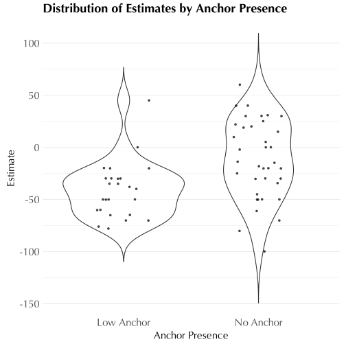

``` r
#bar
summary_anchor_antarctica_data <- anchor_antarctica_data %>%
  group_by(condition) %>%
  mutate(condition = factor(condition, levels = c("Low Anchor", "No Anchor"))) %>%
  summarize(
    mean_choice = mean(choice),
    se_choice = se(choice)
  )


ggplot(summary_anchor_antarctica_data, aes(x = condition, y = mean_choice, fill = condition)) +
  geom_bar(stat = "identity", position = position_dodge()) +
  geom_errorbar(aes(ymin = mean_choice - se_choice, ymax = mean_choice + se_choice), width = 0.2, position = position_dodge(0.9)) +
  labs(title = "Mean Estimates by Anchor Presence", x = "Anchor Presence", y = "Mean Estimate") +
  theme_custom()+
  scale_fill_manual(values = in_and_ex)+
  guides(fill = FALSE)+   scale_x_discrete(labels = function(x) str_wrap(x, width = 14))
```

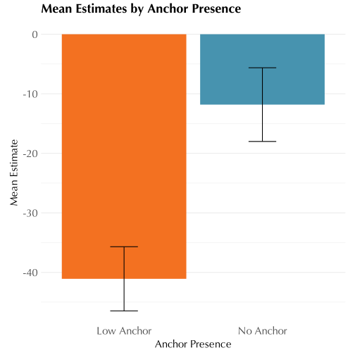

``` r
#analysis

low_anchor <- anchor_antarctica_data %>%
  filter(condition == "Low Anchor") %>%
  pull(choice)

no_anchor <- anchor_antarctica_data %>%
  filter(condition == "No Anchor") %>%
  pull(choice)

t_test_result <- t.test(low_anchor, no_anchor)

print(t_test_result)
```

```
## 
## 	Welch Two Sample t-test
## 
## data:  low_anchor and no_anchor
## t = -3.5648, df = 59.753, p-value = 0.0007237
## alternative hypothesis: true difference in means is not equal to 0
## 95 percent confidence interval:
##  -45.67744 -12.83932
## sample estimates:
## mean of x mean of y 
## -41.08000 -11.82162
```

``` r
#p-value = 0.0007

    ### Whale -----------------------------------------------------------------------
anchor_whale_data <- data %>%
  filter(task_name == "anchoring") %>%
  filter(stimulus != "") %>%
  filter(stimulus == "Whale Length")
  
anchor_whale_data$choice <- as.numeric(anchor_whale_data$choice)

summary_anchor_whale_data <- anchor_whale_data %>%
  group_by(condition) %>%
  summarize(
    mean_choice = mean(choice),
    se_choice = sd(choice)
  )


ggplot(anchor_whale_data, aes(x = condition, y = choice)) +
  geom_violin(trim = FALSE, alpha = 0.5) +
  geom_jitter(width = 0.2, size = 1, alpha = 0.7) +
  labs(title = "Distribution of Estimates by Anchor Presence", x = "Anchor Presence", y = "Estimate") +
  theme_custom()
```

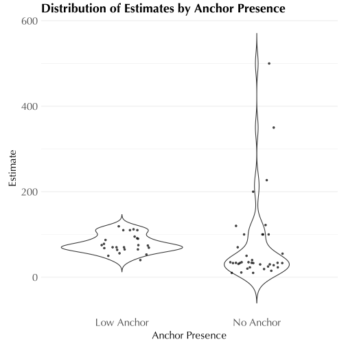

``` r
#analysis

low_anchor <- anchor_whale_data %>%
  filter(condition == "Low Anchor") %>%
  pull(choice)

no_anchor <- anchor_whale_data %>%
  filter(condition == "No Anchor") %>%
  pull(choice)

t_test_result <- t.test(low_anchor, no_anchor, var.equal = FALSE)

print(t_test_result)
```

```
## 
## 	Welch Two Sample t-test
## 
## data:  low_anchor and no_anchor
## t = 0.2597, df = 40.717, p-value = 0.7964
## alternative hypothesis: true difference in means is not equal to 0
## 95 percent confidence interval:
##  -29.86817  38.68114
## sample estimates:
## mean of x mean of y 
##  78.64000  74.23351
```

``` r
#p-value = 0.83

    ## 1.2 introspection -----------------------------------------------------------------------

#did factor included give higher introspection numbers than factor excluded?

summary_anchoring_data <- data %>%
  filter(task_name == "anchoring") %>%
  filter(introspect_rating != "") %>%
  mutate(factor = factor(factor, levels = c("Factor-Included", "Factor-Excluded"))) %>%
  group_by(factor) %>%
  summarize(
    mean_introspect_rating = mean(introspect_rating),
    se_introspect_rating = se(introspect_rating)
  )

ggplot(summary_anchoring_data, aes(x = factor, y = mean_introspect_rating, fill = factor)) +
  geom_bar(stat = "identity") +
  geom_errorbar(aes(ymin = mean_introspect_rating - se_introspect_rating, ymax = mean_introspect_rating + se_introspect_rating), width = 0.2) +
  labs(title = "Anchoring Introspection ratings", x = "Condition", y = "introspection rating") +
  theme_custom()+
  scale_fill_manual(values = in_and_ex)+
  guides(fill = FALSE)+   scale_x_discrete(labels = function(x) str_wrap(x, width = 14))+   scale_y_continuous(limits = c(0, 100))
```

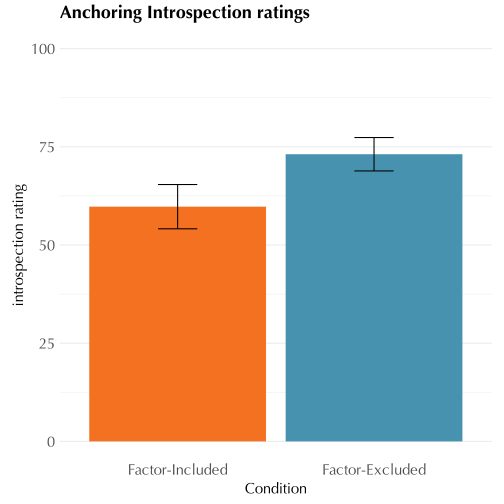

``` r
#"intro_rating(included and lower than mean estimates) 
#> 
#  intro_rating(included and not lower than mean estimates)"

median_antarctica_estimate <- median(anchor_antarctica_data$choice[anchor_antarctica_data$factor == "Factor-Excluded"])

anchoring_subjects <- data %>%
  filter(task_name == "anchoring") %>%
  filter(stimulus == "Antarctic Temperature") %>%
  mutate(choice = as.numeric(choice) ) %>%
  select(subject, factor, choice) %>%
  mutate(less_than_median = ifelse(choice < median_antarctica_estimate, 1, 0)) %>%
  select(subject, less_than_median, factor, choice)

View(anchoring_subjects)

#find subjects who were anchored
subjects_anchored = anchoring_subjects %>%
  group_by(subject) %>%
  filter(less_than_median == 1) %>%
  pull(subject)

# List of all subjects in "Factor-Included"
subjects_included = anchoring_subjects %>%
  filter(factor == "Factor-Included") %>%
  pull(subject) %>%
  unique()

#list of all subjects in "Factor-Excluded"
subjects_excluded = anchoring_subjects %>%
  filter(factor == "Factor-Excluded") %>%
  pull(subject) %>%
  unique()

#list of subjects included and anchored
subjects_included_and_anchored <- intersect(subjects_included, subjects_anchored)


# List of subjects in "Factor-Included" who were not anchored
subjects_included_and_not_anchored = setdiff(subjects_included, subjects_included_and_anchored)


#list of subjects excluded and anchored
subjects_excluded_and_anchored <- intersect(subjects_excluded, subjects_anchored)

#list of subjects excluded and not anchored
subjects_excluded_and_not_anchored = setdiff(subjects_excluded, subjects_excluded_and_anchored)


anchor_data <- data %>%
  filter(task_name == "anchoring") %>%
  filter(any(!is.na(introspect_rating))) %>%
  filter(introspect_rating != "") %>%
  mutate(effect_group = case_when(
    subject %in% subjects_included_and_anchored ~ "Included and Showing Effect",
    subject %in% subjects_included_and_not_anchored ~ "Included and Not Showing Effect",
    subject %in% subjects_excluded_and_anchored ~ "Excluded and Showing Effect",
    subject %in% subjects_excluded_and_not_anchored ~ "Excluded and Not Showing Effect",
      )) %>%
  mutate(effect_group = factor(effect_group, levels = c("Included and Showing Effect", "Included and Not Showing Effect",  "Excluded and Showing Effect", "Excluded and Not Showing Effect")))

##View(anchor_data)

##View(subjects_excluded_and_not_anchored)

summary_anchor_data <- anchor_data %>%
  group_by(effect_group) %>%
  summarize(
    mean_introspect_rating = mean(introspect_rating),
    se_introspect_rating = se(introspect_rating)
  )


ggplot(summary_anchor_data, aes(x = effect_group, y = mean_introspect_rating, fill = effect_group)) +
  geom_bar(stat = "identity") +
  geom_errorbar(aes(ymin = mean_introspect_rating - se_introspect_rating, ymax = mean_introspect_rating + se_introspect_rating), width = 0.2) +
  labs(title = "Anchor Introspection ratings", x = "Condition", y = "introspection rating") +
  theme_custom()+
  scale_fill_manual(values = four_colors) +
  guides(fill = FALSE)+   scale_x_discrete(labels = function(x) str_wrap(x, width = 14))+   scale_y_continuous(limits = c(0, 100))
```

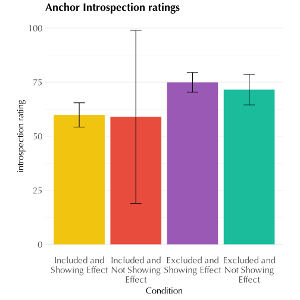

``` r
summary(lm(introspect_rating ~ effect_group, data = anchor_data))
```

```
## 
## Call:
## lm(formula = introspect_rating ~ effect_group, data = anchor_data)
## 
## Residuals:
##     Min      1Q  Median      3Q     Max 
## -67.526 -19.526   4.474  19.474  40.174 
## 
## Coefficients:
##                                             Estimate Std. Error t value Pr(>|t|)    
## (Intercept)                                  59.8261     5.6446  10.599 4.27e-15 ***
## effect_groupIncluded and Not Showing Effect  -0.8261    19.9565  -0.041   0.9671    
## effect_groupExcluded and Showing Effect      15.0563     8.6584   1.739   0.0874 .  
## effect_groupExcluded and Not Showing Effect  11.7002     8.3922   1.394   0.1687    
## ---
## Signif. codes:  0 '***' 0.001 '**' 0.01 '*' 0.05 '.' 0.1 ' ' 1
## 
## Residual standard error: 27.07 on 57 degrees of freedom
## Multiple R-squared:  0.0614,	Adjusted R-squared:  0.012 
## F-statistic: 1.243 on 3 and 57 DF,  p-value: 0.3027
```

``` r
    ## New version ----

anchoring_introspection <- data %>%
  filter(task_name == "anchoring") %>%
  filter(introspect_rating != "")

anchoring_subjects <- data %>%
  group_by(subject) %>%
  left_join(anchoring_introspection %>% select(subject, introspect_rating), by = "subject") %>%
  filter(task_name == "anchoring") %>%
  filter(stimulus == "Antarctic Temperature") %>%
  summarise(
    choice = as.numeric(choice),
    affected = if_else(choice < median_antarctica_estimate, 
                       "Affected by Bias", 
                       "Not Affected by Bias"),
    factor = recode(factor(factor, levels = c("Factor-Included", "Factor-Excluded")), 
                    `Factor-Included` = "Factor Included", 
                    `Factor-Excluded` = "Factor Excluded"),
    introspect_rating = introspect_rating.y,
    condition = factor(condition, levels = c("Factor-Included", "Factor-Excluded")) 
  ) %>%
  filter(!is.na(introspect_rating))

#View(anchoring_subjects)

summary_anchoring <- anchoring_subjects %>%
  group_by(factor, affected) %>%
  summarise(
    mean_introspect_rating = mean(introspect_rating),
    se_introspect_rating = se(introspect_rating),
    n = n()
  )
```

```
## `summarise()` has grouped output by 'factor'. You can override using the `.groups`
## argument.
```

``` r
#View(summary_anchoring)


ggplot(summary_anchoring, aes(x = factor, y = mean_introspect_rating, fill = affected, group = affected)) + 
  theme_custom() +
  geom_bar(stat = "identity", position = position_dodge(0.9)) +
  geom_errorbar(aes(ymin = mean_introspect_rating - se_introspect_rating, ymax = mean_introspect_rating + se_introspect_rating), width = 0.2, position = position_dodge(0.9)) +
  geom_text(aes(label = paste("n =", n), x = stage(factor, after_stat = x - .9 / 2 / 2), y = mean_introspect_rating), 
            hjust = 0, vjust=-0.35, family = "optima", size = 4, position = position_dodge(0.9)) +
  geom_text(aes(label = str_wrap(affected, width = 10), y = 15, color = affected), 
            position = position_dodge(0.9), vjust = 0, family = "optima", size = 5, lineheight = 0.8) +
  labs(title = "Anchoring Introspection", x = "", y = "Introspection Rating") +
  scale_fill_manual(values = effect_no) +
  scale_color_manual(values = c("Affected by Bias" = "white", "Not Affected by Bias" = "black")) +
  scale_x_discrete(labels = function(x) str_wrap(x, width = 14)) +
  guides(fill = FALSE, color = FALSE)+
  scale_y_continuous(limits = c(0, 100))
```

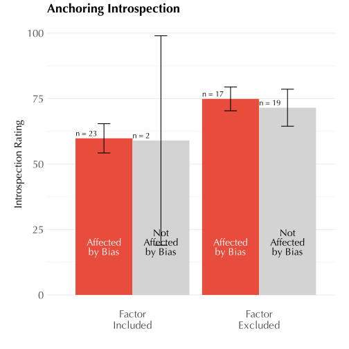

``` r
summary(lm(introspect_rating ~ effect_group, data = reference_data))
```

```
## Error in h(simpleError(msg, call)): error in evaluating the argument 'object' in selecting a method for function 'summary': object 'effect_group' not found
```

``` r
# 2 associative memory effect✅ ----
    ## 2.1 do we see the effect? -----------------------------------------------------------------------

#Did subjects for whom some of the new words were sleep-related 
#more often think they were original words than subjects for whom none of the new words were sleep-related? 

associative_data_only_new <- data %>%
  filter(task_name == "associative memory") %>%
  filter(stimulus!= "") %>% 
  filter(auxiliary_info1 == 'New') %>%
  mutate(false_alarm = ifelse(choice == "Original", 1, 0))

##View(associative_data_only_new)

summary_associative_data_only_new <- associative_data_only_new %>%
  group_by(condition) %>%
  mutate(condition = factor(condition, levels = c("Sleep", "NonSleep"))) %>%
  summarize(
    mean_choice = mean(false_alarm),
    se_choice = se.prop(false_alarm)
  )

ggplot(summary_associative_data_only_new, aes(x = condition, y = mean_choice, fill = condition)) +
  geom_bar(stat = "identity") +
  geom_errorbar(aes(ymin = mean_choice - se_choice, ymax = mean_choice + se_choice), width = 0.2) +
  labs(title = "Associative Effect", x = "Word Relation", y = "False Alarm Rate") +
  theme_custom()+
  scale_fill_manual(values = in_and_ex)+
  guides(fill = FALSE)+   scale_x_discrete(labels = function(x) str_wrap(x, width = 14))
```

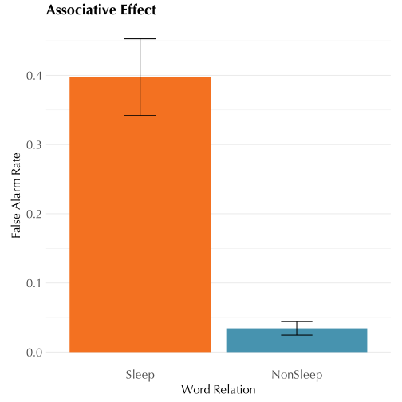

``` r
associative_choices_ex <- associative_data_only_new %>%
  filter(factor == "Factor-Excluded") %>%
  pull(false_alarm)

associative_choices_in <- associative_data_only_new %>%
  filter(factor == "Factor-Included") %>%
  pull(false_alarm)

#analysis -- is there a better way to do this?
prop_ex <- sum(associative_choices_ex) / length(associative_choices_ex)
prop_in <- sum(associative_choices_in) / length(associative_choices_in)

successes <- c(sum(associative_choices_ex), sum(associative_choices_in))
trials <- c(length(associative_choices_ex), length(associative_choices_in))

test_result <- prop.test(successes, trials, alternative = "less")
print(test_result)
```

```
## 
## 	2-sample test for equality of proportions with continuity correction
## 
## data:  successes out of trials
## X-squared = 18.347, df = 1, p-value = 9.207e-06
## alternative hypothesis: less
## 95 percent confidence interval:
##  -1.00000000 -0.07487679
## sample estimates:
##     prop 1     prop 2 
## 0.04489796 0.17582418
```

``` r
    ## 2.2 introspection -----------------------------------------------------------------------

#did factor included give lower introspection numbers than factor excluded?

summary_associative_data <- data %>%
  filter(task_name == "associative memory") %>%
  filter(introspect_rating != "") %>%
  group_by(factor) %>%
  mutate(factor = factor(factor, levels = c("Factor-Included", "Factor-Excluded"))) %>%
  summarize(
    mean_introspect_rating = 100-mean(introspect_rating),
    se_introspect_rating = se(introspect_rating)
  )

ggplot(summary_associative_data, aes(x = factor, y = mean_introspect_rating, fill = factor)) +
  geom_bar(stat = "identity") +
  geom_errorbar(aes(ymin = mean_introspect_rating - se_introspect_rating, ymax = mean_introspect_rating + se_introspect_rating), width = 0.2) +
  labs(title = "Associative Introspection ratings", x = "Condition", y = "introspection rating") +
  theme_custom()+
  scale_fill_manual(values = in_and_ex)+
  guides(fill = FALSE)+   scale_x_discrete(labels = function(x) str_wrap(x, width = 14))+   scale_y_continuous(limits = c(0, 100))
```

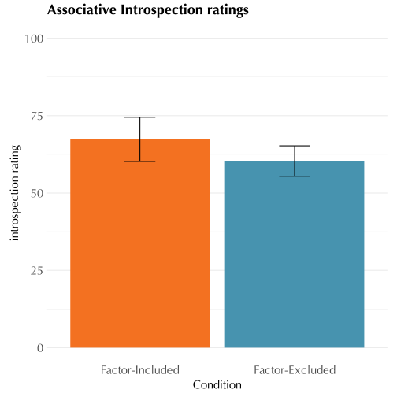

``` r
#"intro_rating(included and more false positives than average)
#<
#  intro_rating(included and not more false positives than average)"


associative_data_by_subject <- associative_data_only_new %>%
  filter(task_name == "associative memory") %>%
  group_by(subject) %>%
  summarize(
    total_false_alarms = sum(false_alarm),
    factor = first(factor)
    )

###View(associative_data_by_subject)

#median false alarms among excluded
median_false_alarm_among_excluded <- median(associative_data_by_subject$total_false_alarms[associative_data_by_subject$factor == "Factor-Excluded"])

#find subjects who had higher than  median_false_alarm_among_excluded
subjects_more_false_alarms = associative_data_by_subject %>%
  group_by(subject) %>%
  summarize(higher = total_false_alarms > median_false_alarm_among_excluded) %>%
  filter(higher) %>%
  pull(subject)

# List of all subjects in "Factor-Included"
all_subjects_included = associative_data_by_subject %>%
  filter(factor == "Factor-Included") %>%
  pull(subject) %>%
  unique()

#list subjects in Factor-Excluded
all_subjects_excluded = associative_data_by_subject %>%
  filter(factor == "Factor-Excluded") %>%
  pull(subject) %>%
  unique()

included_and_high_false_alarms = intersect(all_subjects_included, subjects_more_false_alarms)

included_and_low_false_alarms = setdiff(all_subjects_included, subjects_more_false_alarms)

excluded_and_high_false_alarms = intersect(all_subjects_excluded, subjects_more_false_alarms)

excluded_and_low_false_alarms = setdiff(all_subjects_excluded, subjects_more_false_alarms)


associative_data <- data %>%
  filter(task_name == "associative memory") %>%
  filter(any(!is.na(introspect_rating))) %>%
  filter(introspect_rating != "") %>%
  mutate(effect_group = case_when(
    subject %in% included_and_high_false_alarms ~ "Included and More False Alarms",
    subject %in% included_and_low_false_alarms ~ "Included and Not More False Alarms",
    subject %in% excluded_and_high_false_alarms ~ "Excluded and More False Alarms",
    subject %in% excluded_and_low_false_alarms ~ "Excluded and Not More False Alarms",
  )) %>%
  mutate(effect_group = factor(effect_group, levels = c("Included and More False Alarms", "Included and Not More False Alarms", "Excluded and More False Alarms", "Excluded and Not More False Alarms")))


summary_associative_data <- associative_data %>%
  group_by(effect_group) %>%
  summarize(
    mean_introspect_rating = 100-mean(introspect_rating),
    se_introspect_rating = se(introspect_rating)
  )

##View(associative_data)
##View(summary_associative_data)

ggplot(summary_associative_data, aes(x = effect_group, y = mean_introspect_rating, fill = effect_group)) +
  geom_bar(stat = "identity") +
  geom_errorbar(aes(ymin = mean_introspect_rating - se_introspect_rating, ymax = mean_introspect_rating + se_introspect_rating), width = 0.2) +
  labs(title = "Associative Introspection ratings", x = "Condition", y = "introspection rating") +
  theme_custom()  +
  scale_fill_manual(values = four_colors) +
  guides(fill = FALSE)+   scale_x_discrete(labels = function(x) str_wrap(x, width = 14))+   scale_y_continuous(limits = c(0, 100))
```

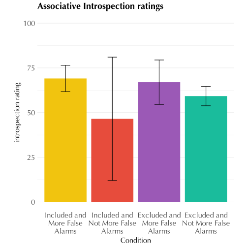

``` r
summary(lm(introspect_rating ~ effect_group, data = associative_data))
```

```
## 
## Call:
## lm(formula = introspect_rating ~ effect_group, data = associative_data)
## 
## Residuals:
##     Min      1Q  Median      3Q     Max 
## -40.767 -26.917  -9.917  19.083  69.083 
## 
## Coefficients:
##                                                Estimate Std. Error t value Pr(>|t|)    
## (Intercept)                                      30.917      6.666   4.638  2.1e-05 ***
## effect_groupIncluded and Not More False Alarms   22.583     24.034   0.940    0.351    
## effect_groupExcluded and More False Alarms        2.083     16.054   0.130    0.897    
## effect_groupExcluded and Not More False Alarms    9.850      8.943   1.101    0.275    
## ---
## Signif. codes:  0 '***' 0.001 '**' 0.01 '*' 0.05 '.' 0.1 ' ' 1
## 
## Residual standard error: 32.66 on 57 degrees of freedom
## Multiple R-squared:  0.0308,	Adjusted R-squared:  -0.02021 
## F-statistic: 0.6038 on 3 and 57 DF,  p-value: 0.6152
```

``` r
    ## New version ----

associative_introspection <- data %>%
  filter(task_name == "associative memory") %>%
  filter(introspect_rating != "")

associative_data_by_subject <- associative_data_only_new %>%
  filter(task_name == "associative memory") %>%
  group_by(subject) %>%
  summarize(
    total_false_alarms = sum(false_alarm),
    factor = first(factor)
  )


#median false alarms among excluded
median_false_alarm_among_excluded <- median(associative_data_by_subject$total_false_alarms[associative_data_by_subject$factor == "Factor-Excluded"])


View(associative)

associative <- associative_data_by_subject %>%
  group_by(subject) %>%
  left_join(associative_introspection %>% select(subject, introspect_rating), by = "subject") %>%
  summarise(
    total_false_alarms = total_false_alarms,
    affected = if_else(total_false_alarms > median_false_alarm_among_excluded, 
                       "Affected by Bias", 
                       "Not Affected by Bias"),
    factor = recode(factor(factor, levels = c("Factor-Included", "Factor-Excluded")), 
                    `Factor-Included` = "Factor Included", 
                    `Factor-Excluded` = "Factor Excluded"),
    introspect_rating = introspect_rating  ) %>%
  filter(!is.na(introspect_rating))

#View(anchoring_subjects)

summary_associative <- associative %>%
  group_by(factor, affected) %>%
  summarise(
    mean_introspect_rating = 100-mean(introspect_rating),
    se_introspect_rating = se(introspect_rating),
    n = n()
  )
```

```
## `summarise()` has grouped output by 'factor'. You can override using the `.groups`
## argument.
```

``` r
#View(summary_anchoring)


ggplot(summary_associative, aes(x = factor, y = mean_introspect_rating, fill = affected, group = affected)) + 
  theme_custom() +
  geom_bar(stat = "identity", position = position_dodge(0.9)) +
  geom_errorbar(aes(ymin = mean_introspect_rating - se_introspect_rating, ymax = mean_introspect_rating + se_introspect_rating), width = 0.2, position = position_dodge(0.9)) +
  geom_text(aes(label = paste("n =", n), x = stage(factor, after_stat = x - .9 / 2 / 2), y = mean_introspect_rating), 
            hjust = 0, vjust=-0.35, family = "optima", size = 4, position = position_dodge(0.9)) +
  geom_text(aes(label = str_wrap(affected, width = 10), y = 15, color = affected), 
            position = position_dodge(0.9), vjust = 0, family = "optima", size = 5, lineheight = 0.8) +
  labs(title = "Associative Introspection", x = "", y = "Introspection Rating") +
  scale_fill_manual(values = effect_no) +
  scale_color_manual(values = c("Affected by Bias" = "white", "Not Affected by Bias" = "black")) +
  scale_x_discrete(labels = function(x) str_wrap(x, width = 14)) +
  guides(fill = FALSE, color = FALSE)+
  scale_y_continuous(limits = c(0, 100))
```

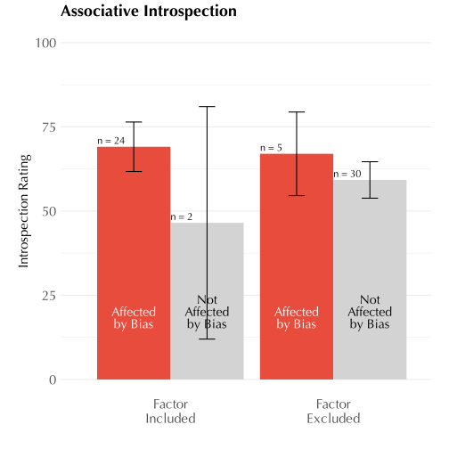

``` r
summary(lm(introspect_rating ~ effect_group, data = reference_data))
```

```
## Error in h(simpleError(msg, call)): error in evaluating the argument 'object' in selecting a method for function 'summary': object 'effect_group' not found
```

``` r
# 3 availability effect✅  -----------------------------------------------------------------------

    ##3.1 do we see the effect ----

#Did subjects for whom the first list contained famous men say it contained 
#more men more often than subjects for whom the first list contained less famous men? 


availability_data = data %>%
  filter(task_name == "availability") %>%
  mutate(choice_binary = as.numeric(choice == "List 1"))


summary_availability_data <- availability_data %>%
  group_by(factor) %>%
  mutate(factor = factor(factor, levels = c("Factor-Included", "Factor-Excluded"))) %>%
  summarize(
    mean_choice = mean(choice_binary),
    se_choice = se.prop(choice_binary)
  )

#View(summary_availability_data)


ggplot(summary_availability_data, aes(x = factor, y = mean_choice, fill = factor)) +
  geom_bar(stat = "identity") +
  geom_errorbar(aes(ymin = mean_choice - se_choice, ymax = mean_choice + se_choice), width = 0.2) +
  labs(title = "Availability Effect", x = "Factor", y = "Percent chance of being engineer") +
  theme_custom()+
  scale_fill_manual(values = in_and_ex)+
  guides(fill = FALSE)+   scale_x_discrete(labels = function(x) str_wrap(x, width = 14))
```

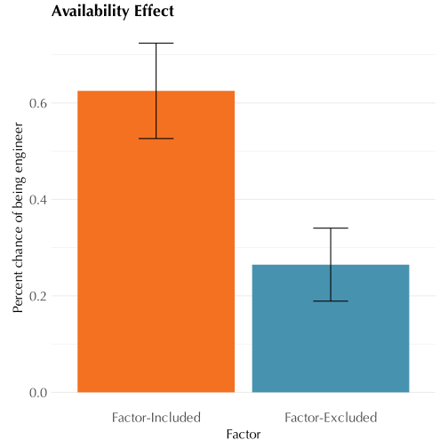

``` r
#analysis

list_one_ex = availability_data %>%
  filter(factor == "Factor-Excluded") %>%
  pull(choice_binary)

list_one_in = availability_data %>%
  filter(factor == "Factor-Included") %>%
  pull(choice_binary)

prop_ex <- sum(list_one_ex) / length(list_one_ex)
prop_in <- sum(list_one_in) / length(list_one_in)

successes <- c(sum(list_one_ex), sum(list_one_in))
trials <- c(length(list_one_ex), length(list_one_in))

test_result <- prop.test(successes, trials, alternative = "less")

print(test_result)
```

```
## 
## 	2-sample test for equality of proportions with continuity correction
## 
## data:  successes out of trials
## X-squared = 6.117, df = 1, p-value = 0.006694
## alternative hypothesis: less
## 95 percent confidence interval:
##  -1.0000000 -0.1200368
## sample estimates:
##    prop 1    prop 2 
## 0.2647059 0.6250000
```

``` r
#p-value = 0.004

    ## 3.2 introspection  -----------------------------------------------------------------------

#did factor included give lower introspection numbers than factor excluded?

summary_availability_data <- availability_data %>%
  group_by(factor) %>%
  mutate(introspect_rating = as.numeric(introspect_rating)) %>%
  mutate(factor = factor(factor, levels = c("Factor-Included", "Factor-Excluded"))) %>%
  summarize(
    mean_introspect_rating = 100-mean(introspect_rating),
    se_introspect_rating = se(introspect_rating)
  )

ggplot(summary_availability_data, aes(x = factor, y = mean_introspect_rating, fill = factor)) +
  geom_bar(stat = "identity") +
  geom_errorbar(aes(ymin = mean_introspect_rating - se_introspect_rating, ymax = mean_introspect_rating + se_introspect_rating), width = 0.2) +
  labs(title = "Availability Introspection ratings", x = "Condition", y = "introspection rating") +
  theme_custom()+
  scale_fill_manual(values = in_and_ex)+
  guides(fill = FALSE)+   scale_x_discrete(labels = function(x) str_wrap(x, width = 14))+   scale_y_continuous(limits = c(0, 100))
```

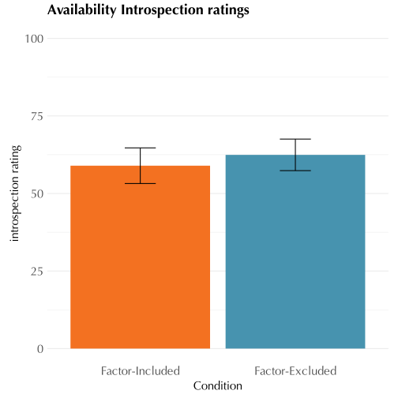

``` r
t.test(introspect_rating ~ factor, data = availability_data)
```

```
## 
## 	Welch Two Sample t-test
## 
## data:  introspect_rating by factor
## t = -0.45398, df = 51.226, p-value = 0.6518
## alternative hypothesis: true difference in means between group Factor-Excluded and group Factor-Included is not equal to 0
## 95 percent confidence interval:
##  -18.88292  11.91723
## sample estimates:
## mean in group Factor-Excluded mean in group Factor-Included 
##                      37.55882                      41.04167
```

``` r
#"intro_rating(included and said first list contained more famous men)
#<
#  intro_rating(included and not said first list contained more famous men)
#"

availability_data <- availability_data %>%
  mutate(effect_group = case_when(
    choice == "List 1" & factor == "Factor-Included" ~ "Included and List 1",
    choice == "List 2" & factor == "Factor-Included" ~ "Included and List 2",
    choice == "List 1" & factor == "Factor-Excluded" ~ "Excluded and List 1",
    choice == "List 2" & factor == "Factor-Excluded" ~ "Excluded and List 2"
  ))%>%
  mutate(effect_group = factor(effect_group, levels = c("Included and List 1", "Included and List 2", "Excluded and List 1", "Excluded and List 2")))


summary_availability_data <- availability_data %>%
  group_by(effect_group) %>%
  summarize(
    mean_introspect_rating = 100-mean(introspect_rating),
    se_introspect_rating = se(introspect_rating)
  )

ggplot(summary_availability_data, aes(x = effect_group, y = mean_introspect_rating, fill = effect_group)) +
  geom_bar(stat = "identity") +
  geom_errorbar(aes(ymin = mean_introspect_rating - se_introspect_rating, ymax = mean_introspect_rating + se_introspect_rating), width = 0.2) +
  labs(title = "Availability Introspection Ratings", x = "Condition", y = "introspection rating") +
  theme_custom() +
  scale_fill_manual(values = four_colors) +
  guides(fill = FALSE)+   scale_x_discrete(labels = function(x) str_wrap(x, width = 14))+   scale_y_continuous(limits = c(0, 100))
```

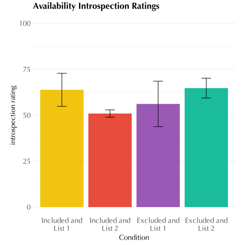

``` r
summary(lm(introspect_rating ~ effect_group, data = availability_data))
```

```
## 
## Call:
## lm(formula = introspect_rating ~ effect_group, data = availability_data)
## 
## Residuals:
##     Min      1Q  Median      3Q     Max 
## -43.889 -23.260   0.889  14.490  62.720 
## 
## Coefficients:
##                                 Estimate Std. Error t value Pr(>|t|)    
## (Intercept)                       36.200      7.519   4.815 1.23e-05 ***
## effect_groupIncluded and List 2   12.911     12.278   1.052    0.298    
## effect_groupExcluded and List 1    7.689     12.278   0.626    0.534    
## effect_groupExcluded and List 2   -0.920      9.511  -0.097    0.923    
## ---
## Signif. codes:  0 '***' 0.001 '**' 0.01 '*' 0.05 '.' 0.1 ' ' 1
## 
## Residual standard error: 29.12 on 54 degrees of freedom
## Multiple R-squared:  0.03374,	Adjusted R-squared:  -0.01994 
## F-statistic: 0.6285 on 3 and 54 DF,  p-value: 0.5998
```

``` r
    ## New version ----


availability_subjects <- availability_data %>%
  group_by(subject) %>%
  summarise(
    choice = choice,
    affected = if_else(choice == "List 1", 
                       "Affected by Bias", 
                       "Not Affected by Bias"),
    factor = recode(factor(factor, levels = c("Factor-Included", "Factor-Excluded")), 
                    `Factor-Included` = "Factor Included", 
                    `Factor-Excluded` = "Factor Excluded"),
    introspect_rating = introspect_rating,
    condition = factor(condition, levels = c("Factor-Included", "Factor-Excluded")) 
  ) %>%
  filter(!is.na(introspect_rating))

View(availability_subjects)

summary_availability <- availability_subjects %>%
  group_by(factor, affected) %>%
  summarise(
    mean_introspect_rating = 100-mean(introspect_rating),
    se_introspect_rating = se(introspect_rating),
    n = n()
  )
```

```
## `summarise()` has grouped output by 'factor'. You can override using the `.groups`
## argument.
```

``` r
#View(summary_anchoring)


ggplot(summary_availability, aes(x = factor, y = mean_introspect_rating, fill = affected, group = affected)) + 
  theme_custom() +
  geom_bar(stat = "identity", position = position_dodge(0.9)) +
  geom_errorbar(aes(ymin = mean_introspect_rating - se_introspect_rating, ymax = mean_introspect_rating + se_introspect_rating), width = 0.2, position = position_dodge(0.9)) +
  geom_text(aes(label = paste("n =", n), x = stage(factor, after_stat = x - .9 / 2 / 2), y = mean_introspect_rating), 
            hjust = 0, vjust=-0.35, family = "optima", size = 4, position = position_dodge(0.9)) +
  geom_text(aes(label = str_wrap(affected, width = 10), y = 15, color = affected), 
            position = position_dodge(0.9), vjust = 0, family = "optima", size = 5, lineheight = 0.8) +
  labs(title = "Availability Introspection", x = "", y = "Introspection Rating") +
  scale_fill_manual(values = effect_no) +
  scale_color_manual(values = c("Affected by Bias" = "white", "Not Affected by Bias" = "black")) +
  scale_x_discrete(labels = function(x) str_wrap(x, width = 14)) +
  guides(fill = FALSE, color = FALSE) +
  scale_y_continuous(limits = c(0, 100))
```

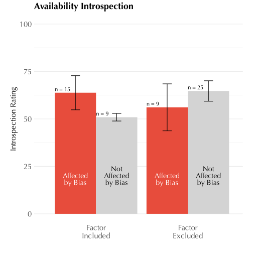

``` r
summary(lm(introspect_rating ~ effect_group, data = availability_data))
```

```
## 
## Call:
## lm(formula = introspect_rating ~ effect_group, data = availability_data)
## 
## Residuals:
##     Min      1Q  Median      3Q     Max 
## -43.889 -23.260   0.889  14.490  62.720 
## 
## Coefficients:
##                                 Estimate Std. Error t value Pr(>|t|)    
## (Intercept)                       36.200      7.519   4.815 1.23e-05 ***
## effect_groupIncluded and List 2   12.911     12.278   1.052    0.298    
## effect_groupExcluded and List 1    7.689     12.278   0.626    0.534    
## effect_groupExcluded and List 2   -0.920      9.511  -0.097    0.923    
## ---
## Signif. codes:  0 '***' 0.001 '**' 0.01 '*' 0.05 '.' 0.1 ' ' 1
## 
## Residual standard error: 29.12 on 54 degrees of freedom
## Multiple R-squared:  0.03374,	Adjusted R-squared:  -0.01994 
## F-statistic: 0.6285 on 3 and 54 DF,  p-value: 0.5998
```

``` r
# 4. Belief effect✅  ----

    ## 4.1 do we see the effect? -----------------------------------------------------------------------

#Were subjects who saw the plausible version more likely to say the argument was sound?


belief_data <- data %>%
  filter(task_name == "belief") %>%
  filter(!str_detect(stimulus, "Practice")) %>%
  filter(stimulus != "") %>%
  mutate(choice_binary = as.numeric(choice == "Yes"))

summary_belief_data <- belief_data %>%
  group_by(condition) %>%
  mutate(condition = factor(condition, levels = c("Unbelievable", "Believable"))) %>%
  summarize(
    mean_choice = mean(choice_binary),
    se_choice = se.prop(choice_binary)
  )
ggplot(summary_belief_data, aes(x = condition, y = mean_choice, fill = condition)) +
  geom_bar(stat = "identity") +
  geom_errorbar(aes(ymin = mean_choice - se_choice, ymax = mean_choice + se_choice), width = 0.2) +
  labs(title = "Belief Effect", x = "Condition", y = "Percent saying acceptible") +
  theme_custom()+
  scale_fill_manual(values = in_and_ex)+
  guides(fill = FALSE)+   scale_x_discrete(labels = function(x) str_wrap(x, width = 14))
```

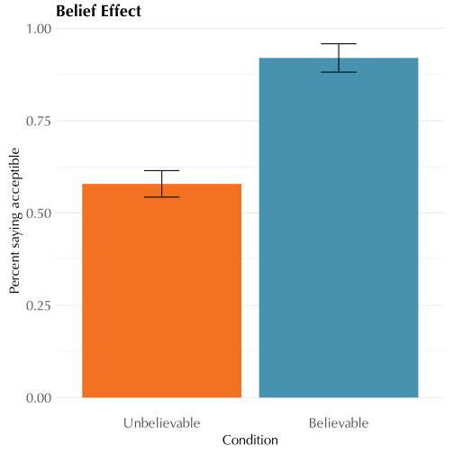

``` r
belief_choices_ex <- belief_data %>%
  filter(factor == "Factor-Excluded") %>%
  pull(choice_binary)

belief_choices_in <- belief_data %>%
  filter(factor == "Factor-Included") %>%
  pull(choice_binary)

#analysis -- is there a better way to do this?
prop_ex <- sum(belief_choices_ex) / length(belief_choices_ex)
prop_in <- sum(belief_choices_in) / length(belief_choices_in)

successes <- c(sum(belief_choices_ex), sum(belief_choices_in))
trials <- c(length(belief_choices_ex), length(belief_choices_in))

test_result <- prop.test(successes, trials, alternative = "less")
print(test_result)
```

```
## 
## 	2-sample test for equality of proportions with continuity correction
## 
## data:  successes out of trials
## X-squared = 6.8006, df = 1, p-value = 0.004556
## alternative hypothesis: less
## 95 percent confidence interval:
##  -1.0000000 -0.0639384
## sample estimates:
##    prop 1    prop 2 
## 0.5785714 0.7500000
```

``` r
    ## 4.2 introspection ----

#Did factor included give higher introspection numbers than factor excluded?

summary_belief_data <- data %>%
  filter(task_name == "belief") %>%
  filter(introspect_rating != "") %>%
  mutate(factor = factor(factor, levels = c("Factor-Included", "Factor-Excluded"))) %>%
  
  group_by(factor) %>%
  summarize(
    mean_introspect_rating = mean(introspect_rating),
    se_introspect_rating = se(introspect_rating)
  )

ggplot(summary_belief_data, aes(x = factor, y = mean_introspect_rating, fill = factor)) +
  geom_bar(stat = "identity") +
  geom_errorbar(aes(ymin = mean_introspect_rating - se_introspect_rating, ymax = mean_introspect_rating + se_introspect_rating), width = 0.2) +
  labs(title = "Belief Introspection ratings", x = "Condition", y = "introspection rating") +
  theme_custom()+
  scale_fill_manual(values = in_and_ex)+
  guides(fill = FALSE)+   scale_x_discrete(labels = function(x) str_wrap(x, width = 14))+   scale_y_continuous(limits = c(0, 100))
```

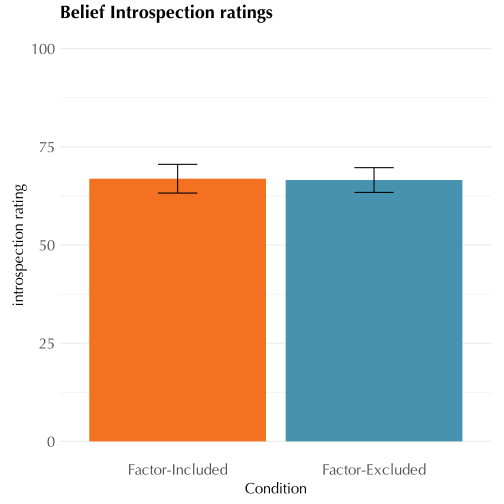

``` r
#"intro_rating(included and more "acceptable"s than average)
#>
#intro_rating(included and not more "acceptable"s than average)"

belief_data <- data %>%
  filter(task_name == "belief") %>%
  filter(stimulus != "") %>%
  mutate(choice = as.numeric(choice))
```

```
## Warning: There was 1 warning in `mutate()`.
## ℹ In argument: `choice = as.numeric(choice)`.
## Caused by warning:
## ! NAs introduced by coercion
```

``` r
##View(belief_data_by_subject)

belief_data_by_subject <- data %>%
  filter(task_name == "belief") %>%
  group_by(subject) %>%
  filter(any(!is.na(introspect_rating))) %>%
  summarize(
    number_total_yes = sum(choice == "Yes"),
    factor = first(factor),
    introspect_rating = first(introspect_rating[!is.na(introspect_rating)])
  )

#median total_yes among excluded
median_total_yes_among_excluded <- median(belief_data_by_subject$number_total_yes[belief_data_by_subject$factor == "Factor-Excluded"])

subjects_more_acceptable = belief_data_by_subject %>%
  group_by(subject) %>%
  summarize(higher = number_total_yes > median_total_yes_among_excluded) %>%
  filter(higher) %>%
  pull(subject)

# List of all subjects in "Factor-Included"
all_subjects_included = belief_data_by_subject %>%
  filter(factor == "Factor-Included") %>%
  pull(subject) %>%
  unique()

# List of all subjects in "Factor-Excluded"
all_subjects_excluded = belief_data_by_subject %>%
  filter(factor == "Factor-Excluded") %>%
  pull(subject) %>%
  unique()

subjects_included_and_more_acceptable = intersect(all_subjects_included, subjects_more_acceptable)

subjects_included_and_less_acceptable = setdiff(all_subjects_included, subjects_more_acceptable)

subjects_excluded_and_more_acceptable = intersect(all_subjects_excluded, subjects_more_acceptable)

subjects_excluded_and_less_acceptable = setdiff(all_subjects_excluded, subjects_more_acceptable)

belief_data <- data %>%
  filter(task_name == "belief") %>%
  filter(any(!is.na(introspect_rating))) %>%
  filter(stimulus == "") %>%
  mutate(effect_group = case_when(
    subject %in% subjects_included_and_more_acceptable ~ "Included and More Acceptable",
    subject %in% subjects_included_and_less_acceptable ~ "Included and Less Acceptable",
    subject %in% subjects_excluded_and_more_acceptable ~ "Excluded and More Acceptable",
    subject %in% subjects_excluded_and_less_acceptable ~ "Excluded and Less Acceptable",
      )) %>%
  mutate(effect_group = factor(effect_group, levels = c("Included and More Acceptable", "Included and Less Acceptable", "Excluded and More Acceptable", "Excluded and Less Acceptable")))


#View(belief_data)

summary_belief_data <- belief_data %>%
  group_by(effect_group) %>%
  summarize(
    mean_introspect_rating = mean(introspect_rating),
    se_introspect_rating = se(introspect_rating)
  )

ggplot(summary_belief_data, aes(x = effect_group, y = mean_introspect_rating, fill = effect_group)) +
  geom_bar(stat = "identity") +
  geom_errorbar(aes(ymin = mean_introspect_rating - se_introspect_rating, ymax = mean_introspect_rating + se_introspect_rating), width = 0.2) +
  labs(title = "Belief Introspection ratings", x = "Condition", y = "introspection rating") +
  theme_custom()+
  scale_fill_manual(values = four_colors) +
  guides(fill = FALSE)+   scale_x_discrete(labels = function(x) str_wrap(x, width = 14))+   scale_y_continuous(limits = c(0, 100))
```


``` r
summary(lm(introspect_rating ~ effect_group, data = belief))
```

```
## Error in h(simpleError(msg, call)): error in evaluating the argument 'object' in selecting a method for function 'summary': object 'belief' not found
```

``` r
    ## New version ----

belief_data_to_calculate_median <- data %>%
  filter(task_name == "belief") %>%
  group_by(subject) %>%
  filter(any(!is.na(introspect_rating))) %>%
  summarize(
    number_total_yes = sum(choice == "Yes"),
    factor = first(factor),
    introspect_rating = first(introspect_rating[!is.na(introspect_rating)])
  )

#median total_yes among excluded
median_total_yes_among_excluded <- median(belief_data_to_calculate_median$number_total_yes[belief_data_by_subject$factor == "Factor-Excluded"])


belief_data_to_calculate_median <- data %>%
  filter(task_name == "belief") %>%
  group_by(subject) %>%
  filter(any(!is.na(introspect_rating))) %>%
  summarize(
    number_total_yes = sum(choice == "Yes"),
    factor = first(factor),
    introspect_rating = first(introspect_rating[!is.na(introspect_rating)])
  )

median_total_yes_among_excluded <- median(belief_data_to_calculate_median$number_total_yes[belief_data_to_calculate_median$factor == "Factor-Excluded"])


belief_data_by_subject <- data %>%
  filter(task_name == "belief") %>%
  group_by(subject) %>%
  filter(any(!is.na(introspect_rating))) %>%
  summarize(
    number_total_yes = sum(choice == "Yes"),
    factor = recode(factor(first(factor), levels = c("Factor-Included", "Factor-Excluded")), 
                    `Factor-Included` = "Factor Included", 
                    `Factor-Excluded` = "Factor Excluded"),
    introspect_rating = first(introspect_rating[!is.na(introspect_rating)]),
    affected = if_else(number_total_yes > median_total_yes_among_excluded, 
                       "Affected by Bias", 
                       "Not Affected by Bias"),
  )%>%
  filter(!is.na(introspect_rating))

View(belief_data_by_subject)

summary_belief <- belief_data_by_subject %>%
  group_by(factor, affected) %>%
  summarise(
    mean_introspect_rating = mean(introspect_rating),
    se_introspect_rating = se(introspect_rating),
    n = n()
  )
```

```
## `summarise()` has grouped output by 'factor'. You can override using the `.groups`
## argument.
```

``` r
#View(summary_anchoring)

ggplot(summary_belief, aes(x = factor, y = mean_introspect_rating, fill = affected, group = affected)) + 
  theme_custom() +
  geom_bar(stat = "identity", position = position_dodge(0.9)) +
  geom_errorbar(aes(ymin = mean_introspect_rating - se_introspect_rating, ymax = mean_introspect_rating + se_introspect_rating), width = 0.2, position = position_dodge(0.9)) +
  geom_text(aes(label = paste("n =", n), x = stage(factor, after_stat = x - .9 / 2 / 2), y = mean_introspect_rating), 
            hjust = 0, vjust=-0.35, family = "optima", size = 4, position = position_dodge(0.9)) +
  geom_text(aes(label = str_wrap(affected, width = 10), y = 15, color = affected), 
            position = position_dodge(0.9), vjust = 0, family = "optima", size = 5, lineheight = 0.8) +
  labs(title = "Belief Bias Introspection", x = "", y = "Introspection Rating") +
  scale_fill_manual(values = effect_no) +
  scale_color_manual(values = c("Affected by Bias" = "white", "Not Affected by Bias" = "black")) +
  scale_x_discrete(labels = function(x) str_wrap(x, width = 14)) +
  guides(fill = FALSE, color = FALSE)+
  scale_y_continuous(limits = c(0, 100))
```


``` r
summary(lm(introspect_rating ~ effect_group, data = belief_data))
```

```
## 
## Call:
## lm(formula = introspect_rating ~ effect_group, data = belief_data)
## 
## Residuals:
##     Min      1Q  Median      3Q     Max 
## -34.824 -15.824  -3.999  13.426  36.583 
## 
## Coefficients:
##                                          Estimate Std. Error t value Pr(>|t|)    
## (Intercept)                                65.824      4.536  14.511   <2e-16 ***
## effect_groupIncluded and Less Acceptable    3.301      8.019   0.412    0.682    
## effect_groupExcluded and More Acceptable   -2.407      7.051  -0.341    0.734    
## effect_groupExcluded and Less Acceptable    2.350      5.982   0.393    0.696    
## ---
## Signif. codes:  0 '***' 0.001 '**' 0.01 '*' 0.05 '.' 0.1 ' ' 1
## 
## Residual standard error: 18.7 on 56 degrees of freedom
## Multiple R-squared:  0.01208,	Adjusted R-squared:  -0.04085 
## F-statistic: 0.2282 on 3 and 56 DF,  p-value: 0.8764
```

``` r
# 5. causal inference✅  ----
    ## 5.1 do we see the effect? ----

#Did subjects who saw only one green ball 
#think it was more casual than subjects who saw many green balls?

causal_data <- data %>%
  filter(task_name == "causal inference") %>%
  mutate(choice = as.numeric(choice))

summary_causal_data <- causal_data %>%
  group_by(condition) %>%
  mutate(condition = factor(condition, levels = c("One", "Nine"))) %>%
  summarize(
    mean_choice = mean(choice),
    se_choice = se(choice)
  )

ggplot(summary_causal_data, aes(x = condition, y = mean_choice, fill = condition)) +
  geom_bar(stat = "identity") +
  geom_errorbar(aes(ymin = mean_choice - se_choice, ymax = mean_choice + se_choice), width = 0.2) +
  labs(title = "Causal Inference", x = "Condition", y = "Causality") +
  theme_custom()+
  scale_fill_manual(values = in_and_ex)+
  guides(fill = FALSE)+   scale_x_discrete(labels = function(x) str_wrap(x, width = 14))
```

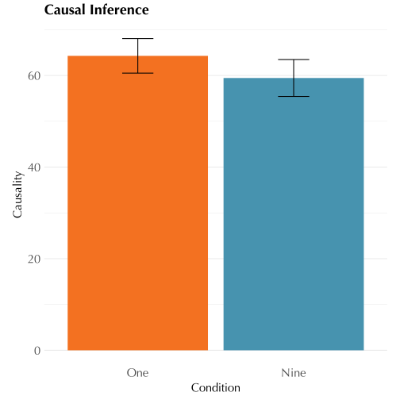

``` r
t.test(choice ~ factor, data = causal_data)
```

```
## 
## 	Welch Two Sample t-test
## 
## data:  choice by factor
## t = -0.8761, df = 58.125, p-value = 0.3846
## alternative hypothesis: true difference in means between group Factor-Excluded and group Factor-Included is not equal to 0
## 95 percent confidence interval:
##  -15.883375   6.212264
## sample estimates:
## mean in group Factor-Excluded mean in group Factor-Included 
##                      59.44444                      64.28000
```

``` r
    ## 5.2 introspection----

#Did factor included give higher introspection numbers than factor excluded?

summary_causal_data <- causal_data %>%
  group_by(factor) %>%
  mutate(factor = factor(factor, levels = c("Factor-Included", "Factor-Excluded"))) %>%
  summarize(
    mean_introspect_rating = mean(introspect_rating),
    se_introspect_rating = se(introspect_rating)
  )

ggplot(summary_causal_data, aes(x = factor, y = mean_introspect_rating, fill = factor)) +
  geom_bar(stat = "identity") +
  geom_errorbar(aes(ymin = mean_introspect_rating - se_introspect_rating, ymax = mean_introspect_rating + se_introspect_rating), width = 0.2) +
  labs(title = "Causal Inference Introspection ratings", x = "Condition", y = "introspection rating") +
  theme_custom()+
  scale_fill_manual(values = in_and_ex)+
  guides(fill = FALSE)+   scale_x_discrete(labels = function(x) str_wrap(x, width = 14))+   scale_y_continuous(limits = c(0, 100))
```

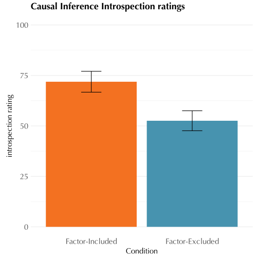

``` r
t.test(introspect_rating ~ factor, data = causal_data)
```

```
## 
## 	Welch Two Sample t-test
## 
## data:  introspect_rating by factor
## t = -2.6994, df = 55.884, p-value = 0.009172
## alternative hypothesis: true difference in means between group Factor-Excluded and group Factor-Included is not equal to 0
## 95 percent confidence interval:
##  -33.665750  -4.983139
## sample estimates:
## mean in group Factor-Excluded mean in group Factor-Included 
##                      52.55556                      71.88000
```

``` r
#p-value = 0.01214

#"intro_rating(included and higher than median causality rating)
#>
#  intro_rating(included and not higher than median causality rating)"

#median causality rating

median_causality_rating <- median(causal_data$choice[causal_data$factor == "Factor-Excluded"])

causal_data <- causal_data %>%
  mutate(effect_group = case_when(
    choice > median_causality_rating & factor == "Factor-Included" ~ "Included and Higher Causality Than Median",
    choice <= median_causality_rating & factor == "Factor-Included" ~ "Included and Not Higher Causality Than Median",
    choice > median_causality_rating & factor == "Factor-Excluded" ~ "Excluded and Higher Causality Than Median",
    choice <= median_causality_rating & factor == "Factor-Excluded" ~ "Excluded and Not Higher Causality Than Median"
  ))%>%
  mutate(effect_group = factor(effect_group, levels = c("Included and Higher Causality Than Median", "Included and Not Higher Causality Than Median", "Excluded and Higher Causality Than Median", "Excluded and Not Higher Causality Than Median")))

summary_causal_data <- causal_data %>%
  group_by(effect_group) %>%
  summarize(
    mean_introspect_rating = mean(introspect_rating),
    se_introspect_rating = se(introspect_rating)
  )

ggplot(summary_causal_data, aes(x = effect_group, y = mean_introspect_rating, fill = effect_group)) +
  geom_bar(stat = "identity") +
  geom_errorbar(aes(ymin = mean_introspect_rating - se_introspect_rating, ymax = mean_introspect_rating + se_introspect_rating), width = 0.2) +
  labs(title = "Causal Introspection ratings", x = "Condition", y = "introspection rating") +
  theme_custom()  +
  scale_fill_manual(values = four_colors) +
  guides(fill = FALSE)+   scale_x_discrete(labels = function(x) str_wrap(x, width = 14))+   scale_y_continuous(limits = c(0, 100))
```

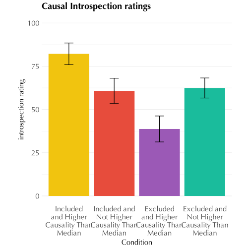

``` r
summary(lm(introspect_rating ~ effect_group, data = causal_data))
```

```
## 
## Call:
## lm(formula = introspect_rating ~ effect_group, data = causal_data)
## 
## Residuals:
##     Min      1Q  Median      3Q     Max 
## -62.429 -12.429  -2.429  17.846  52.267 
## 
## Coefficients:
##                                                           Estimate Std. Error t value Pr(>|t|)    
## (Intercept)                                                 82.154      7.266  11.307 3.44e-16 ***
## effect_groupIncluded and Not Higher Causality Than Median  -21.404     10.487  -2.041   0.0459 *  
## effect_groupExcluded and Higher Causality Than Median      -43.421      9.927  -4.374 5.25e-05 ***
## effect_groupExcluded and Not Higher Causality Than Median  -19.725      9.245  -2.134   0.0372 *  
## ---
## Signif. codes:  0 '***' 0.001 '**' 0.01 '*' 0.05 '.' 0.1 ' ' 1
## 
## Residual standard error: 26.2 on 57 degrees of freedom
## Multiple R-squared:  0.2535,	Adjusted R-squared:  0.2142 
## F-statistic: 6.451 on 3 and 57 DF,  p-value: 0.0007758
```

``` r
    ## New version ----

median_causality_rating <- median(causal_data$choice[causal_data$factor == "Factor-Excluded"])

causal_data_by_subject <- data %>%
  filter(task_name == "causal inference") %>%
  group_by(subject) %>%
  filter(any(!is.na(introspect_rating))) %>%
  summarize(
    choice = as.numeric(choice),
    factor = recode(factor(first(factor), levels = c("Factor-Included", "Factor-Excluded")), 
                    `Factor-Included` = "Factor Included", 
                    `Factor-Excluded` = "Factor Excluded"),
    introspect_rating = introspect_rating,
    affected = if_else(choice > median_causality_rating, 
                       "Affected by Bias", 
                       "Not Affected by Bias"),
  )%>%
  filter(!is.na(introspect_rating))

View(causal_data_by_subject)

summary_causal <- causal_data_by_subject %>%
  group_by(factor, affected) %>%
  summarise(
    mean_introspect_rating = mean(introspect_rating),
    se_introspect_rating = se(introspect_rating),
    n = n()
  )
```

```
## `summarise()` has grouped output by 'factor'. You can override using the `.groups`
## argument.
```

``` r
#View(summary_causal)

ggplot(summary_causal, aes(x = factor, y = mean_introspect_rating, fill = affected, group = affected)) + 
  theme_custom() +
  geom_bar(stat = "identity", position = position_dodge(0.9)) +
  geom_errorbar(aes(ymin = mean_introspect_rating - se_introspect_rating, ymax = mean_introspect_rating + se_introspect_rating), width = 0.2, position = position_dodge(0.9)) +
  geom_text(aes(label = paste("n =", n), x = stage(factor, after_stat = x - .9 / 2 / 2), y = mean_introspect_rating), 
            hjust = 0, vjust=-0.35, family = "optima", size = 4, position = position_dodge(0.9)) +
  geom_text(aes(label = str_wrap(affected, width = 10), y = 15, color = affected), 
            position = position_dodge(0.9), vjust = 0, family = "optima", size = 5, lineheight = 0.8) +
  labs(title = "Causal Inference Introspection", x = "", y = "Introspection Rating") +
  scale_fill_manual(values = effect_no) +
  scale_color_manual(values = c("Affected by Bias" = "white", "Not Affected by Bias" = "black")) +
  scale_x_discrete(labels = function(x) str_wrap(x, width = 14)) +
  guides(fill = FALSE, color = FALSE)+
  scale_y_continuous(limits = c(0, 100))
```

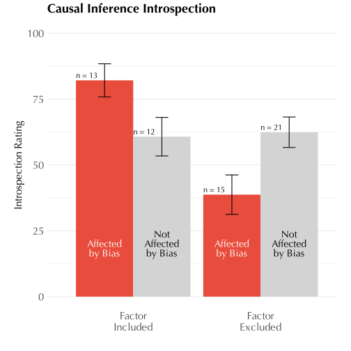

``` r
summary(lm(introspect_rating ~ effect_group, data = causal_data))
```

```
## 
## Call:
## lm(formula = introspect_rating ~ effect_group, data = causal_data)
## 
## Residuals:
##     Min      1Q  Median      3Q     Max 
## -62.429 -12.429  -2.429  17.846  52.267 
## 
## Coefficients:
##                                                           Estimate Std. Error t value Pr(>|t|)    
## (Intercept)                                                 82.154      7.266  11.307 3.44e-16 ***
## effect_groupIncluded and Not Higher Causality Than Median  -21.404     10.487  -2.041   0.0459 *  
## effect_groupExcluded and Higher Causality Than Median      -43.421      9.927  -4.374 5.25e-05 ***
## effect_groupExcluded and Not Higher Causality Than Median  -19.725      9.245  -2.134   0.0372 *  
## ---
## Signif. codes:  0 '***' 0.001 '**' 0.01 '*' 0.05 '.' 0.1 ' ' 1
## 
## Residual standard error: 26.2 on 57 degrees of freedom
## Multiple R-squared:  0.2535,	Adjusted R-squared:  0.2142 
## F-statistic: 6.451 on 3 and 57 DF,  p-value: 0.0007758
```

``` r
#6. contact principle✅  ----
    ## 6.1 do we see the effect?----

#Did subjects for whom Frank needed to make physical contact 
#judge his action as less acceptable?

contact_data = data %>% 
  filter(task_name == 'contact principle') %>%
  mutate(choice_binary = as.numeric(choice == "Permissible"))

summary_contact_data <- contact_data %>%
  group_by(condition) %>%
  mutate(condition = factor(condition, levels = c("Contact", "No Contact"))) %>%
  summarize(
    mean_choice = mean(choice_binary),
    se_choice = se.prop(choice_binary)
  )

ggplot(summary_contact_data, aes(x = condition, y = mean_choice, fill = condition)) +
  geom_bar(stat = "identity") +
  geom_errorbar(aes(ymin = mean_choice - se_choice, ymax = mean_choice + se_choice), width = 0.2) +
  labs(title = "Contact Effect", x = "Condition", y = "Permissibility") +
  theme_custom()+
  scale_fill_manual(values = in_and_ex)+
  guides(fill = FALSE)+   scale_x_discrete(labels = function(x) str_wrap(x, width = 14))
```

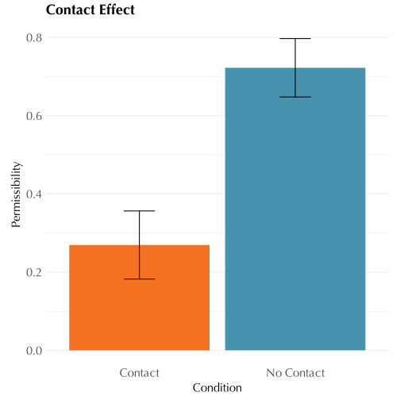

``` r
contact_choices_ex <- contact_data %>%
  filter(factor == "Factor-Excluded") %>%
  pull(choice_binary)

contact_choices_in <- contact_data %>%
  filter(factor == "Factor-Included") %>%
  pull(choice_binary)

#analysis -- is there a better way to do this?
prop_ex <- sum(contact_choices_ex) / length(contact_choices_ex)
prop_in <- sum(contact_choices_in) / length(contact_choices_in)

successes <- c(sum(contact_choices_ex), sum(contact_choices_in))
trials <- c(length(contact_choices_ex), length(contact_choices_in))

test_result <- prop.test(successes, trials, alternative = "less")
print(test_result)
```

```
## 
## 	2-sample test for equality of proportions with continuity correction
## 
## data:  successes out of trials
## X-squared = 10.69, df = 1, p-value = 0.9995
## alternative hypothesis: less
## 95 percent confidence interval:
##  -1.0000000  0.6746593
## sample estimates:
##    prop 1    prop 2 
## 0.7222222 0.2692308
```

``` r
    ## 6.2 introspection ----

#Did factor included give lower introspection numbers 
#than factor excluded?

summary_contact_data <- contact_data %>%
  group_by(factor) %>%
  mutate(introspect_rating = as.numeric(introspect_rating)) %>%
  mutate(factor = factor(factor, levels = c("Factor-Included", "Factor-Excluded"))) %>%
  summarize(
    mean_introspect_rating = 100-mean(introspect_rating),
    se_introspect_rating = se(introspect_rating)
  )

ggplot(summary_contact_data, aes(x = factor, y = mean_introspect_rating, fill = factor)) +
  geom_bar(stat = "identity") +
  geom_errorbar(aes(ymin = mean_introspect_rating - se_introspect_rating, ymax = mean_introspect_rating + se_introspect_rating), width = 0.2) +
  labs(title = "Contact Introspection ratings", x = "Condition", y = "introspection rating") +
  theme_custom()+
  scale_fill_manual(values = in_and_ex)+
  guides(fill = FALSE)+   scale_x_discrete(labels = function(x) str_wrap(x, width = 14))+   scale_y_continuous(limits = c(0, 100))
```

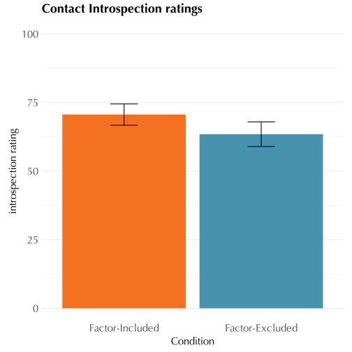

``` r
t.test(introspect_rating ~ factor, data = contact_data)
```

```
## 
## 	Welch Two Sample t-test
## 
## data:  introspect_rating by factor
## t = 1.2097, df = 59.974, p-value = 0.2312
## alternative hypothesis: true difference in means between group Factor-Excluded and group Factor-Included is not equal to 0
## 95 percent confidence interval:
##  -4.687073 19.028954
## sample estimates:
## mean in group Factor-Excluded mean in group Factor-Included 
##                      36.55556                      29.38462
```

``` r
#intro_rating(included and acceptable)
#<
#intro_rating(included and unacceptable)

contact_data <- contact_data %>%
  mutate(effect_group = case_when(
    choice == "Permissible" & factor == "Factor-Included" ~ "Included and Permissible",
    choice == "Impermissible" & factor == "Factor-Included" ~ "Included and Impermissible",
    choice == "Permissible" & factor == "Factor-Excluded" ~ "Excluded and Permissible",
    choice == "Impermissible" & factor == "Factor-Excluded" ~ "Excluded and Impermissible"
      ))%>%
  mutate(effect_group = factor(effect_group, levels = c("Included and Impermissible", "Included and Permissible", "Excluded and Impermissible", "Excluded and Permissible")))


summary_contact_data <- contact_data %>%
  group_by(effect_group) %>%
  summarize(
    mean_introspect_rating = 100-mean(introspect_rating),
    se_introspect_rating = se(introspect_rating)
  )

ggplot(summary_contact_data, aes(x = effect_group, y = mean_introspect_rating, fill = effect_group)) +
  geom_bar(stat = "identity") +
  geom_errorbar(aes(ymin = mean_introspect_rating - se_introspect_rating, ymax = mean_introspect_rating + se_introspect_rating), width = 0.2) +
  labs(title = "Contact Introspection Ratings", x = "Condition", y = "introspection rating") +
  theme_custom()  +
  scale_fill_manual(values = four_colors) +
  guides(fill = FALSE)+   scale_x_discrete(labels = function(x) str_wrap(x, width = 14))+   scale_y_continuous(limits = c(0, 100))
```

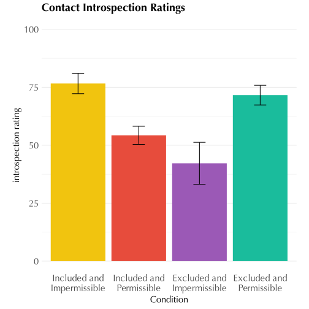

``` r
summary(lm(introspect_rating ~ effect_group, data = contact_data))
```

```
## 
## Call:
## lm(formula = introspect_rating ~ effect_group, data = contact_data)
## 
## Residuals:
##     Min      1Q  Median      3Q     Max 
## -57.800 -14.717  -3.377  12.054  49.615 
## 
## Coefficients:
##                                        Estimate Std. Error t value Pr(>|t|)    
## (Intercept)                              23.368      4.887   4.781 1.23e-05 ***
## effect_groupIncluded and Permissible     22.346      9.419   2.372 0.021009 *  
## effect_groupExcluded and Impermissible   34.432      8.323   4.137 0.000115 ***
## effect_groupExcluded and Permissible      5.016      6.430   0.780 0.438463    
## ---
## Signif. codes:  0 '***' 0.001 '**' 0.01 '*' 0.05 '.' 0.1 ' ' 1
## 
## Residual standard error: 21.3 on 58 degrees of freedom
## Multiple R-squared:  0.2668,	Adjusted R-squared:  0.2289 
## F-statistic: 7.036 on 3 and 58 DF,  p-value: 0.0004091
```

``` r
    ## New version ----


contact_data_by_subject <- data %>%
  filter(task_name == "contact principle") %>%
  group_by(subject) %>%
  filter(any(!is.na(introspect_rating))) %>%
  summarize(
    choice = choice,
    factor = recode(factor(first(factor), levels = c("Factor-Included", "Factor-Excluded")), 
                    `Factor-Included` = "Factor Included", 
                    `Factor-Excluded` = "Factor Excluded"),
    introspect_rating = introspect_rating,
    affected = if_else(choice == "Impermissible", 
                       "Affected by Bias", 
                       "Not Affected by Bias"),
  )%>%
  filter(!is.na(introspect_rating))
```

```
## Warning: Returning more (or less) than 1 row per `summarise()` group was deprecated in dplyr
## 1.1.0.
## ℹ Please use `reframe()` instead.
## ℹ When switching from `summarise()` to `reframe()`, remember that `reframe()`
##   always returns an ungrouped data frame and adjust accordingly.
## Call `lifecycle::last_lifecycle_warnings()` to see where this warning was
## generated.
```

```
## `summarise()` has grouped output by 'subject'. You can override using the `.groups`
## argument.
```

``` r
View(contact_data_by_subject)

summary_contact <- contact_data_by_subject %>%
  group_by(factor, affected) %>%
  summarise(
    mean_introspect_rating = 100-mean(introspect_rating),
    se_introspect_rating = se(introspect_rating),
    n = n()
  )
```

```
## `summarise()` has grouped output by 'factor'. You can override using the `.groups`
## argument.
```

``` r
#View(summary_causal)

ggplot(summary_contact, aes(x = factor, y = mean_introspect_rating, fill = affected, group = affected)) + 
  theme_custom() +
  geom_bar(stat = "identity", position = position_dodge(0.9)) +
  geom_errorbar(aes(ymin = mean_introspect_rating - se_introspect_rating, ymax = mean_introspect_rating + se_introspect_rating), width = 0.2, position = position_dodge(0.9)) +
  geom_text(aes(label = paste("n =", n), x = stage(factor, after_stat = x - .9 / 2 / 2), y = mean_introspect_rating), 
            hjust = 0, vjust=-0.35, family = "optima", size = 4, position = position_dodge(0.9)) +
  geom_text(aes(label = str_wrap(affected, width = 10), y = 15, color = affected), 
            position = position_dodge(0.9), vjust = 0, family = "optima", size = 5, lineheight = 0.8) +
  labs(title = "Contact Principle Introspection", x = "", y = "Introspection Rating") +
  scale_fill_manual(values = effect_no) +
  scale_color_manual(values = c("Affected by Bias" = "white", "Not Affected by Bias" = "black")) +
  scale_x_discrete(labels = function(x) str_wrap(x, width = 14)) +
  guides(fill = FALSE, color = FALSE)+
  scale_y_continuous(limits = c(0, 100))
```

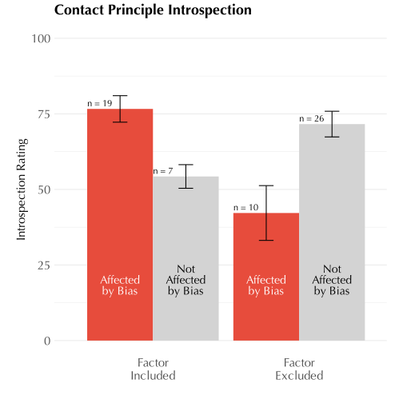

``` r
summary(lm(introspect_rating ~ effect_group, data = contact_data))
```

```
## 
## Call:
## lm(formula = introspect_rating ~ effect_group, data = contact_data)
## 
## Residuals:
##     Min      1Q  Median      3Q     Max 
## -57.800 -14.717  -3.377  12.054  49.615 
## 
## Coefficients:
##                                        Estimate Std. Error t value Pr(>|t|)    
## (Intercept)                              23.368      4.887   4.781 1.23e-05 ***
## effect_groupIncluded and Permissible     22.346      9.419   2.372 0.021009 *  
## effect_groupExcluded and Impermissible   34.432      8.323   4.137 0.000115 ***
## effect_groupExcluded and Permissible      5.016      6.430   0.780 0.438463    
## ---
## Signif. codes:  0 '***' 0.001 '**' 0.01 '*' 0.05 '.' 0.1 ' ' 1
## 
## Residual standard error: 21.3 on 58 degrees of freedom
## Multiple R-squared:  0.2668,	Adjusted R-squared:  0.2289 
## F-statistic: 7.036 on 3 and 58 DF,  p-value: 0.0004091
```

``` r
#7. decoy effect ✅  ----
    ## 7.1 do we see the effect? TO DO----

#Were subjects who saw Brand W more likely to choose brand N?
decoy_data <- data %>%
  filter(task_name == "decoy effect") %>%
  mutate(choice_binary = as.numeric(choice == "Brand N (Target)"))%>%
  mutate(condition = factor(condition, levels = c("Decoy Present", "Decoy Absent")))
  

summary_decoy_data <- decoy_data %>%
  group_by(condition) %>%
  summarize(
    mean_choice = mean(choice_binary),
    se_choice = se.prop(choice_binary)
  )

ggplot(summary_decoy_data, aes(x = condition, y = mean_choice, fill = condition)) +
  geom_bar(stat = "identity") +
  geom_errorbar(aes(ymin = mean_choice - se_choice, ymax = mean_choice + se_choice), width = 0.2) +
  labs(title = "Decoy Effect", x = "Condition", y = "Choosing Brand N") +
  theme_custom()+
  scale_fill_manual(values = in_and_ex)+
  guides(fill = FALSE)+   scale_x_discrete(labels = function(x) str_wrap(x, width = 14))
```

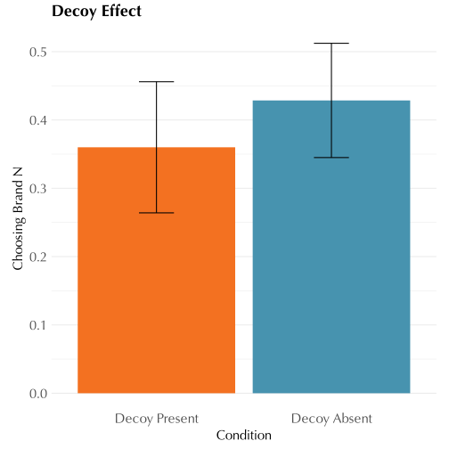

``` r
decoy_choices_ex <- decoy_data %>%
  filter(factor == "Factor-Excluded") %>%
  pull(choice_binary)

decoy_choices_in <- decoy_data %>%
  filter(factor == "Factor-Included") %>%
  pull(choice_binary)

#analysis -- is there a better way to do this?
prop_ex <- sum(decoy_choices_ex) / length(decoy_choices_ex)
prop_in <- sum(decoy_choices_in) / length(decoy_choices_in)

successes <- c(sum(decoy_choices_ex), sum(decoy_choices_in))
trials <- c(length(decoy_choices_ex), length(decoy_choices_in))

test_result <- prop.test(successes, trials, alternative = "less")
print(test_result)
```

```
## 
## 	2-sample test for equality of proportions with continuity correction
## 
## data:  successes out of trials
## X-squared = 0.071429, df = 1, p-value = 0.6054
## alternative hypothesis: less
## 95 percent confidence interval:
##  -1.0000000  0.3122974
## sample estimates:
##    prop 1    prop 2 
## 0.4285714 0.3600000
```

``` r
    ## 7.2 introspection ----

#Did factor included give higher introspection numbers 
#factor excluded?

summary_decoy_data <- decoy_data %>%
  group_by(factor) %>%
  mutate(factor = factor(factor, levels = c("Factor-Included", "Factor-Excluded"))) %>%
  summarize(
    mean_introspect_rating = 100-mean(as.numeric(introspect_rating), na.rm = TRUE),
    se_introspect_rating = se(introspect_rating)
  )

ggplot(summary_decoy_data, aes(x = factor, y = mean_introspect_rating, fill = factor)) +
  geom_bar(stat = "identity") +
  geom_errorbar(aes(ymin = mean_introspect_rating - se_introspect_rating, ymax = mean_introspect_rating + se_introspect_rating), width = 0.2) +
  labs(title = "Decoy Introspection ratings", x = "Condition", y = "introspection rating") +
  theme_custom()+
  scale_fill_manual(values = in_and_ex)+
  guides(fill = FALSE)+   scale_x_discrete(labels = function(x) str_wrap(x, width = 14))+   scale_y_continuous(limits = c(0, 100))
```

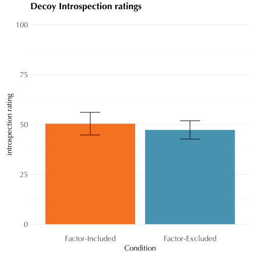

``` r
#"intro_rating(included and chose brand N)
#>
#intro_rating(included and did not choose brand N)"

decoy_data <- decoy_data %>%
  mutate(effect_group = case_when(
    choice == "Brand N (Target)" & factor == "Factor-Included" ~ "Included and Chose Brand N",
    choice != "Brand N (Target)" & factor == "Factor-Included" ~ "Included and Did Not Choose Brand N",
    choice == "Brand N (Target)" & factor == "Factor-Excluded" ~ "Excluded and Chose Brand N",
    choice != "Brand N (Target)" & factor == "Factor-Excluded" ~ "Excluded and Did Not Choose Brand N"
      ))%>%
  mutate(effect_group = factor(effect_group, levels = c("Included and Chose Brand N", "Included and Did Not Choose Brand N", "Excluded and Chose Brand N", "Excluded and Did Not Choose Brand N")))


summary_decoy_data <- decoy_data %>%
  group_by(effect_group) %>%
  summarize(
    mean_introspect_rating = 100-mean(introspect_rating),
    se_introspect_rating = se(introspect_rating)
  )

ggplot(summary_decoy_data, aes(x = effect_group, y = mean_introspect_rating, fill = effect_group)) +
  geom_bar(stat = "identity") +
  geom_errorbar(aes(ymin = mean_introspect_rating - se_introspect_rating, ymax = mean_introspect_rating + se_introspect_rating), width = 0.2) +
  labs(title = "Decoy Introspection Ratings", x = "Condition", y = "introspection rating") +
  theme_custom() +
  scale_fill_manual(values = four_colors) +
  guides(fill = FALSE)+   scale_x_discrete(labels = function(x) str_wrap(x, width = 14))+   scale_y_continuous(limits = c(0, 100))
```

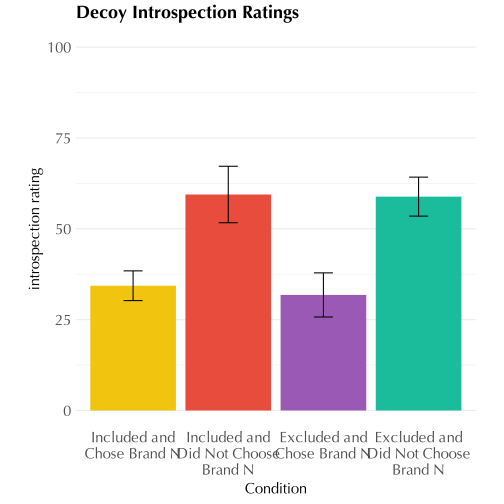

``` r
summary(lm(introspect_rating ~ effect_group, data = decoy_data))
```

```
## 
## Call:
## lm(formula = introspect_rating ~ effect_group, data = decoy_data)
## 
## Residuals:
##     Min      1Q  Median      3Q     Max 
## -41.150 -18.200   7.092   9.850  59.438 
## 
## Coefficients:
##                                                 Estimate Std. Error t value Pr(>|t|)    
## (Intercept)                                       65.667      8.261   7.949  9.4e-11 ***
## effect_groupIncluded and Did Not Choose Brand N  -25.104     10.327  -2.431   0.0183 *  
## effect_groupExcluded and Chose Brand N             2.533     10.450   0.242   0.8093    
## effect_groupExcluded and Did Not Choose Brand N  -24.517      9.948  -2.464   0.0168 *  
## ---
## Signif. codes:  0 '***' 0.001 '**' 0.01 '*' 0.05 '.' 0.1 ' ' 1
## 
## Residual standard error: 24.78 on 56 degrees of freedom
## Multiple R-squared:  0.226,	Adjusted R-squared:  0.1846 
## F-statistic: 5.451 on 3 and 56 DF,  p-value: 0.002327
```

``` r
    ## New version ----


decoy_data_by_subject <- data %>%
  filter(task_name == "decoy effect") %>%
  group_by(subject) %>%
  filter(any(!is.na(introspect_rating))) %>%
  summarize(
    choice = choice,
    factor = recode(factor(first(factor), levels = c("Factor-Included", "Factor-Excluded")), 
                    `Factor-Included` = "Factor Included", 
                    `Factor-Excluded` = "Factor Excluded"),
    introspect_rating = introspect_rating,
    affected = if_else(choice == "Brand N (Target)", 
                       "Affected by Bias", 
                       "Not Affected by Bias"),
  )%>%
  filter(!is.na(introspect_rating))

View(decoy_data_by_subject)

summary_decoy <- decoy_data_by_subject %>%
  group_by(factor, affected) %>%
  summarise(
    mean_introspect_rating = 100-mean(introspect_rating),
    se_introspect_rating = se(introspect_rating),
    n = n()
  )
```

```
## `summarise()` has grouped output by 'factor'. You can override using the `.groups`
## argument.
```

``` r
#View(summary_causal)

ggplot(summary_decoy, aes(x = factor, y = mean_introspect_rating, fill = affected, group = affected)) + 
  theme_custom() +
  geom_bar(stat = "identity", position = position_dodge(0.9)) +
  geom_errorbar(aes(ymin = mean_introspect_rating - se_introspect_rating, ymax = mean_introspect_rating + se_introspect_rating), width = 0.2, position = position_dodge(0.9)) +
  geom_text(aes(label = paste("n =", n), x = stage(factor, after_stat = x - .9 / 2 / 2), y = mean_introspect_rating), 
            hjust = 0, vjust=-0.35, family = "optima", size = 4, position = position_dodge(0.9)) +
  geom_text(aes(label = str_wrap(affected, width = 10), y = 15, color = affected), 
            position = position_dodge(0.9), vjust = 0, family = "optima", size = 5, lineheight = 0.8) +
  labs(title = "Decoy Effect Introspection", x = "", y = "Introspection Rating") +
  scale_fill_manual(values = effect_no) +
  scale_color_manual(values = c("Affected by Bias" = "white", "Not Affected by Bias" = "black")) +
  scale_x_discrete(labels = function(x) str_wrap(x, width = 14)) +
  guides(fill = FALSE, color = FALSE)+
  scale_y_continuous(limits = c(0, 100))
```

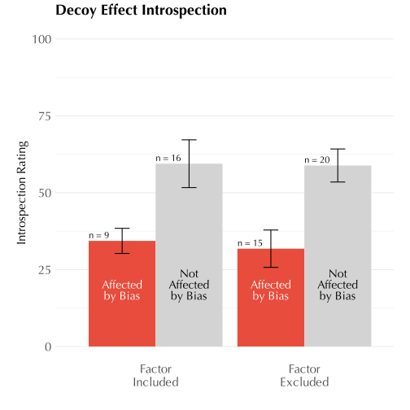

``` r
summary(lm(introspect_rating ~ effect_group, data = decoy_data))
```

```
## 
## Call:
## lm(formula = introspect_rating ~ effect_group, data = decoy_data)
## 
## Residuals:
##     Min      1Q  Median      3Q     Max 
## -41.150 -18.200   7.092   9.850  59.438 
## 
## Coefficients:
##                                                 Estimate Std. Error t value Pr(>|t|)    
## (Intercept)                                       65.667      8.261   7.949  9.4e-11 ***
## effect_groupIncluded and Did Not Choose Brand N  -25.104     10.327  -2.431   0.0183 *  
## effect_groupExcluded and Chose Brand N             2.533     10.450   0.242   0.8093    
## effect_groupExcluded and Did Not Choose Brand N  -24.517      9.948  -2.464   0.0168 *  
## ---
## Signif. codes:  0 '***' 0.001 '**' 0.01 '*' 0.05 '.' 0.1 ' ' 1
## 
## Residual standard error: 24.78 on 56 degrees of freedom
## Multiple R-squared:  0.226,	Adjusted R-squared:  0.1846 
## F-statistic: 5.451 on 3 and 56 DF,  p-value: 0.002327
```

``` r
#8. Double effect ✅  ----
    ##8.1 do we see the effect? ----

#Were subjects who saw Peter's killing as means to an end more likely 
#to judge it impermissible than those who saw it as a side-effect?

#double_effect_data <- data %>%
#  filter(task_name == "double effect") %>%
#  mutate(choice = as.numeric(choice))

#temporary until we fix why choice is coming up Null 
double_effect_data <- read_csv("double.csv") %>%
  filter(familiarity != "Yes") %>% #only when people are not familiar with a task
  mutate(
    task_name = factor(task_name)  # Convert task_name to a factor
  ) %>%
  mutate(choice_binary = as.numeric(choice == "Permissible"))
```

```
## Rows: 61 Columns: 16
## ── Column specification ───────────────────────────────────────────────────────────────────────────
## Delimiter: ","
## chr  (8): subject, version, factor, task_name, condition, choice, openq_response, familiarity
## dbl  (4): introspect_rating, introspect_open, rt, id
## lgl  (3): subject_prolific, stimulus, auxiliary_info1
## dttm (1): timestamp
## 
## ℹ Use `spec()` to retrieve the full column specification for this data.
## ℹ Specify the column types or set `show_col_types = FALSE` to quiet this message.
```

``` r
summary_double_effect_data <- double_effect_data %>%
  group_by(condition) %>%
  mutate(condition = factor(condition, levels = c("Means", "Side Effect"))) %>%
  summarize(
    mean_choice = mean(choice_binary),
    se_choice = se.prop(choice_binary)
  )

ggplot(summary_double_effect_data, aes(x = condition, y = mean_choice, fill = condition)) +
  geom_bar(stat = "identity") +
  geom_errorbar(aes(ymin = mean_choice - se_choice, ymax = mean_choice + se_choice), width = 0.2) +
  labs(title = "Double Effect", x = "Condition", y = "Permissibility") +
  theme_custom()+
  scale_fill_manual(values = in_and_ex)+
  guides(fill = FALSE)+   scale_x_discrete(labels = function(x) str_wrap(x, width = 14))
```

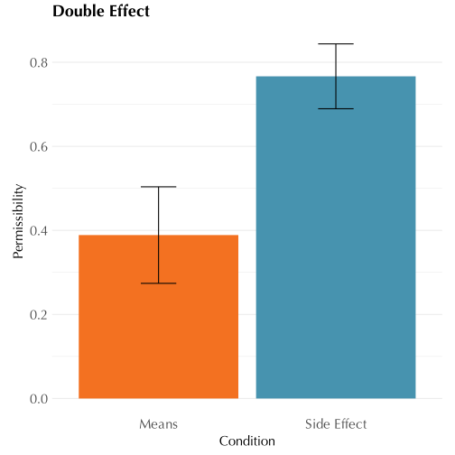

``` r
double_choices_ex <- double_effect_data %>%
  filter(factor == "Factor-Excluded") %>%
  pull(choice_binary)

double_choices_in <- double_effect_data %>%
  filter(factor == "Factor-Included") %>%
  pull(choice_binary)

#analysis -- is there a better way to do this?
prop_ex <- sum(double_choices_ex) / length(double_choices_ex)
prop_in <- sum(double_choices_in) / length(double_choices_in)

successes <- c(sum(double_choices_ex), sum(double_choices_in))
trials <- c(length(double_choices_ex), length(double_choices_in))

test_result <- prop.test(successes, trials, alternative = "less")
print(test_result)
```

```
## 
## 	2-sample test for equality of proportions with continuity correction
## 
## data:  successes out of trials
## X-squared = 5.3333, df = 1, p-value = 0.9895
## alternative hypothesis: less
## 95 percent confidence interval:
##  -1.0000000  0.6499378
## sample estimates:
##    prop 1    prop 2 
## 0.7666667 0.3888889
```

``` r
    ##8.2 introspection----

#Did factor included give higher introspection numbers 
#than factor excluded?

summary_double_effect_data <- double_effect_data %>%
  group_by(factor) %>%
  mutate(introspect_rating = as.numeric(introspect_rating)) %>%
  mutate(factor = factor(factor, levels = c("Factor-Included", "Factor-Excluded"))) %>%
  summarize(
    mean_introspect_rating = 100-mean(introspect_rating),
    se_introspect_rating = se(introspect_rating)
  )

str(summary_double_effect_data)
```

```
## tibble [2 × 3] (S3: tbl_df/tbl/data.frame)
##  $ factor                : Factor w/ 2 levels "Factor-Included",..: 1 2
##  $ mean_introspect_rating: num [1:2] 54.6 43.2
##  $ se_introspect_rating  : num [1:2] 7.51 4.21
```

``` r
ggplot(summary_double_effect_data, aes(x = factor, y = mean_introspect_rating, fill = factor)) +
  geom_bar(stat = "identity") +
  geom_errorbar(aes(ymin = mean_introspect_rating - se_introspect_rating, ymax = mean_introspect_rating + se_introspect_rating), width = 0.2) +
  labs(title = "Double Introspection ratings", x = "Condition", y = "introspection rating") +
  theme_custom()+
  scale_fill_manual(values = in_and_ex)+
  guides(fill = FALSE)+   scale_x_discrete(labels = function(x) str_wrap(x, width = 14))+   scale_y_continuous(limits = c(0, 100))
```

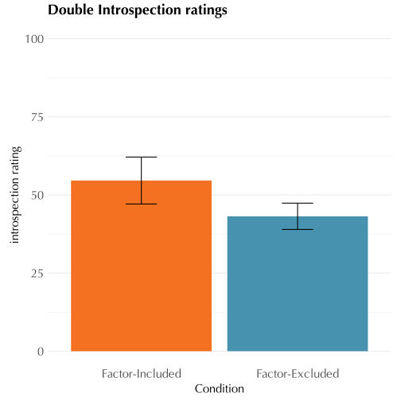

``` r
t.test(introspect_rating ~ factor, data = double_effect_data)
```

```
## 
## 	Welch Two Sample t-test
## 
## data:  introspect_rating by factor
## t = 1.3294, df = 27.746, p-value = 0.1946
## alternative hypothesis: true difference in means between group Factor-Excluded and group Factor-Included is not equal to 0
## 95 percent confidence interval:
##  -6.197495 29.086384
## sample estimates:
## mean in group Factor-Excluded mean in group Factor-Included 
##                      56.83333                      45.38889
```

``` r
#"intro_rating(included and permissible)
#>
#intro_rating(included and not permissible)"

double_effect_data <- double_effect_data %>%
  mutate(effect_group = case_when(
    choice == "Permissible" & factor == "Factor-Included" ~ "Included and Permissible",
    choice == "Impermissible" & factor == "Factor-Included" ~ "Included and Impermissible",
    choice == "Permissible" & factor == "Factor-Excluded" ~ "Excluded and Permissible",
    choice == "Impermissible" & factor == "Factor-Excluded" ~ "Excluded and Impermissible"
      ))%>%
  mutate(effect_group = factor(effect_group, levels = c("Included and Impermissible", "Included and Permissible", "Excluded and Impermissible", "Excluded and Permissible")))

summary_double_effect_data <- double_effect_data %>%
  group_by(effect_group) %>%
  summarize(
    mean_introspect_rating = 100-mean(introspect_rating),
    se_introspect_rating = se(introspect_rating)
  )

ggplot(summary_double_effect_data, aes(x = effect_group, y = mean_introspect_rating, fill = effect_group)) +
  geom_bar(stat = "identity") +
  geom_errorbar(aes(ymin = mean_introspect_rating - se_introspect_rating, ymax = mean_introspect_rating + se_introspect_rating), width = 0.2) +
  labs(title = "Double Introspection Ratings", x = "Condition", y = "introspection rating") +
  theme_custom()+
  scale_fill_manual(values = four_colors) +
  guides(fill = FALSE)+   scale_x_discrete(labels = function(x) str_wrap(x, width = 14))+   scale_y_continuous(limits = c(0, 100))
```

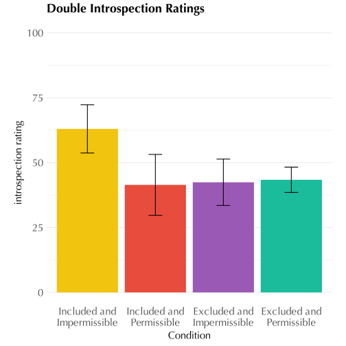

``` r
summary(lm(introspect_rating ~ effect_group, data = double_effect_data))
```

```
## 
## Call:
## lm(formula = introspect_rating ~ effect_group, data = double_effect_data)
## 
## Residuals:
##     Min      1Q  Median      3Q     Max 
## -56.609  -9.831  -6.609  13.000  52.000 
## 
## Coefficients:
##                                        Estimate Std. Error t value Pr(>|t|)    
## (Intercept)                              37.000      7.961   4.648 3.05e-05 ***
## effect_groupIncluded and Permissible     21.571     12.765   1.690   0.0981 .  
## effect_groupExcluded and Impermissible   20.571     12.765   1.612   0.1142    
## effect_groupExcluded and Permissible     19.609      9.679   2.026   0.0489 *  
## ---
## Signif. codes:  0 '***' 0.001 '**' 0.01 '*' 0.05 '.' 0.1 ' ' 1
## 
## Residual standard error: 26.4 on 44 degrees of freedom
## Multiple R-squared:  0.1016,	Adjusted R-squared:  0.04036 
## F-statistic: 1.659 on 3 and 44 DF,  p-value: 0.1897
```

``` r
    ## New version ----


double_data_by_subject <- double_effect_data %>%
  group_by(subject) %>%
  filter(any(!is.na(introspect_rating))) %>%
  summarize(
    choice = choice,
    factor = recode(factor(first(factor), levels = c("Factor-Included", "Factor-Excluded")), 
                    `Factor-Included` = "Factor Included", 
                    `Factor-Excluded` = "Factor Excluded"),
    introspect_rating = introspect_rating,
    affected = if_else(choice == "Impermissible", 
                       "Affected by Bias", 
                       "Not Affected by Bias"),
  )%>%
  filter(!is.na(introspect_rating))

View(double_data_by_subject)

summary_double <- double_data_by_subject %>%
  group_by(factor, affected) %>%
  summarise(
    mean_introspect_rating = 100-mean(introspect_rating),
    se_introspect_rating = se(introspect_rating),
    n = n()
  )
```

```
## `summarise()` has grouped output by 'factor'. You can override using the `.groups`
## argument.
```

``` r
#View(summary_causal)

ggplot(summary_double, aes(x = factor, y = mean_introspect_rating, fill = affected, group = affected)) + 
  theme_custom() +
  geom_bar(stat = "identity", position = position_dodge(0.9)) +
  geom_errorbar(aes(ymin = mean_introspect_rating - se_introspect_rating, ymax = mean_introspect_rating + se_introspect_rating), width = 0.2, position = position_dodge(0.9)) +
  geom_text(aes(label = paste("n =", n), x = stage(factor, after_stat = x - .9 / 2 / 2), y = mean_introspect_rating), 
            hjust = 0, vjust=-0.35, family = "optima", size = 4, position = position_dodge(0.9)) +
  geom_text(aes(label = str_wrap(affected, width = 10), y = 15, color = affected), 
            position = position_dodge(0.9), vjust = 0, family = "optima", size = 5, lineheight = 0.8) +
  labs(title = "Double Effect Introspection", x = "", y = "Introspection Rating") +
  scale_fill_manual(values = effect_no) +
  scale_color_manual(values = c("Affected by Bias" = "white", "Not Affected by Bias" = "black")) +
  scale_x_discrete(labels = function(x) str_wrap(x, width = 14)) +
  guides(fill = FALSE, color = FALSE)+
  scale_y_continuous(limits = c(0, 100))
```

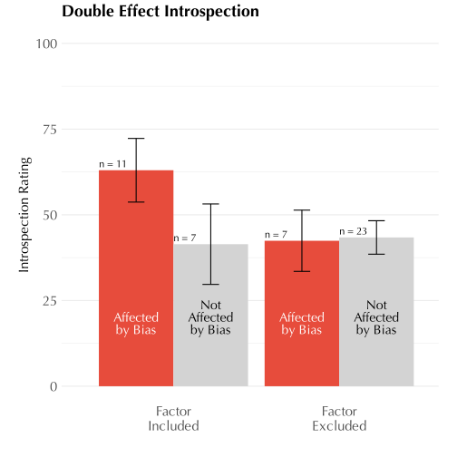

``` r
summary(lm(introspect_rating ~ effect_group, data = double_data))
```

```
## Error in h(simpleError(msg, call)): error in evaluating the argument 'object' in selecting a method for function 'summary': object 'double_data' not found
```

``` r
#9. Halo Effect  ✅ ----
    ##9.1 do we see the effect? ----

#Did subjects who were shown some attractive and 
#some attractive faces think the attractive were more persuasive, with the subjects who only saw neutral faces calling in the middle?

halo_bar_data <- data %>%
  filter(task_name == "halo") %>%
  mutate(choice = as.numeric(choice))%>%
  filter(stimulus != "") %>%
  mutate(
    condition = case_when(
      grepl("img/U", stimulus) ~ "unattractive",
      grepl("img/A", stimulus) ~ "attractive",
      grepl("img/M", stimulus) ~ "average",
      TRUE ~ condition
    )
  )
```

```
## Warning: There was 1 warning in `mutate()`.
## ℹ In argument: `choice = as.numeric(choice)`.
## Caused by warning:
## ! NAs introduced by coercion
```

``` r
summary_halo_data <- halo_bar_data %>%
  group_by(condition) %>%
  summarize(
    mean_choice = mean(choice),
    se_choice = se(choice)
  )

ggplot(summary_halo_data, aes(x = condition, y = mean_choice, fill = condition)) +
  geom_bar(stat = "identity") +
  geom_errorbar(aes(ymin = mean_choice - se_choice, ymax = mean_choice + se_choice), width = 0.2) +
  labs(title = "Average Persuasiveness by Attractiveness", x = "Condition", y = "Average Choice") +
  theme_custom()+
  scale_fill_manual(values = in_neutral_ex)+
  guides(fill = FALSE)+   scale_x_discrete(labels = function(x) str_wrap(x, width = 14))
```

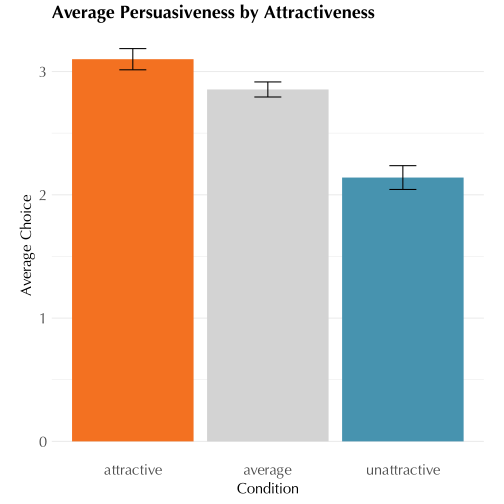

``` r
summary(lm(choice ~ condition, data = halo_bar_data))
```

```
## 
## Call:
## lm(formula = choice ~ condition, data = halo_bar_data)
## 
## Residuals:
##     Min      1Q  Median      3Q     Max 
## -2.1000 -0.8546  0.1454  0.8600  2.8600 
## 
## Coefficients:
##                       Estimate Std. Error t value Pr(>|t|)    
## (Intercept)            3.10000    0.09734  31.847  < 2e-16 ***
## conditionaverage      -0.24545    0.11367  -2.159   0.0313 *  
## conditionunattractive -0.96000    0.13766  -6.974 1.05e-11 ***
## ---
## Signif. codes:  0 '***' 0.001 '**' 0.01 '*' 0.05 '.' 0.1 ' ' 1
## 
## Residual standard error: 0.9734 on 472 degrees of freedom
## Multiple R-squared:  0.105,	Adjusted R-squared:  0.1012 
## F-statistic: 27.68 on 2 and 472 DF,  p-value: 4.304e-12
```

``` r
    ##9.2 introspection ----

#Did factor included give higher introspection 
#numbers than factor excluded?

summary_halo_data <- data %>%
  filter(task_name == "halo", stimulus == "") %>% 
  group_by(factor) %>%
  mutate(factor = factor(factor, levels = c("Factor-Included", "Factor-Excluded"))) %>%
  summarize(
    mean_introspect_rating = mean(as.numeric(introspect_rating), na.rm = TRUE),
    se_introspect_rating = se(introspect_rating)
  )

ggplot(summary_halo_data, aes(x = factor, y = mean_introspect_rating, fill = factor)) +
  geom_bar(stat = "identity") +
  geom_errorbar(aes(ymin = mean_introspect_rating - se_introspect_rating, ymax = mean_introspect_rating + se_introspect_rating), width = 0.2) +
  labs(title = "Halo Introspection ratings", x = "Condition", y = "introspection rating") +
  theme_custom()+
  scale_fill_manual(values = in_and_ex)+
  guides(fill = FALSE)+   scale_x_discrete(labels = function(x) str_wrap(x, width = 14))+   scale_y_continuous(limits = c(0, 100))
```


``` r
t.test(introspect_rating ~ factor, data = halo_data)
```

```
## Error in t.test.formula(introspect_rating ~ factor, data = halo_data): grouping factor must have exactly 2 levels
```

``` r
#next question:"intro_rating(included and gave median attractive faces persuasive score higher than median unattractive face)
#>
#  intro_rating(included and gave median attractive faces persuasive score not higher than median unattractive face)"

halo_data <- data %>%
  filter(task_name == "halo") %>%
  filter(familiarity == "") %>%
  mutate(choice = as.numeric(choice)) %>%
  mutate(
    condition = case_when(
      grepl("img/U", stimulus) ~ "unattractive",
      grepl("img/A", stimulus) ~ "attractive",
      grepl("img/M", stimulus) ~ "average",
      TRUE ~ condition
    )
  )


# Find subjects who gave higher median scores to attractive than unattractive
subject_list_included_and_affected <- halo_data %>%
  # Step 1: Calculate median choice for each subject under "attractive" condition
  filter(condition == "attractive") %>%
  group_by(subject) %>%
  summarize(median_choice_attractive = median(choice, na.rm = TRUE)) %>%
  
  # Step 2: Join with median choice for "unattractive" condition
  inner_join(
    halo_data %>%
      filter(condition == "unattractive") %>%
      group_by(subject) %>%
      summarize(median_choice_unattractive = median(choice, na.rm = TRUE)),
    by = "subject"
  ) %>%
  
  # Step 3: Filter subjects where median choice for "attractive" is higher than "unattractive"
  filter(median_choice_attractive > median_choice_unattractive) %>%
  
  # Pull the subject list
  pull(subject)

View(subject_list_included_and_affected)

# List of all subjects in "Factor-Included"
all_subjects_included = halo_data %>%
  filter(factor == "Factor-Included") %>%
  pull(subject)

#View(all_subjects_included)

subject_list_included_and_not_higher_than_median = setdiff(all_subjects_included, subject_list_included_and_affected)

#View(subject_list_included_and_not_higher_than_median)

halo_data <- data %>%
  filter(task_name == "halo") %>%
  filter(familiarity == "") %>%
  
  mutate(effect_group = case_when(
    factor == "Factor-Excluded" ~ "Excluded",
    subject %in% subject_list_included_and_higher_than_median ~ "Included and Higher Than Median",
    TRUE ~ "Included and Not Higher Than Median",
    
    )) %>%
  mutate(effect_group = factor(effect_group, levels = c("Included and Higher Than Median", "Included and Not Higher Than Median", "Excluded")))


#View(halo_data)

halo_data <- data %>%
  filter(task_name == "halo") %>%
  filter(familiarity != "") %>%
  mutate(effect_group = case_when(
    factor == "Factor-Excluded" ~ "Excluded",
    subject %in% subject_list_included_and_higher_than_median ~ "Included and Shows Effect",
    TRUE ~ "Included and Doesn't Show Effect",
    
  )) %>%
  mutate(effect_group = factor(effect_group, levels = c("Included and Shows Effect", "Included and Doesn't Show Effect", "Excluded")))


summary_halo_data <- halo_data %>%
  group_by(effect_group) %>%
  summarize(
    mean_introspect_rating = mean(introspect_rating),
    se_introspect_rating = se(introspect_rating)
  )

#View(summary_halo_data)


ggplot(summary_halo_data, aes(x = effect_group, y = mean_introspect_rating, fill = effect_group)) +
  geom_bar(stat = "identity") +
  geom_errorbar(aes(ymin = mean_introspect_rating - se_introspect_rating, ymax = mean_introspect_rating + se_introspect_rating), width = 0.2) +
  labs(title = "Halo Introspection ratings", x = "Condition", y = "introspection rating") +
  theme_custom()  +
  scale_fill_manual(values = three_colors) +
  guides(fill = FALSE)+   scale_x_discrete(labels = function(x) str_wrap(x, width = 14))+   scale_y_continuous(limits = c(0, 100))
```

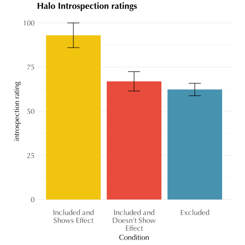

``` r
summary(lm(introspect_rating ~ effect_group, data = halo_data))
```

```
## 
## Call:
## lm(formula = introspect_rating ~ effect_group, data = halo_data)
## 
## Residuals:
##    Min     1Q Median     3Q    Max 
##  -45.3  -12.3   -6.6   14.8   37.7 
## 
## Coefficients:
##                                              Estimate Std. Error t value Pr(>|t|)    
## (Intercept)                                     93.00      15.08   6.169 1.29e-07 ***
## effect_groupIncluded and Doesn't Show Effect   -26.10      15.81  -1.651   0.1052    
## effect_groupExcluded                           -30.70      15.57  -1.972   0.0543 .  
## ---
## Signif. codes:  0 '***' 0.001 '**' 0.01 '*' 0.05 '.' 0.1 ' ' 1
## 
## Residual standard error: 21.32 on 49 degrees of freedom
## Multiple R-squared:  0.0769,	Adjusted R-squared:  0.03923 
## F-statistic: 2.041 on 2 and 49 DF,  p-value: 0.1408
```

``` r
    ## New version ----

halo_introspection <- data %>%
  filter(task_name == "halo") %>%
  filter(introspect_rating != "") %>%
  mutate(
    condition = case_when(
      grepl("img/U", stimulus) ~ "unattractive",
      grepl("img/A", stimulus) ~ "attractive",
      grepl("img/M", stimulus) ~ "average",
      TRUE ~ condition
    )
  )


halo_data <- data %>%
  filter(task_name == "halo") %>%
  filter(familiarity == "") %>%
  mutate(choice = as.numeric(choice)) %>%
  mutate(
    condition = case_when(
      grepl("img/U", stimulus) ~ "unattractive",
      grepl("img/A", stimulus) ~ "attractive",
      grepl("img/M", stimulus) ~ "average",
      TRUE ~ condition
    )
  )


halo_data_included <- halo_data %>%
  # Step 1: Calculate median choice for each subject under "attractive" condition
  filter(condition == "attractive") %>%
  group_by(subject) %>%
  summarize(median_choice_attractive = median(choice, na.rm = TRUE)) %>%
  
  # Step 2: Join with median choice for "unattractive" condition
  inner_join(
    halo_data %>%
      filter(condition == "unattractive") %>%
      group_by(subject) %>%
      summarize(median_choice_unattractive = median(choice, na.rm = TRUE)),
    by = "subject"
  )%>%
  left_join(halo_introspection %>% select(subject, introspect_rating), by = "subject") %>%
  
  summarize(factor = "Factor Included",
            affected = if_else(median_choice_attractive > median_choice_unattractive, 
                               "Affected by Bias", 
                               "Not Affected by Bias"),
            introspect_rating=introspect_rating,
            
            )%>%
              filter(!is.na(introspect_rating))
```

```
## Warning: Returning more (or less) than 1 row per `summarise()` group was deprecated in dplyr
## 1.1.0.
## ℹ Please use `reframe()` instead.
## ℹ When switching from `summarise()` to `reframe()`, remember that `reframe()`
##   always returns an ungrouped data frame and adjust accordingly.
## Call `lifecycle::last_lifecycle_warnings()` to see where this warning was
## generated.
```

``` r
View(halo_data_included)

halo_data_excluded = halo_data %>%
  filter(factor == "Factor-Excluded") %>%
  group_by(subject) %>%
  summarize(median_choice = median(choice, na.rm = TRUE))  %>%
  left_join(halo_introspection %>% select(subject, introspect_rating), by = "subject") %>%
  summarize(factor = "Factor Excluded",
            affected = "Not Affected by Bias",
            introspect_rating=introspect_rating,
            
            )%>%
              filter(!is.na(introspect_rating))
```

```
## Warning: Returning more (or less) than 1 row per `summarise()` group was deprecated in dplyr
## 1.1.0.
## ℹ Please use `reframe()` instead.
## ℹ When switching from `summarise()` to `reframe()`, remember that `reframe()`
##   always returns an ungrouped data frame and adjust accordingly.
## Call `lifecycle::last_lifecycle_warnings()` to see where this warning was
## generated.
```

``` r
View(halo_data_excluded)


halo_combined <- rbind(halo_data_included, halo_data_excluded) %>%
  mutate(factor = factor(factor, levels = c("Factor Included", "Factor Excluded"))) 
  
View(halo_combined)


summary_halo <- halo_combined %>%
  group_by(factor, affected) %>%
  summarise(
    mean_introspect_rating = mean(introspect_rating),
    se_introspect_rating = se(introspect_rating),
    n = n()
  )
```

```
## `summarise()` has grouped output by 'factor'. You can override using the `.groups`
## argument.
```

``` r
#View(summary_anchoring)

ggplot(summary_halo, aes(x = factor, y = mean_introspect_rating, fill = affected, group = affected)) + 
  theme_custom() +
  geom_bar(stat = "identity", position = position_dodge(0.9)) +
  geom_errorbar(aes(ymin = mean_introspect_rating - se_introspect_rating, ymax = mean_introspect_rating + se_introspect_rating), width = 0.2, position = position_dodge(0.9)) +
  geom_text(aes(label = paste("n =", n), x = stage(factor, after_stat = x - .9 / 2 / 2), y = mean_introspect_rating), 
            hjust = 0, vjust=-0.35, family = "optima", size = 4, position = position_dodge(0.9)) +
  geom_text(aes(label = str_wrap(affected, width = 10), y = 15, color = affected), 
            position = position_dodge(0.9), vjust = 0, family = "optima", size = 5, lineheight = 0.8) +
  labs(title = "Halo Effect Introspection", x = "", y = "Introspection Rating") +
  scale_fill_manual(values = effect_no) +
  scale_color_manual(values = c("Affected by Bias" = "white", "Not Affected by Bias" = "black")) +
  scale_x_discrete(labels = function(x) str_wrap(x, width = 14)) +
  guides(fill = FALSE, color = FALSE) +
  scale_y_continuous(limits = c(0, 100))
```

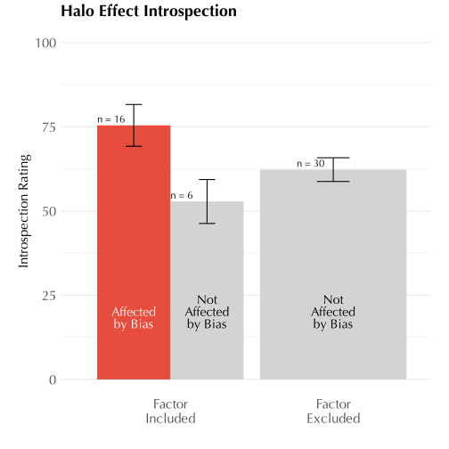

``` r
summary(lm(introspect_rating ~ effect_group, data = halo_data))
```

```
## Error in h(simpleError(msg, call)): error in evaluating the argument 'object' in selecting a method for function 'summary': object 'effect_group' not found
```

``` r
#10 hindsight bias ----
    ##10.1 do we see the effect? TO DO----

#Did subjects who saw the correct answers misremember their previous answers as closer to the correct answer than the subjects who did not see the correct answers?

# Function to clean and convert values
convert_to_numeric <- function(values) {
  # Remove all commas
  values <- gsub(",", "", values)
  
  # Handle ' million', ' Million', 'M'
  millions <- grepl(" million| milliion| millon| mil| Million|M", values)
  values[millions] <- as.numeric(gsub(" million| milliion| millon| mil| Million|M", "", values[millions])) * 1e6
  
  # Handle 'k'
  thousands <- grepl("k", values, ignore.case = TRUE)
  values[thousands] <- as.numeric(gsub("k|K", "", values[thousands])) * 1e3
  
  # Attempt to convert the rest directly to numeric
  values[!millions & !thousands] <- suppressWarnings(as.numeric(values[!millions & !thousands]))
  
  return(values)
}


true_values <- c(
  Pakistan = 203177034,
  Nigeria = 199045324,
  Mexico = 131738729,
  Vietnam = 97074662,
  The_Democratic_Republic_of_the_Congo = 85705256,
  Thailand = 69256846,
  Tanzania = 60229204,
  South_Korea = 51273440,
  Colombia = 49705306,
  Uganda = 45169147,
  Ukraine = 43877093,
  Malaysia = 32294009,
  North_Korea = 25683863,
  Niger = 22850032,
  Burkina_Faso = 20106983,
  Romania = 19519762,
  Zimbabwe = 17154637,
  The_Netherlands = 17114912,
  Somalia = 14600000,
  Guinea = 13270289,
  Benin = 11683042,
  Haiti = 11193952,
  Greece = 11133944,
  The_Czech_Republic = 10629078,
  Azerbaijan = 9980369
)

View(hindsight_data)

hindsight_data <- data %>%
  filter(task_name == "hindsight bias") %>%
  filter(!(subject %in% c("66749b876f32a4ad246db5da","5f2d95153c1140074cc81b4c","667469ea0d42f70a9a75567b","667444e5662b7a4ebf82d5e1","665c6f67d9ea69740afbcab8","6273238a4a8b39041ff1bd2c", "664d3c950d24d83ca7b4dd68", "6020606d7b0258677b881f63", "6159fe7811a7e1b94401c33f"))) %>%
  mutate(parsed_choice = convert_to_numeric(choice)) %>%
  filter(parsed_choice != "NA") %>%
  mutate(which_estimate = case_when(
    str_detect(auxiliary_info1, "_first_response") ~ "first",
    str_detect(auxiliary_info1, "_recall_original_response") ~ "recall",
    TRUE ~ NA_character_
  )) %>%


  # Extract the country name
  mutate(country = case_when(
    str_detect(auxiliary_info1, "_estimate") ~ str_extract(auxiliary_info1, "^[^_]+(?:_[^_]+)*(?=_estimate)"),
    str_detect(auxiliary_info1, "_recall") ~ str_extract(auxiliary_info1, "^[^_]+(?:_[^_]+)*(?=_recall)"),
    TRUE ~ NA_character_
  ))%>%

  mutate(true_value = true_values[country])%>%
  mutate(difference_from_true = as.numeric(true_value) - as.numeric(parsed_choice))
```

```
## Warning: There was 1 warning in `mutate()`.
## ℹ In argument: `parsed_choice = convert_to_numeric(choice)`.
## Caused by warning in `convert_to_numeric()`:
## ! NAs introduced by coercion
```

``` r
View(hindsight_data)

medians_hindsight <- hindsight_data %>%
  group_by(subject) %>%
  summarise(
    median_first_estimate = abs(median(difference_from_true[which_estimate == "first"], na.rm = TRUE)),
    median_second_estimate = abs(median(difference_from_true[which_estimate == "recall"], na.rm = TRUE)),
    factor = first(factor),
    introspect_rating = first(introspect_rating)
  ) %>%
  filter(!is.na(median_first_estimate) & !is.na(median_second_estimate))

View(medians_hindsight)

custom_labels <- c("median_first_estimate" = "Median First Estimate",
                   "median_second_estimate" = "Median Second Estimate")


medians_summary <- medians_hindsight %>%
  pivot_longer(cols = c(median_first_estimate, median_second_estimate),
               names_to = "estimate_type",
               values_to = "estimate_value") %>%
  group_by(estimate_type, factor) %>%
  mutate(factor = factor(factor, levels = c("Factor-Included", "Factor-Excluded"))) %>%
  
  summarise(
    mean_choice = mean(estimate_value),
    se_choice = se(estimate_value),
    n_choice = n()
  )
```

```
## `summarise()` has grouped output by 'estimate_type'. You can override using the
## `.groups` argument.
```

``` r
# Create the ggplot with n labels for each bar
ggplot(medians_summary, aes(x = estimate_type, y = mean_choice, fill = factor)) +
  geom_bar(stat = "identity", position = "dodge") +
  geom_errorbar(aes(ymin = mean_choice - se_choice, ymax = mean_choice + se_choice), 
                width = 0.2, position = position_dodge(0.9)) +
  geom_text(aes(label = paste0("n=", n_choice)), 
            position = position_dodge(0.9), vjust = -0.5) +
  facet_wrap(~factor) +
  labs(title = "Hindsight Effect",
       x = "Estimate Type",
       y = "Mean Estimate Distance From True Value") +
  theme_custom() + 
  scale_fill_manual(values = in_and_ex) +
  scale_x_discrete(labels = function(x) str_wrap(str_replace_all(x, "_", " "), width = 10))+
  guides(fill = FALSE)
```

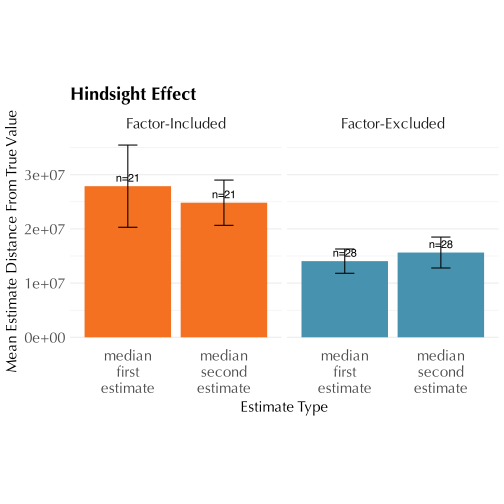

``` r
    ##10.2 introspection----

#Did factor included give lower introspection numbers than factor excluded?

hindsight_data <- data %>%
  filter(task_name == "hindsight") %>%
  filter(stimulus == "") 

View(hindsight_data)
View(summary_hindsight_data)

summary_hindsight_data <- hindsight_data %>%
  group_by(factor) %>%
  mutate(factor = factor(factor, levels = c("Factor-Included", "Factor-Excluded"))) %>%
  summarize(
    mean_introspect_rating = 100-mean(introspect_rating),
    se_introspect_rating = se(introspect_rating)
  )

ggplot(summary_hindsight_data, aes(x = factor, y = mean_introspect_rating, fill = factor)) +
  geom_bar(stat = "identity") +
  geom_errorbar(aes(ymin = mean_introspect_rating - se_introspect_rating, ymax = mean_introspect_rating + se_introspect_rating), width = 0.2) +
  labs(title = "Hindsight Introspection ratings", x = "Condition", y = "introspection rating") +
  theme_custom()+
  scale_fill_manual(values = in_and_ex)+
  guides(fill = FALSE)+   scale_x_discrete(labels = function(x) str_wrap(x, width = 14))+   scale_y_continuous(limits = c(0, 100))+
  scale_y_continuous(limits = c(0, 100))
```

```
## Scale for y is already present.
## Adding another scale for y, which will replace the existing scale.
```

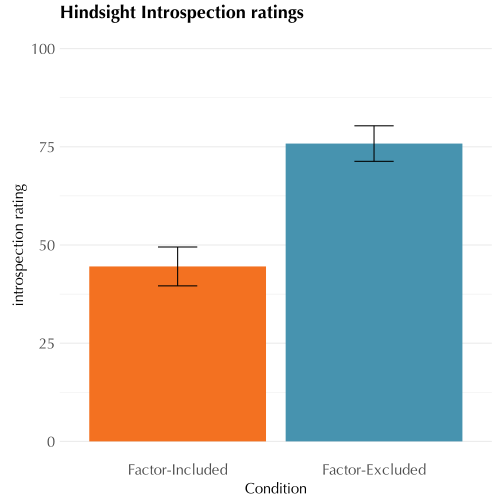

``` r
t.test(introspect_rating ~ factor, data = mere_exposure_data)
```

```
## Error in t.test.formula(introspect_rating ~ factor, data = mere_exposure_data): grouping factor must have exactly 2 levels
```

``` r
##"intro_rating(included and average distance between the answer and the true number is lower after than before)
#<
#intro_rating(included and average distance between the answer and the true number is not lower after than before)"

hindsight_introspection <- data %>%
  filter(task_name == "hindsight")
#this was because of a bug where all the introspect ratings were saved under hindsight instead of hindsight bias

medians_hindsight <- hindsight_data %>%
  group_by(subject) %>%
  summarise(
    median_first_estimate = abs(median(difference_from_true[which_estimate == "first"], na.rm = TRUE)),
    median_second_estimate = abs(median(difference_from_true[which_estimate == "recall"], na.rm = TRUE)),
    factor = first(factor),
    introspect_rating = first(introspect_rating)
  ) %>%
  filter(!is.na(median_first_estimate) & !is.na(median_second_estimate))
```

```
## Error in `summarise()`:
## ℹ In argument: `median_first_estimate =
##   abs(median(difference_from_true[which_estimate == "first"], na.rm = TRUE))`.
## ℹ In group 1: `subject = "572bf2aa34b25a000edd2e73"`.
## Caused by error:
## ! object 'difference_from_true' not found
```

``` r
View(medians_hindsight)

summary_hindsight <- medians_hindsight %>%
  mutate(affected = if_else(median_first_estimate > median_second_estimate, 
                            "Affected by Bias", 
                            "Not Affected by Bias"))%>%
  left_join(hindsight_introspection %>% select(subject, introspect_rating), by = "subject") %>%
  select(factor, affected, introspect_rating.y) %>%
  group_by(factor, affected) %>%
  mutate(factor = factor(factor, levels = c("Factor-Included", "Factor-Excluded"))) %>%
  mutate(factor = recode(factor, 
                         `Factor-Included` = "Factor Included", 
                         `Factor-Excluded` = "Factor Excluded")) %>%
  summarise(
    mean_introspect_rating = 100-mean(introspect_rating.y),
    se_introspect_rating = se(introspect_rating.y),
    n = n()
  )
```

```
## `summarise()` has grouped output by 'factor'. You can override using the `.groups`
## argument.
```

``` r
ggplot(summary_hindsight, aes(x = factor, y = mean_introspect_rating, fill = affected, group = affected)) + 
  theme_custom() +
  geom_bar(stat = "identity", position = position_dodge(0.9)) +
  geom_errorbar(aes(ymin = mean_introspect_rating - se_introspect_rating, ymax = mean_introspect_rating + se_introspect_rating), width = 0.2, position = position_dodge(0.9)) +
  geom_text(aes(label = paste("n =", n), x = stage(factor, after_stat = x - .9 / 2 / 2), y = mean_introspect_rating), 
            hjust = 0, vjust=-0.35, family = "optima", size = 4, position = position_dodge(0.9)) +
  geom_text(aes(label = str_wrap(affected, width = 10), y = 15, color = affected), 
            position = position_dodge(0.9), vjust = 0, family = "optima", size = 5, lineheight = 0.8) +
  labs(title = "Hindsight Introspection", x = "", y = "Introspection Rating") +
  scale_fill_manual(values = effect_no) +
  scale_color_manual(values = c("Affected by Bias" = "white", "Not Affected by Bias" = "black")) +
  scale_x_discrete(labels = function(x) str_wrap(x, width = 14)) +
  guides(fill = FALSE, color = FALSE) +
  scale_y_continuous(limits = c(0, 100))
```

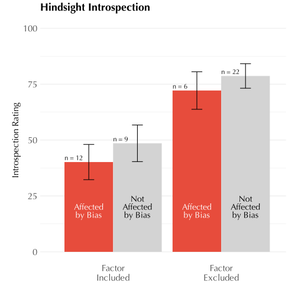

``` r
#11 mere exposure ✅ ----
    ##11.1 do we see the effect? ----

#Were the most seen words the most liked?

mere_exposure_data <- data %>%
  filter(task_name == "mere exposure") %>%
  filter(stimulus != "") %>%
  mutate(choice = as.numeric(choice))%>%
  mutate(condition = factor(condition, levels = c("25", "13","1")))
    

summary_mere_exposure_data <- mere_exposure_data %>%
  group_by(condition) %>%
  summarize(
    mean_choice = mean(choice),
    se_choice = se(choice)
  )

ggplot(summary_mere_exposure_data, aes(x = condition, y = mean_choice, fill = condition)) +
  geom_bar(stat = "identity") +
  geom_errorbar(aes(ymin = mean_choice - se_choice, ymax = mean_choice + se_choice), width = 0.2) +
  labs(title = "Mere Exposure effect", x = "Times seen the word", y = "Average rating of word") +
  theme_custom()+
  scale_fill_manual(values = in_neutral_ex)+
  guides(fill = FALSE)+   scale_x_discrete(labels = function(x) str_wrap(x, width = 14))
```

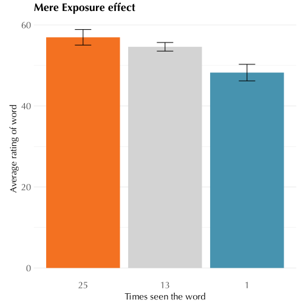

``` r
summary(lm(choice ~ condition, data = mere_exposure_data))
```

```
## 
## Call:
## lm(formula = choice ~ condition, data = mere_exposure_data)
## 
## Residuals:
##    Min     1Q Median     3Q    Max 
## -46.95 -14.60   1.76  13.40  41.76 
## 
## Coefficients:
##             Estimate Std. Error t value Pr(>|t|)    
## (Intercept)   56.950      1.871  30.446  < 2e-16 ***
## condition13   -2.346      2.179  -1.077  0.28211    
## condition1    -8.710      2.645  -3.293  0.00107 ** 
## ---
## Signif. codes:  0 '***' 0.001 '**' 0.01 '*' 0.05 '.' 0.1 ' ' 1
## 
## Residual standard error: 18.71 on 477 degrees of freedom
## Multiple R-squared:  0.02491,	Adjusted R-squared:  0.02082 
## F-statistic: 6.093 on 2 and 477 DF,  p-value: 0.002437
```

``` r
    ##11.2 introspection----

#Did factor included give higher introspection numbers 
#than factor excluded?

mere_exposure_data <- data %>%
  filter(task_name == "mere exposure") %>%
  filter(stimulus == "") %>%
  mutate(choice = as.numeric(choice))

summary_mere_exposure_data <- mere_exposure_data %>%
  group_by(factor) %>%
  mutate(factor = factor(factor, levels = c("Factor-Included", "Factor-Excluded"))) %>%
  summarize(
    mean_introspect_rating = mean(introspect_rating),
    se_introspect_rating = se(introspect_rating)
  )

ggplot(summary_mere_exposure_data, aes(x = factor, y = mean_introspect_rating, fill = factor)) +
  geom_bar(stat = "identity") +
  geom_errorbar(aes(ymin = mean_introspect_rating - se_introspect_rating, ymax = mean_introspect_rating + se_introspect_rating), width = 0.2) +
  labs(title = "Mere Exposure Introspection ratings", x = "Condition", y = "introspection rating") +
  theme_custom()+
  scale_fill_manual(values = in_and_ex)+
  guides(fill = FALSE)+   scale_x_discrete(labels = function(x) str_wrap(x, width = 14))+   scale_y_continuous(limits = c(0, 100))
```


``` r
t.test(introspect_rating ~ factor, data = mere_exposure_data)
```

```
## 
## 	Welch Two Sample t-test
## 
## data:  introspect_rating by factor
## t = -0.41536, df = 53.911, p-value = 0.6795
## alternative hypothesis: true difference in means between group Factor-Excluded and group Factor-Included is not equal to 0
## 95 percent confidence interval:
##  -10.92150   7.17293
## sample estimates:
## mean in group Factor-Excluded mean in group Factor-Included 
##                      52.88571                      54.76000
```

``` r
#next question: "intro_rating(included and their median rating of how much they liked the words was greater than the median rating for excluded)
#>
#intro_rating(included and not their median rating of how much they liked the words was greater than the median rating for excluded)"


mere_exposure_data <- data %>%
  filter(task_name == "mere exposure") %>%
  filter(stimulus != "") %>%
  mutate(choice = as.numeric(choice))

#median rating among excluded
median_rating_excluded = median(mere_exposure_data$choice[mere_exposure_data$factor == "Factor-Excluded"])

#I do not know why but these two subjects never gave introspection ratings
filtered_data <- data %>%
  filter(!(subject %in% c("58635484a73baa00010db537", "65e29e4514fa80bea57284b7")))

#make new table with subject number, average rating, and introspection rating
subject_data <- filtered_data %>%
  group_by(subject) %>%
  filter(task_name == "mere exposure") %>%
  mutate(choice = as.numeric(choice)) %>%
  summarise(
    average_choice_rating_per_subject = median(choice, na.rm = TRUE),
    introspect_rating = first(introspect_rating[!is.na(introspect_rating)]),
    factor = first(factor)
  )


#make new column for effect group
subject_data <- subject_data %>%
  mutate(effect_group = case_when(
    average_choice_rating_per_subject > median_rating_excluded & factor == "Factor-Included" ~ "Included and Rating Higher Than Excluded Median",
    average_choice_rating_per_subject <= median_rating_excluded & factor == "Factor-Included" ~ "Included and Rating Not Higher Than Excluded Median",
    average_choice_rating_per_subject > median_rating_excluded & factor == "Factor-Excluded" ~ "Excluded and Rating Higher Than Excluded Median",
    average_choice_rating_per_subject <= median_rating_excluded & factor == "Factor-Excluded" ~ "Excluded and Rating Not Higher Than Excluded Median",
  )) %>%
  mutate(effect_group = factor(effect_group, levels = c("Included and Rating Higher Than Excluded Median", "Included and Rating Not Higher Than Excluded Median", "Excluded and Rating Higher Than Excluded Median", "Excluded and Rating Not Higher Than Excluded Median", "Excluded")))

summary_mere_exposure_data <- subject_data %>%
  group_by(effect_group) %>%
  summarize(
    mean_introspect_rating = mean(introspect_rating),
    se_introspect_rating = se(introspect_rating)
  )

ggplot(summary_mere_exposure_data, aes(x = effect_group, y = mean_introspect_rating, fill = effect_group)) +
  geom_bar(stat = "identity") +
  geom_errorbar(aes(ymin = mean_introspect_rating - se_introspect_rating, ymax = mean_introspect_rating + se_introspect_rating), width = 0.2) +
  labs(title = "Mere Exposure Introspection ratings", x = "Condition", y = "introspection rating") +
  theme_custom() +
  scale_fill_manual(values = four_colors) +
  guides(fill = FALSE)+   scale_x_discrete(labels = function(x) str_wrap(x, width = 14))+   scale_y_continuous(limits = c(0, 100))+
  scale_x_discrete(labels = function(x) str_wrap(x, width = 14))
```

```
## Scale for x is already present.
## Adding another scale for x, which will replace the existing scale.
```

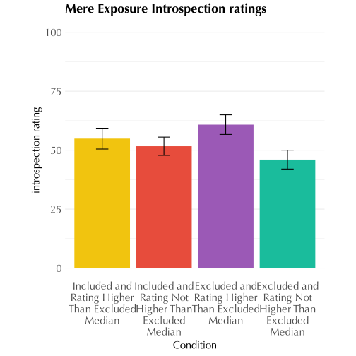

``` r
    ## New version ----


mere_exposure_data <- data %>%
  filter(task_name == "mere exposure") %>%
  filter(stimulus != "") %>%
  mutate(choice = as.numeric(choice))

#median rating among excluded
median_rating_excluded = median(mere_exposure_data$choice[mere_exposure_data$factor == "Factor-Excluded"])

#I do not know why but these two subjects never gave introspection ratings
filtered_data <- data %>%
  filter(!(subject %in% c("58635484a73baa00010db537", "65e29e4514fa80bea57284b7")))

#make new table with subject number, average rating, and introspection rating
mere_exposure_subject_data <- filtered_data %>%
  group_by(subject) %>%
  filter(task_name == "mere exposure") %>%
  mutate(choice = as.numeric(choice)) %>%
  summarise(
    average_choice_rating_per_subject = median(choice, na.rm = TRUE),
    introspect_rating = first(introspect_rating[!is.na(introspect_rating)]),
    affected = if_else(average_choice_rating_per_subject > median_rating_excluded,
                       "Affected by Bias",
                       "Not Affected by Bias"),
    factor = recode(factor(first(factor), levels = c("Factor-Included", "Factor-Excluded")),
                    `Factor-Included` = "Factor Included",
                    `Factor-Excluded` = "Factor Excluded"),
  )


summary_mere_exposure <- mere_exposure_subject_data %>%
  group_by(factor, affected) %>%
  summarise(
    mean_introspect_rating = mean(introspect_rating),
    se_introspect_rating = se(introspect_rating),
    n = n()
  )
```

```
## `summarise()` has grouped output by 'factor'. You can override using the `.groups`
## argument.
```

``` r
ggplot(summary_mere_exposure, aes(x = factor, y = mean_introspect_rating, fill = affected, group = affected)) + 
  theme_custom() +
  geom_bar(stat = "identity", position = position_dodge(0.9)) +
  geom_errorbar(aes(ymin = mean_introspect_rating - se_introspect_rating, ymax = mean_introspect_rating + se_introspect_rating), width = 0.2, position = position_dodge(0.9)) +
  geom_text(aes(label = paste("n =", n), x = stage(factor, after_stat = x - .9 / 2 / 2), y = mean_introspect_rating), 
            hjust = 0, vjust=-0.35, family = "optima", size = 4, position = position_dodge(0.9)) +
  geom_text(aes(label = str_wrap(affected, width = 10), y = 15, color = affected), 
            position = position_dodge(0.9), vjust = 0, family = "optima", size = 5, lineheight = 0.8) +
  labs(title = "Mere Exposure Introspection", x = "", y = "Introspection Rating") +
  scale_fill_manual(values = effect_no) +
  scale_color_manual(values = c("Affected by Bias" = "white", "Not Affected by Bias" = "black")) +
  scale_x_discrete(labels = function(x) str_wrap(x, width = 14)) +
  guides(fill = FALSE, color = FALSE) +
  scale_y_continuous(limits = c(0, 100))
```

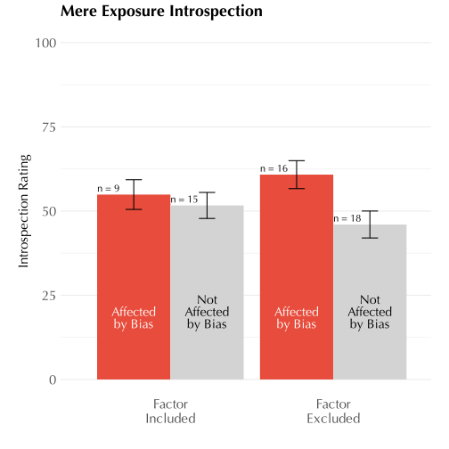

``` r
summary(lm(introspect_rating ~ effect_group, data = representativeness_data))
```

```
## 
## Call:
## lm(formula = introspect_rating ~ effect_group, data = representativeness_data)
## 
## Residuals:
##     Min      1Q  Median      3Q     Max 
## -55.200 -22.423   3.588  20.800  52.600 
## 
## Coefficients:
##                                            Estimate Std. Error t value Pr(>|t|)    
## (Intercept)                                  79.200      5.629  14.070  < 2e-16 ***
## effect_groupIncluded and Not Said Engineer  -32.950     13.788  -2.390  0.02025 *  
## effect_groupExcluded and Said Engineer      -31.800      9.750  -3.262  0.00189 ** 
## effect_groupExcluded and Not Said Engineer   -6.777      7.487  -0.905  0.36927    
## ---
## Signif. codes:  0 '***' 0.001 '**' 0.01 '*' 0.05 '.' 0.1 ' ' 1
## 
## Residual standard error: 25.17 on 56 degrees of freedom
## Multiple R-squared:  0.2044,	Adjusted R-squared:  0.1618 
## F-statistic: 4.796 on 3 and 56 DF,  p-value: 0.004818
```

``` r
#12 reference price ✅ ----
    ##12.1 do we see the effect? ----

#When subjects were told the hotel was fancy, were 
#they more likely to give a higher price they'd be willing to pay?

reference_price_data <- data %>%
  filter(task_name == "reference price") %>%
  mutate(choice_parsed = parse_number(choice))

##View(reference_price_data)

summary_reference_price_data <- reference_price_data %>%
  group_by(condition) %>%
  mutate(condition = factor(condition, levels = c("hotel", "motel"))) %>%
  summarize(
    mean_choice = mean(choice_parsed),
    se_choice = se(choice_parsed)
  )

ggplot(summary_reference_price_data, aes(x = condition, y = mean_choice, fill = condition)) +
  geom_bar(stat = "identity") +
  geom_errorbar(aes(ymin = mean_choice - se_choice, ymax = mean_choice + se_choice), width = 0.2) +
  labs(title = "Amount Willing to Pay for Beer", x = "Condition", y = "Average Amount Willing to Pay (Dollars)") +
  theme_custom()+
  scale_fill_manual(values = in_and_ex)+
  guides(fill = FALSE)+   scale_x_discrete(labels = function(x) str_wrap(x, width = 14))
```

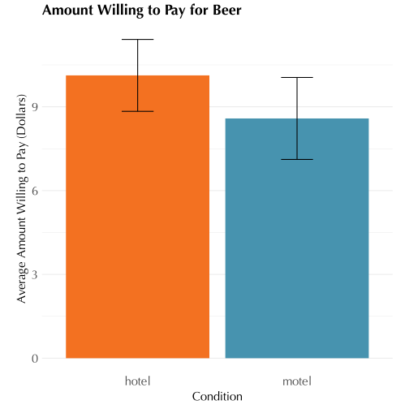

``` r
t.test(choice_parsed ~ factor, data = reference_price_data)
```

```
## 
## 	Welch Two Sample t-test
## 
## data:  choice_parsed by factor
## t = -0.78999, df = 57.642, p-value = 0.4328
## alternative hypothesis: true difference in means between group Factor-Excluded and group Factor-Included is not equal to 0
## 95 percent confidence interval:
##  -5.448517  2.365184
## sample estimates:
## mean in group Factor-Excluded mean in group Factor-Included 
##                      8.583333                     10.125000
```

``` r
# p-value = 0.4913

    ##12.2 introspection----

#Did factor included give lower introspection numbers than 
#factor excluded?

summary_reference_price_data <- reference_price_data %>%
  group_by(condition) %>%
  summarize(
    mean_introspect_rating = 100-mean(introspect_rating),
    se_introspect_rating = se(introspect_rating)
  )

ggplot(summary_reference_price_data, aes(x = condition, y = mean_introspect_rating, fill = condition)) +
  geom_bar(stat = "identity") +
  geom_errorbar(aes(ymin = mean_introspect_rating - se_introspect_rating, ymax = mean_introspect_rating + se_introspect_rating), width = 0.2) +
  labs(title = "Reference Price Introspection ratings", x = "Condition", y = "introspection rating") +
  theme_custom()+
  scale_fill_manual(values = in_and_ex)+
  guides(fill = FALSE)+   scale_x_discrete(labels = function(x) str_wrap(x, width = 14))+   scale_y_continuous(limits = c(0, 100))
```

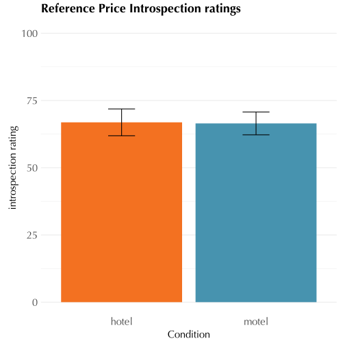

``` r
t.test(introspect_rating ~ factor, data = reference_price_data)
```

```
## 
## 	Welch Two Sample t-test
## 
## data:  introspect_rating by factor
## t = 0.061526, df = 50.792, p-value = 0.9512
## alternative hypothesis: true difference in means between group Factor-Excluded and group Factor-Included is not equal to 0
## 95 percent confidence interval:
##  -12.74118  13.54674
## sample estimates:
## mean in group Factor-Excluded mean in group Factor-Included 
##                      33.52778                      33.12500
```

``` r
#p-value = 0.8909

#"intro_rating(included and higher than median price)
#<
#  intro_rating(included and not higher than median price)
#"

#median price among excluded
median_price_among_excluded <- median(reference_price_data$choice_parsed[reference_price_data$factor == "Factor-Excluded"])

reference_price_data <- reference_price_data %>%
  mutate(effect_group = case_when(
    choice_parsed > median_price_among_excluded & factor == "Factor-Included" ~ "Included and Higher Than Median",
    choice_parsed <= median_price_among_excluded & factor == "Factor-Included" ~ "Included and Not Higher Than Median",
    choice_parsed > median_price_among_excluded & factor == "Factor-Excluded" ~ "Excluded and Higher Than Median",
    choice_parsed <= median_price_among_excluded & factor == "Factor-Excluded" ~ "Excluded and Not Higher Than Median",
    factor == "Factor-Excluded" ~ "Excluded"
  ))%>%
  mutate(effect_group = factor(effect_group, levels = c("Included and Higher Than Median", "Included and Not Higher Than Median",  "Excluded and Higher Than Median", "Excluded and Not Higher Than Median")))


summary_reference_price_data <- reference_price_data %>%
  group_by(effect_group) %>%
  summarize(
    mean_introspect_rating = 100-mean(introspect_rating),
    se_introspect_rating = se(introspect_rating)
  )

ggplot(summary_reference_price_data, aes(x = effect_group, y = mean_introspect_rating, fill = effect_group)) +
  geom_bar(stat = "identity") +
  geom_errorbar(aes(ymin = mean_introspect_rating - se_introspect_rating, ymax = mean_introspect_rating + se_introspect_rating), width = 0.2) +
  labs(title = "Reference Price Introspection ratings", x = "Condition", y = "introspection rating") +
  theme_custom() +
  scale_fill_manual(values = four_colors) +
  guides(fill = FALSE)+   scale_x_discrete(labels = function(x) str_wrap(x, width = 14))+   scale_y_continuous(limits = c(0, 100))
```

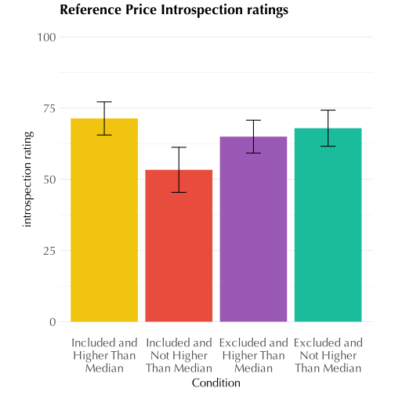

``` r
summary(lm(introspect_rating ~ effect_group, data = reference_price_data))
```

```
## 
## Call:
## lm(formula = introspect_rating ~ effect_group, data = reference_price_data)
## 
## Residuals:
##     Min      1Q  Median      3Q     Max 
## -35.000 -21.958   1.361  17.944  62.944 
## 
## Coefficients:
##                                                 Estimate Std. Error t value Pr(>|t|)    
## (Intercept)                                       28.611      5.878   4.867 9.62e-06 ***
## effect_groupIncluded and Not Higher Than Median   18.056     11.757   1.536    0.130    
## effect_groupExcluded and Higher Than Median        6.389      8.313   0.769    0.445    
## effect_groupExcluded and Not Higher Than Median    3.444      8.313   0.414    0.680    
## ---
## Signif. codes:  0 '***' 0.001 '**' 0.01 '*' 0.05 '.' 0.1 ' ' 1
## 
## Residual standard error: 24.94 on 56 degrees of freedom
## Multiple R-squared:  0.04254,	Adjusted R-squared:  -0.008757 
## F-statistic: 0.8293 on 3 and 56 DF,  p-value: 0.4834
```

``` r
    ## New version ----

median_price_among_excluded <- median(reference_price_data$choice_parsed[reference_price_data$factor == "Factor-Excluded"])

View(reference_data)

reference_data <- data %>%
  group_by(subject) %>%
  filter(task_name == "reference price") %>%
  summarise(
    choice_parsed = parse_number(choice),
    affected = if_else(choice_parsed > median_price_among_excluded, 
                       "Affected by Bias", 
                       "Not Affected by Bias"),
    factor = recode(factor(factor, levels = c("Factor-Included", "Factor-Excluded")), 
                    `Factor-Included` = "Factor Included", 
                    `Factor-Excluded` = "Factor Excluded"),
    introspect_rating = introspect_rating,
    condition = factor(condition, levels = c("Factor-Included", "Factor-Excluded")) 
  ) 


summary_reference <- reference_data %>%
  group_by(factor, affected) %>%
  summarise(
    mean_introspect_rating = 100-mean(introspect_rating),
    se_introspect_rating = se(introspect_rating),
    n = n()
  )
```

```
## `summarise()` has grouped output by 'factor'. You can override using the `.groups`
## argument.
```

``` r
ggplot(summary_reference, aes(x = factor, y = mean_introspect_rating, fill = affected, group = affected)) + 
  theme_custom() +
  geom_bar(stat = "identity", position = position_dodge(0.9)) +
  geom_errorbar(aes(ymin = mean_introspect_rating - se_introspect_rating, ymax = mean_introspect_rating + se_introspect_rating), width = 0.2, position = position_dodge(0.9)) +
  geom_text(aes(label = paste("n =", n), x = stage(factor, after_stat = x - .9 / 2 / 2), y = mean_introspect_rating), 
            hjust = 0, vjust=-0.35, family = "optima", size = 4, position = position_dodge(0.9)) +
  geom_text(aes(label = str_wrap(affected, width = 10), y = 15, color = affected), 
            position = position_dodge(0.9), vjust = 0, family = "optima", size = 5, lineheight = 0.8) +
  labs(title = "Reference Price Introspection", x = "", y = "Introspection Rating") +
  scale_fill_manual(values = effect_no) +
  scale_color_manual(values = c("Affected by Bias" = "white", "Not Affected by Bias" = "black")) +
  scale_x_discrete(labels = function(x) str_wrap(x, width = 14)) +
  guides(fill = FALSE, color = FALSE) +
  scale_y_continuous(limits = c(0, 100))
```

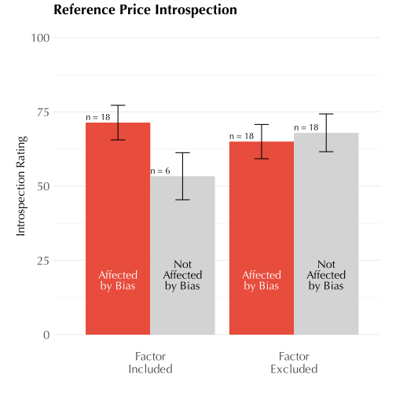

``` r
summary(lm(introspect_rating ~ effect_group, data = reference_data))
```

```
## Error in h(simpleError(msg, call)): error in evaluating the argument 'object' in selecting a method for function 'summary': object 'effect_group' not found
```

``` r
#13 representativeness  ✅ ----
    ##13.1 do we see the effect ----

#When subjects were given the description about Jack, 
#did more of them say he was an engineer?

representativeness_data <- data %>%
  filter(task_name == "rep") %>%
  mutate(choice = as.numeric(choice))

summary_representativeness_data <- representativeness_data %>%
  group_by(condition) %>%
  mutate(condition = factor(condition, levels = c("Factor-Included", "Factor-Excluded"))) %>%
  summarize(
    mean_choice = mean(choice),
    se_choice = se(choice)
  )

ggplot(summary_representativeness_data, aes(x = condition, y = mean_choice, fill = condition)) +
  geom_bar(stat = "identity") +
  geom_errorbar(aes(ymin = mean_choice - se_choice, ymax = mean_choice + se_choice), width = 0.2) +
  labs(title = "Is Jack an Engineer?", x = "Condition", y = "average likelihood of engineer") +
  theme_custom() +
  scale_fill_manual(values = in_and_ex)+
  guides(fill = FALSE)+   scale_x_discrete(labels = function(x) str_wrap(x, width = 14))
```

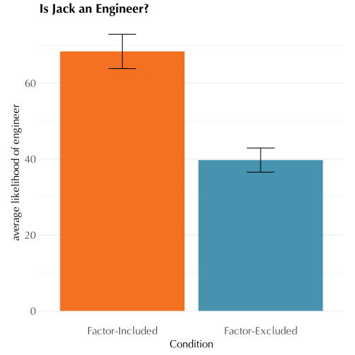

``` r
t.test(choice ~ factor, data = representativeness_data)
```

```
## 
## 	Welch Two Sample t-test
## 
## data:  choice by factor
## t = -5.1715, df = 44.132, p-value = 5.425e-06
## alternative hypothesis: true difference in means between group Factor-Excluded and group Factor-Included is not equal to 0
## 95 percent confidence interval:
##  -39.76019 -17.46203
## sample estimates:
## mean in group Factor-Excluded mean in group Factor-Included 
##                      39.72222                      68.33333
```

``` r
# p-value = 7.142e-06

    ##13.2 introspection----

#Did factor included give higher introspection 
#numbers than factor excluded?

summary_representativeness_data <- representativeness_data %>%
  group_by(condition) %>%
  mutate(condition = factor(condition, levels = c("Factor-Included", "Factor-Excluded"))) %>%
  summarize(
    mean_introspect_rating = mean(introspect_rating),
    se_introspect_rating = se(introspect_rating)
  )

ggplot(summary_representativeness_data, aes(x = condition, y = mean_introspect_rating, fill = condition)) +
  geom_bar(stat = "identity") +
  geom_errorbar(aes(ymin = mean_introspect_rating - se_introspect_rating, ymax = mean_introspect_rating + se_introspect_rating), width = 0.2) +
  labs(title = "Representativeness Introspection ratings", x = "Condition", y = "introspection rating") +
  theme_custom()+
  scale_fill_manual(values = in_and_ex)+
  guides(fill = FALSE)+   scale_x_discrete(labels = function(x) str_wrap(x, width = 14))+   scale_y_continuous(limits = c(0, 100))
```

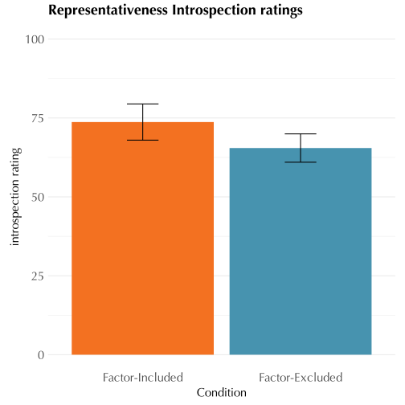

``` r
t.test(introspect_rating ~ factor, data = representativeness_data)
```

```
## 
## 	Welch Two Sample t-test
## 
## data:  introspect_rating by factor
## t = -1.1299, df = 47.999, p-value = 0.2641
## alternative hypothesis: true difference in means between group Factor-Excluded and group Factor-Included is not equal to 0
## 95 percent confidence interval:
##  -22.89177   6.41955
## sample estimates:
## mean in group Factor-Excluded mean in group Factor-Included 
##                      65.47222                      73.70833
```

``` r
#p-value = 0.2962

#next question: "intro_rating(included and said Jack was more likely to be engineer than median of excluded)
#>
#  intro_rating(included and not said Jack was more likely to be engineer than median of excluded"

#median likelihood of engineer among excluded
median_likelihood_of_engineer <- median(representativeness_data$choice[representativeness_data$factor == "Factor-Excluded"])
print(median_likelihood_of_engineer)
```

```
## [1] 30
```

``` r
representativeness_data <- representativeness_data %>%
  mutate(effect_group = case_when(
    choice > median_likelihood_of_engineer & factor == "Factor-Included" ~ "Included and Said Engineer",
    choice <= median_likelihood_of_engineer & factor == "Factor-Included" ~ "Included and Not Said Engineer",
    choice > median_likelihood_of_engineer & factor == "Factor-Excluded" ~ "Excluded and Said Engineer",
    choice <= median_likelihood_of_engineer & factor == "Factor-Excluded" ~ "Excluded and Not Said Engineer"
  )) %>%
  mutate(effect_group = factor(effect_group, levels = c("Included and Said Engineer", "Included and Not Said Engineer",  "Excluded and Said Engineer", "Excluded and Not Said Engineer")))


summary_representativeness_data <- representativeness_data %>%
  group_by(effect_group) %>%
  summarize(
    mean_introspect_rating = mean(introspect_rating),
    se_introspect_rating = se(introspect_rating)
  )

ggplot(summary_representativeness_data, aes(x = effect_group, y = mean_introspect_rating, fill = effect_group)) +
  geom_bar(stat = "identity") +
  geom_errorbar(aes(ymin = mean_introspect_rating - se_introspect_rating, ymax = mean_introspect_rating + se_introspect_rating), width = 0.2) +
  labs(title = "Representativeness Introspection Ratings", x = "Condition", y = "introspection rating") +
  theme_custom()+
  scale_fill_manual(values = four_colors) +
  guides(fill = FALSE)+   scale_x_discrete(labels = function(x) str_wrap(x, width = 14))+   scale_y_continuous(limits = c(0, 100))
```

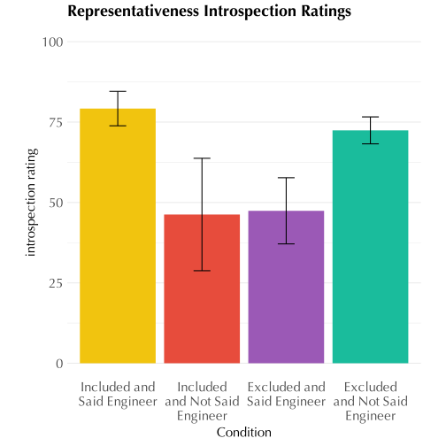

``` r
    ## New version ----

median_likelihood_of_engineer <- median(representativeness_data$choice[representativeness_data$factor == "Factor-Excluded"])


View(representatative_data)

representatative_data <- data %>%
  group_by(subject) %>%
  filter(task_name == "rep") %>%
  summarise(
    affected = if_else(choice > median_likelihood_of_engineer, 
                       "Affected by Bias", 
                       "Not Affected by Bias"),
    factor = recode(factor(factor, levels = c("Factor-Included", "Factor-Excluded")), 
                    `Factor-Included` = "Factor Included", 
                    `Factor-Excluded` = "Factor Excluded"),
    introspect_rating = introspect_rating,
    condition = factor(condition, levels = c("Factor-Included", "Factor-Excluded")) 
  ) 


summary_representatative <- representatative_data %>%
  group_by(factor, affected) %>%
  summarise(
    mean_introspect_rating = mean(introspect_rating),
    se_introspect_rating = se(introspect_rating),
    n = n()
  )
```

```
## `summarise()` has grouped output by 'factor'. You can override using the `.groups`
## argument.
```

``` r
ggplot(summary_representatative, aes(x = factor, y = mean_introspect_rating, fill = affected, group = affected)) + 
  theme_custom() +
  geom_bar(stat = "identity", position = position_dodge(0.9)) +
  geom_errorbar(aes(ymin = mean_introspect_rating - se_introspect_rating, ymax = mean_introspect_rating + se_introspect_rating), width = 0.2, position = position_dodge(0.9)) +
  geom_text(aes(label = paste("n =", n), x = stage(factor, after_stat = x - .9 / 2 / 2), y = mean_introspect_rating), 
            hjust = 0, vjust=-0.35, family = "optima", size = 4, position = position_dodge(0.9)) +
  geom_text(aes(label = str_wrap(affected, width = 10), y = 15, color = affected), 
            position = position_dodge(0.9), vjust = 0, family = "optima", size = 5, lineheight = 0.8) +
  labs(title = "Representativeness Introspection", x = "", y = "Introspection Rating") +
  scale_fill_manual(values = effect_no) +
  scale_color_manual(values = c("Affected by Bias" = "white", "Not Affected by Bias" = "black")) +
  scale_x_discrete(labels = function(x) str_wrap(x, width = 14)) +
  guides(fill = FALSE, color = FALSE) +
  scale_y_continuous(limits = c(0, 100))
```

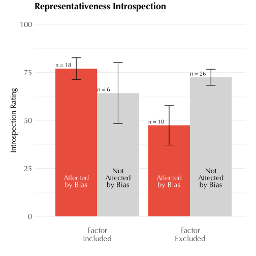

``` r
summary(lm(introspect_rating ~ effect_group, data = representativeness_data))
```

```
## 
## Call:
## lm(formula = introspect_rating ~ effect_group, data = representativeness_data)
## 
## Residuals:
##     Min      1Q  Median      3Q     Max 
## -55.200 -22.423   3.588  20.800  52.600 
## 
## Coefficients:
##                                            Estimate Std. Error t value Pr(>|t|)    
## (Intercept)                                  79.200      5.629  14.070  < 2e-16 ***
## effect_groupIncluded and Not Said Engineer  -32.950     13.788  -2.390  0.02025 *  
## effect_groupExcluded and Said Engineer      -31.800      9.750  -3.262  0.00189 ** 
## effect_groupExcluded and Not Said Engineer   -6.777      7.487  -0.905  0.36927    
## ---
## Signif. codes:  0 '***' 0.001 '**' 0.01 '*' 0.05 '.' 0.1 ' ' 1
## 
## Residual standard error: 25.17 on 56 degrees of freedom
## Multiple R-squared:  0.2044,	Adjusted R-squared:  0.1618 
## F-statistic: 4.796 on 3 and 56 DF,  p-value: 0.004818
```

``` r
#14 status quo ✅ ----

    ##14.1 do we see the effect ----

#When subjects were told the status quo, 
#were they more likely to recommend the 70/30 allocation?

status_quo_data <- data %>%
  filter(task_name == "status_quo") %>%
  mutate(choice_binary = as.numeric(choice == "70/30"))%>%
  mutate(condition = factor(condition, levels = c("Factor-Included", "Factor-Excluded"))) 
  


summary_status_quo_data <- status_quo_data %>%
  group_by(condition) %>%
  summarize(
    mean_choice = mean(choice_binary),
    se_choice = se.prop(choice_binary)
  )

ggplot(summary_status_quo_data, aes(x = condition, y = mean_choice, fill = condition)) +
  geom_bar(stat = "identity") +
  geom_errorbar(aes(ymin = mean_choice - se_choice, ymax = mean_choice + se_choice), width = 0.2) +
  labs(title = "Choices to continue the status quo", x = "Condition", y = "Percent subjects who recommended the status quo") +
  theme_custom() +
  scale_fill_manual(values = in_and_ex)+
  guides(fill = FALSE)+   scale_x_discrete(labels = function(x) str_wrap(x, width = 14))
```

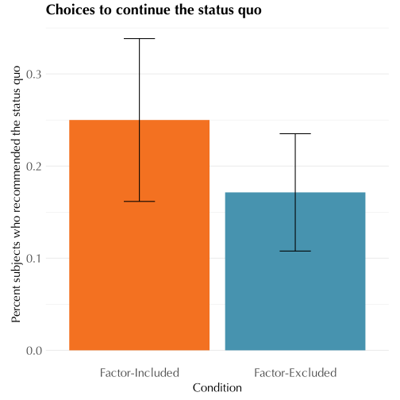

``` r
status_quo_choices_ex <- status_quo_data %>%
  filter(factor == "Factor-Excluded") %>%
  pull(choice_binary)

status_quo_choices_in <- status_quo_data %>%
  filter(factor == "Factor-Included") %>%
  pull(choice_binary)

#analysis -- is there a better way to do this?
prop_ex <- sum(status_quo_choices_ex) / length(status_quo_choices_ex)
prop_in <- sum(status_quo_choices_in) / length(status_quo_choices_in)

successes <- c(sum(status_quo_choices_ex), sum(status_quo_choices_in))
trials <- c(length(status_quo_choices_ex), length(status_quo_choices_in))

test_result <- prop.test(successes, trials, alternative = "less")
```

```
## Warning in prop.test(successes, trials, alternative = "less"): Chi-squared
## approximation may be incorrect
```

``` r
print(test_result)
```

```
## 
## 	2-sample test for equality of proportions with continuity correction
## 
## data:  successes out of trials
## X-squared = 0.16591, df = 1, p-value = 0.3419
## alternative hypothesis: less
## 95 percent confidence interval:
##  -1.0000000  0.1357598
## sample estimates:
##    prop 1    prop 2 
## 0.1714286 0.2500000
```

``` r
#p-value = 0.3625
  
    ##14.2 introspection----

#Did factor included give lower introspection 
#numbers than factor excluded?

summary_status_quo_data <- status_quo_data %>%
  mutate(condition = factor(condition, levels = c("Factor-Included", "Factor-Excluded"))) %>%
  group_by(condition) %>%
  summarize(
    mean_introspect_rating = 100-mean(introspect_rating),
    se_introspect_rating = se(introspect_rating)
  )

View(summary_status_quo_data)

ggplot(summary_status_quo_data, aes(x = condition, y = mean_introspect_rating, fill = condition)) +
  geom_bar(stat = "identity") +
  geom_errorbar(aes(ymin = mean_introspect_rating - se_introspect_rating, ymax = mean_introspect_rating + se_introspect_rating), width = 0.2) +
  labs(title = "Status Quo Introspection Ratings", x = "Condition", y = "Introspection rating") +
  theme_custom() +
  scale_fill_manual(values = in_and_ex)+
  guides(fill = FALSE)+   scale_x_discrete(labels = function(x) str_wrap(x, width = 14))+   scale_y_continuous(limits = c(0, 100))
```

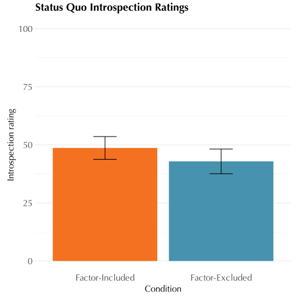

``` r
t.test(introspect_rating ~ factor, data = status_quo_data)
```

```
## 
## 	Welch Two Sample t-test
## 
## data:  introspect_rating by factor
## t = 0.79918, df = 56.266, p-value = 0.4275
## alternative hypothesis: true difference in means between group Factor-Excluded and group Factor-Included is not equal to 0
## 95 percent confidence interval:
##  -8.708115 20.270020
## sample estimates:
## mean in group Factor-Excluded mean in group Factor-Included 
##                      57.11429                      51.33333
```

``` r
#p-value = 0.3647

#next question: "intro_rating(included and said 70/30)
#<
#  intro_rating(included and said 50/50)"

status_quo_data <- data %>%
  group_by(subject) %>%
  filter(task_name == "status_quo") %>%
  summarise(
    affected = if_else(choice == "70/30", 
                       "Affected by Bias", 
                       "Not Affected by Bias"),
    factor = recode(factor(factor, levels = c("Factor-Included", "Factor-Excluded")), 
                    `Factor-Included` = "Factor Included", 
                    `Factor-Excluded` = "Factor Excluded"),
    introspect_rating = introspect_rating,
    condition = factor(condition, levels = c("Factor-Included", "Factor-Excluded")) 
  ) 

View(summary_status_quo)

summary_status_quo <- status_quo_data %>%
  group_by(factor, affected) %>%
  summarise(
    mean_introspect_rating = 100-mean(introspect_rating),
    se_introspect_rating = se(introspect_rating),
    n = n()
  )
```

```
## `summarise()` has grouped output by 'factor'. You can override using the `.groups`
## argument.
```

``` r
ggplot(summary_status_quo, aes(x = factor, y = mean_introspect_rating, fill = affected, group = affected)) + 
  theme_custom() +
  geom_bar(stat = "identity", position = position_dodge(0.9)) +
  geom_errorbar(aes(ymin = mean_introspect_rating - se_introspect_rating, ymax = mean_introspect_rating + se_introspect_rating), width = 0.2, position = position_dodge(0.9)) +
  geom_text(aes(label = paste("n =", n), x = stage(factor, after_stat = x - .9 / 2 / 2), y = mean_introspect_rating), 
            hjust = 0, vjust=-0.35, family = "optima", size = 4, position = position_dodge(0.9)) +
  geom_text(aes(label = str_wrap(affected, width = 10), y = 15, color = affected), 
            position = position_dodge(0.9), vjust = 0, family = "optima", size = 5, lineheight = 0.8) +
  labs(title = "Status Quo Bias Introspection", x = "", y = "Introspection Rating") +
  scale_fill_manual(values = effect_no) +
  scale_color_manual(values = c("Affected by Bias" = "white", "Not Affected by Bias" = "black")) +
  scale_x_discrete(labels = function(x) str_wrap(x, width = 14)) +
  guides(fill = FALSE, color = FALSE) +
  scale_y_continuous(limits = c(0, 100))


# Knittr ----

if (!requireNamespace("knitr", quietly = TRUE)) {
  install.packages("knitr")
}
library(knitr)

setwd(dirname(rstudioapi::getActiveDocumentContext()$path))
```

```
## Error in dirname(rstudioapi::getActiveDocumentContext()$path): a character vector argument expected
```

``` r
knitr::opts_chunk$set(dev = 'svg')

# Use the stitch function
knitr::spin("analysis2024.R")
```

```
## 
## 
## processing file: analysis2024.Rmd
```

```
## 
  |                                                                             
  |                                                                       |   0%
  |                                                                             
  |........................                                               |  33%                  
  |                                                                             
  |...............................................                        |  67% [unnamed-chunk-3]
  |                                                                             
  |.......................................................................| 100%                  
```

```
## output file: analysis2024.md
```

```
## Warning in file.remove(outsrc): cannot remove file 'analysis2024.Rmd', reason 'No
## such file or directory'
```

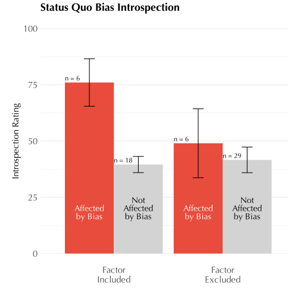

