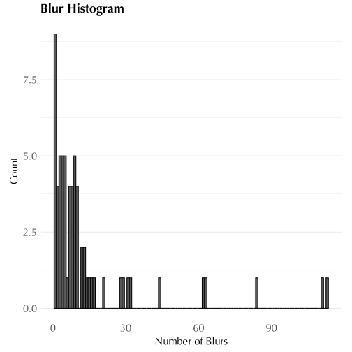
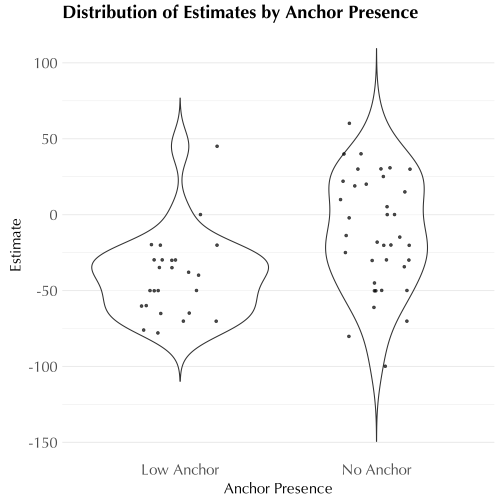

``` r
# Setup -------------------------------------------------------------------
library(extrafont)
require(dplyr)
require(ggplot2)
require(lme4)
require(lmerTest)
require(sjPlot)
require(magrittr)
require(readr)
library(stringr)
library(RColorBrewer)
library(extrafont)
library(Cairo)


setwd(dirname(rstudioapi::getActiveDocumentContext()$path))

se = function(x) {return(sd(x, na.rm = T) / sqrt(sum(!is.na(x))))}
se.prop = function(x) {return(sqrt(mean(x, na.rm = T) * (1-mean(x, na.rm = T)) / sum(!is.na(x))))}
dodge <- position_dodge(width=0.9)

data <- read.csv('data.csv') %>%
  arrange(subject, task_name) %>%
  mutate(total_time = ifelse(grepl("^total_time", introspect_rating), introspect_rating, NA)) %>%
  mutate(introspect_rating = ifelse(grepl("^total_time", introspect_rating), NA, introspect_rating)) %>%
  mutate(introspect_rating = as.numeric(introspect_rating))
head(data)
```

```
##                    subject subject_prolific   version
## 1 572bf2aa34b25a000edd2e73               NA v5_pilot1
## 2 572bf2aa34b25a000edd2e73               NA v5_pilot1
## 3 572bf2aa34b25a000edd2e73               NA v5_pilot1
## 4 572bf2aa34b25a000edd2e73               NA v5_pilot1
## 5 572bf2aa34b25a000edd2e73               NA v5_pilot1
## 6 572bf2aa34b25a000edd2e73               NA v5_pilot1
##            factor          task_name  condition
## 1 Factor-Included          anchoring Low Anchor
## 2 Factor-Included          anchoring Low Anchor
## 3 Factor-Included          anchoring Low Anchor
## 4 Factor-Included associative memory      Sleep
## 5 Factor-Included associative memory   NonSleep
## 6 Factor-Included associative memory   NonSleep
##                stimulus   choice auxiliary_info1
## 1 Antarctic Temperature      -76           Lower
## 2          Whale Length       64         Shorter
## 3                                               
## 4                  rest Original        Original
## 5                 heart      New             New
## 6                bitter      New             New
##                                                                                                                                                                                                                                                                                                                          openq_response
## 1                                                                                                                                                                                                                                                                                                                                      
## 2                                                                                                                                                                                                                                                                                                                                      
## 3 I just tried to estimate what I would think a winter in the arctic and the shortest blue whale would look like. I know the arctic gets deadly cold, and that blue whales are huge, so I just assumed that there might be some slight deviation for blue whales, and that it gets colder than what I was given for the arctic question
## 4                                                                                                                                                                                                                                                                                                                                      
## 5                                                                                                                                                                                                                                                                                                                                      
## 6                                                                                                                                                                                                                                                                                                                                      
##   introspect_rating introspect_open familiarity    rt
## 1                NA              NA             18739
## 2                NA              NA             18739
## 3                79              32          No  4131
## 4                NA              NA               796
## 5                NA              NA               920
## 6                NA              NA               708
##             timestamp    id total_time
## 1 2024-06-21 20:30:24 76596       <NA>
## 2 2024-06-21 20:30:24 76597       <NA>
## 3 2024-06-21 20:32:21 76641       <NA>
## 4 2024-06-21 20:37:42 76765       <NA>
## 5 2024-06-21 20:37:44 76767       <NA>
## 6 2024-06-21 20:37:45 76768       <NA>
```

``` r
data = data %>%
  filter(familiarity != "Yes") %>%
  mutate(factor = factor(factor, levels = c("Factor-Included", "Factor-Excluded")))


# color palettes: hot for included, cool for excluded

#Included vs. Excluded
in_and_ex <- c("#F37121", "#4793AF")

in_neutral_ex <- c("#F37121", "#D3D3D3", "#4793AF")


#In&Effect, In&NoEffect, Ex&Effect, Ex&NoEffect
four_colors <- c("#f1c40f", "#e74c3c","#9b59b6", "#1abc9c")

#In&Effect, In&NoEffect, Ex
three_colors <- c("#f1c40f", "#e74c3c","#4793AF")

#In&Effect, Ex
two_colors <- c("#f1c40f", "#e74c3c")

theme_custom <- function() {
  theme_minimal(base_family = "Forum") +
    theme(
    )
}

font_import(pattern = "Forum", prompt = FALSE)
```

```
## Scanning ttf files in /Library/Fonts/, /System/Library/Fonts, /System/Library/Fonts/Supplemental, ~/Library/Fonts/ ...
```

```
## Extracting .afm files from .ttf files...
```

```
## /Users/noaperlmutter/Library/Fonts/Forum-Regular.ttf : Forum already registered in fonts database. Skipping.
## Found FontName for 0 fonts.
## Scanning afm files in /Library/Frameworks/R.framework/Versions/4.4-arm64/Resources/library/extrafontdb/metrics
```

``` r
loadfonts(device = "pdf")
```

```
## .Keyboard already registered with pdfFont().
## .New York already registered with pdfFont().
## .SF Arabic already registered with pdfFont().
## .SF Arabic Rounded already registered with pdfFont().
## .SF Armenian already registered with pdfFont().
## .SF Armenian Rounded already registered with pdfFont().
## .SF Camera already registered with pdfFont().
## .SF Compact already registered with pdfFont().
## .SF Compact Rounded already registered with pdfFont().
## .SF Georgian already registered with pdfFont().
## .SF Georgian Rounded already registered with pdfFont().
## .SF Hebrew already registered with pdfFont().
## .SF Hebrew Rounded already registered with pdfFont().
## .SF NS Mono already registered with pdfFont().
## .SF NS Rounded already registered with pdfFont().
## Academy Engraved LET already registered with pdfFont().
## Amarante already registered with pdfFont().
## Andale Mono already registered with pdfFont().
## Anonymice Powerline already registered with pdfFont().
## More than one version of regular/bold/italic found for Apple Braille. Skipping setup for this font.
## AppleMyungjo already registered with pdfFont().
## Arial already registered with pdfFont().
## Arial Black already registered with pdfFont().
## Arial Narrow already registered with pdfFont().
## Arial Rounded MT Bold already registered with pdfFont().
## Arial Unicode MS already registered with pdfFont().
## Arimo for Powerline already registered with pdfFont().
## Barokah Signature already registered with pdfFont().
## Belleza already registered with pdfFont().
## Birthstone Bounce already registered with pdfFont().
## Birthstone Bounce Medium already registered with pdfFont().
## Bodoni 72 Smallcaps already registered with pdfFont().
## Bodoni Ornaments already registered with pdfFont().
## No regular (non-bold, non-italic) version of Brush Script MT. Skipping setup for this font.
## Champagne & Limousines already registered with pdfFont().
## Comic Sans MS already registered with pdfFont().
## Cormorant already registered with pdfFont().
## Cormorant Garamond already registered with pdfFont().
## Cormorant Garamond Light already registered with pdfFont().
## Cormorant Garamond Medium already registered with pdfFont().
## Cormorant Garamond SemiBold already registered with pdfFont().
## Cormorant Light already registered with pdfFont().
## Cormorant Medium already registered with pdfFont().
## Cormorant SemiBold already registered with pdfFont().
## Courier New already registered with pdfFont().
## Cousine for Powerline already registered with pdfFont().
## More than one version of regular/bold/italic found for DejaVu LGC Sans. Skipping setup for this font.
## DejaVu LGC Sans Condensed already registered with pdfFont().
## DejaVu LGC Sans Mono already registered with pdfFont().
## DejaVu Sans Mono for Powerline already registered with pdfFont().
## No regular (non-bold, non-italic) version of DIN Alternate. Skipping setup for this font.
## No regular (non-bold, non-italic) version of DIN Condensed. Skipping setup for this font.
## Droid Sans Mono Dotted for Powerline already registered with pdfFont().
## Droid Sans Mono Slashed for Powerline already registered with pdfFont().
## EB Garamond already registered with pdfFont().
## Forum already registered with pdfFont().
## Georgia already registered with pdfFont().
## Go Mono for Powerline already registered with pdfFont().
## Goudy Bookletter 1911 already registered with pdfFont().
## Great Vibes already registered with pdfFont().
## Hack already registered with pdfFont().
## IBM 3270 already registered with pdfFont().
## IBM 3270 Narrow already registered with pdfFont().
## IBM 3270 Semi-Narrow already registered with pdfFont().
## Impact already registered with pdfFont().
## No regular (non-bold, non-italic) version of Inconsolata for Powerline. Skipping setup for this font.
## Initials with curls already registered with pdfFont().
## Josefin Sans Thin already registered with pdfFont().
## Khmer Sangam MN already registered with pdfFont().
## king plus monospace already registered with pdfFont().
## Lao Sangam MN already registered with pdfFont().
## Libre Caslon Text already registered with pdfFont().
## LimeGloryCaps already registered with pdfFont().
## Literation Mono Powerline already registered with pdfFont().
## Luminari already registered with pdfFont().
## Meslo LG L DZ for Powerline already registered with pdfFont().
## Meslo LG L for Powerline already registered with pdfFont().
## Meslo LG M DZ for Powerline already registered with pdfFont().
## Meslo LG M for Powerline already registered with pdfFont().
## Meslo LG S DZ for Powerline already registered with pdfFont().
## Meslo LG S for Powerline already registered with pdfFont().
## Microsoft Sans Serif already registered with pdfFont().
## More than one version of regular/bold/italic found for monofur for Powerline. Skipping setup for this font.
## Monopol already registered with pdfFont().
## Myfont already registered with pdfFont().
## NegativeO already registered with pdfFont().
## Noto Mono for Powerline already registered with pdfFont().
## Noto Sans Adlam already registered with pdfFont().
## Noto Sans Avestan already registered with pdfFont().
## Noto Sans Bamum already registered with pdfFont().
## Noto Sans Bassa Vah already registered with pdfFont().
## Noto Sans Batak already registered with pdfFont().
## Noto Sans Bhaiksuki already registered with pdfFont().
## Noto Sans Brahmi already registered with pdfFont().
## Noto Sans Buginese already registered with pdfFont().
## Noto Sans Buhid already registered with pdfFont().
## Noto Sans Carian already registered with pdfFont().
## Noto Sans CaucAlban already registered with pdfFont().
## Noto Sans Chakma already registered with pdfFont().
## Noto Sans Cham already registered with pdfFont().
## Noto Sans Coptic already registered with pdfFont().
## Noto Sans Cuneiform already registered with pdfFont().
## Noto Sans Cypriot already registered with pdfFont().
## Noto Sans Duployan already registered with pdfFont().
## Noto Sans EgyptHiero already registered with pdfFont().
## Noto Sans Elbasan already registered with pdfFont().
## Noto Sans Glagolitic already registered with pdfFont().
## Noto Sans Gothic already registered with pdfFont().
## Noto Sans HanifiRohg already registered with pdfFont().
## Noto Sans Hanunoo already registered with pdfFont().
## Noto Sans Hatran already registered with pdfFont().
## Noto Sans ImpAramaic already registered with pdfFont().
## Noto Sans InsPahlavi already registered with pdfFont().
## Noto Sans InsParthi already registered with pdfFont().
## Noto Sans Kaithi already registered with pdfFont().
## Noto Sans Kayah Li already registered with pdfFont().
## Noto Sans Kharoshthi already registered with pdfFont().
## Noto Sans Khojki already registered with pdfFont().
## Noto Sans Khudawadi already registered with pdfFont().
## Noto Sans Lepcha already registered with pdfFont().
## Noto Sans Limbu already registered with pdfFont().
## Noto Sans Linear A already registered with pdfFont().
## Noto Sans Linear B already registered with pdfFont().
## Noto Sans Lisu already registered with pdfFont().
## Noto Sans Lycian already registered with pdfFont().
## Noto Sans Lydian already registered with pdfFont().
## Noto Sans Mahajani already registered with pdfFont().
## Noto Sans Mandaic already registered with pdfFont().
## Noto Sans Manichaean already registered with pdfFont().
## Noto Sans Marchen already registered with pdfFont().
## Noto Sans MeeteiMayek already registered with pdfFont().
## Noto Sans Mende Kikakui already registered with pdfFont().
## Noto Sans Meroitic already registered with pdfFont().
## Noto Sans Miao already registered with pdfFont().
## Noto Sans Modi already registered with pdfFont().
## Noto Sans Mongolian already registered with pdfFont().
## Noto Sans Mro already registered with pdfFont().
## Noto Sans Multani already registered with pdfFont().
## Noto Sans Nabataean already registered with pdfFont().
## Noto Sans Newa already registered with pdfFont().
## Noto Sans NewTaiLue already registered with pdfFont().
## Noto Sans NKo already registered with pdfFont().
## Noto Sans Ol Chiki already registered with pdfFont().
## No regular (non-bold, non-italic) version of Noto Sans Old Italic. Skipping setup for this font.
## Noto Sans Old Permic already registered with pdfFont().
## Noto Sans Old Turkic already registered with pdfFont().
## Noto Sans OldHung already registered with pdfFont().
## Noto Sans OldNorArab already registered with pdfFont().
## Noto Sans OldPersian already registered with pdfFont().
## Noto Sans OldSouArab already registered with pdfFont().
## Noto Sans Osage already registered with pdfFont().
## Noto Sans Osmanya already registered with pdfFont().
## Noto Sans Pahawh Hmong already registered with pdfFont().
## Noto Sans Palmyrene already registered with pdfFont().
## Noto Sans PauCinHau already registered with pdfFont().
## Noto Sans PhagsPa already registered with pdfFont().
## Noto Sans Phoenician already registered with pdfFont().
## Noto Sans PsaPahlavi already registered with pdfFont().
## Noto Sans Rejang already registered with pdfFont().
## Noto Sans Samaritan already registered with pdfFont().
## Noto Sans Saurashtra already registered with pdfFont().
## Noto Sans Sharada already registered with pdfFont().
## Noto Sans Siddham already registered with pdfFont().
## Noto Sans SoraSomp already registered with pdfFont().
## Noto Sans Sundanese already registered with pdfFont().
## Noto Sans Syloti Nagri already registered with pdfFont().
## Noto Sans Syriac already registered with pdfFont().
## Noto Sans Tagalog already registered with pdfFont().
## Noto Sans Tagbanwa already registered with pdfFont().
## Noto Sans Tai Le already registered with pdfFont().
## Noto Sans Tai Tham already registered with pdfFont().
## Noto Sans Tai Viet already registered with pdfFont().
## Noto Sans Takri already registered with pdfFont().
## Noto Sans Thaana already registered with pdfFont().
## Noto Sans Tifinagh already registered with pdfFont().
## Noto Sans Tirhuta already registered with pdfFont().
## Noto Sans Ugaritic already registered with pdfFont().
## Noto Sans Vai already registered with pdfFont().
## Noto Sans Wancho already registered with pdfFont().
## Noto Sans WarangCiti already registered with pdfFont().
## Noto Sans Yi already registered with pdfFont().
## Noto Serif Ahom already registered with pdfFont().
## Noto Serif Balinese already registered with pdfFont().
## Noto Serif Hmong Nyiakeng already registered with pdfFont().
## NovaMono for Powerline already registered with pdfFont().
## Party LET already registered with pdfFont().
## Pompiere  already registered with pdfFont().
## ProFont for Powerline already registered with pdfFont().
## Rec Mono Linear already registered with pdfFont().
## Rec Mono Semicasual already registered with pdfFont().
## Roboto Mono for Powerline already registered with pdfFont().
## Roboto Mono Light for Powerline already registered with pdfFont().
## Roboto Mono Medium for Powerline already registered with pdfFont().
## Roboto Mono Thin for Powerline already registered with pdfFont().
## SF Compact already registered with pdfFont().
## SF Pro already registered with pdfFont().
## Soria already registered with pdfFont().
## Space Mono already registered with pdfFont().
## Space Mono for Powerline already registered with pdfFont().
## STIX Two Text already registered with pdfFont().
## Symbol Neu for Powerline already registered with pdfFont().
## System Font already registered with pdfFont().
## Tahoma already registered with pdfFont().
## Tangerine already registered with pdfFont().
## Times New Roman already registered with pdfFont().
## Tinos for Powerline already registered with pdfFont().
## Trattatello already registered with pdfFont().
## Trebuchet MS already registered with pdfFont().
## Ubuntu Mono derivative Powerline already registered with pdfFont().
## URWClassico already registered with pdfFont().
## Verdana already registered with pdfFont().
## Webdings already registered with pdfFont().
## Wingdings already registered with pdfFont().
## Wingdings 2 already registered with pdfFont().
## Wingdings 3 already registered with pdfFont().
## More than one version of regular/bold/italic found for Wrought. Skipping setup for this font.
## XAyax already registered with pdfFont().
## Zt Chablis already registered with pdfFont().
## Zt Chablis Light already registered with pdfFont().
## Zt Chablis Light Slow already registered with pdfFont().
## Zt Chablis Med already registered with pdfFont().
## Zt Chablis Med Slow already registered with pdfFont().
## Zt Chablis SemBd already registered with pdfFont().
## Zt Chablis SemBd Slow already registered with pdfFont().
## Zt Chablis Slow already registered with pdfFont().
```

``` r
#14 status quo ✅ ----

##14.1 do we see the effect ----

#When subjects were told the status quo, 
#were they more likely to recommend the 70/30 allocation?

status_quo_data <- data %>%
  filter(task_name == "status_quo") %>%
  mutate(choice_binary = as.numeric(choice == "70/30"))%>%
  mutate(condition = factor(condition, levels = c("Factor-Included", "Factor-Excluded"))) 


summary_status_quo_data <- status_quo_data %>%
  group_by(condition) %>%
  summarize(
    mean_choice = mean(choice_binary),
    se_choice = se.prop(choice_binary)
  )

ggplot(summary_status_quo_data, aes(x = condition, y = mean_choice, fill = condition, fill = condition)) +
  geom_bar(stat = "identity") +
  geom_errorbar(aes(ymin = mean_choice - se_choice, ymax = mean_choice + se_choice), width = 0.2) +
  labs(title = "Choices to continue the status quo", x = "Condition", y = "Percent subjects who recommended the status quo") +
  theme_custom() +
  scale_fill_manual(values = in_and_ex)+
  guides(fill = FALSE)
```

```
## Warning: Duplicated aesthetics after name standardisation: fill
```



``` r
status_quo_choices_ex <- status_quo_data %>%
  filter(factor == "Factor-Excluded") %>%
  pull(choice_binary)

status_quo_choices_in <- status_quo_data %>%
  filter(factor == "Factor-Included") %>%
  pull(choice_binary)

#analysis -- is there a better way to do this?
prop_ex <- sum(status_quo_choices_ex) / length(status_quo_choices_ex)
prop_in <- sum(status_quo_choices_in) / length(status_quo_choices_in)

successes <- c(sum(status_quo_choices_ex), sum(status_quo_choices_in))
trials <- c(length(status_quo_choices_ex), length(status_quo_choices_in))

test_result <- prop.test(successes, trials, alternative = "less")
```

```
## Warning in prop.test(successes, trials, alternative = "less"):
## Chi-squared approximation may be incorrect
```

``` r
print(test_result)
```

```
## 
## 	2-sample test for equality of proportions with continuity
## 	correction
## 
## data:  successes out of trials
## X-squared = 0.12374, df = 1, p-value = 0.3625
## alternative hypothesis: less
## 95 percent confidence interval:
##  -1.0000000  0.1428455
## sample estimates:
##    prop 1    prop 2 
## 0.1764706 0.2500000
```

``` r
#p-value = 0.3625

##14.2 introspection----

#Did factor included give lower introspection 
#numbers than factor excluded?

summary_status_quo_data <- status_quo_data %>%
  mutate(condition = factor(condition, levels = c("Factor-Included", "Factor-Excluded"))) %>%
  group_by(condition) %>%
  summarize(
    mean_introspect_rating = 100-mean(introspect_rating),
    se_introspect_rating = se(introspect_rating)
  )

ggplot(summary_status_quo_data, aes(x = condition, y = mean_introspect_rating, fill = condition, fill = condition)) +
  geom_bar(stat = "identity") +
  geom_errorbar(aes(ymin = mean_introspect_rating - se_introspect_rating, ymax = mean_introspect_rating + se_introspect_rating), width = 0.2) +
  labs(title = "Status Quo Introspection Ratings", x = "Condition", y = "Introspection rating") +
  theme_custom() +
  scale_fill_manual(values = in_and_ex)+
  guides(fill = FALSE)
```

```
## Warning: Duplicated aesthetics after name standardisation: fill
```


``` r
t.test(introspect_rating ~ factor, data = status_quo_data)
```

```
## 
## 	Welch Two Sample t-test
## 
## data:  introspect_rating by factor
## t = -0.91396, df = 55.61, p-value = 0.3647
## alternative hypothesis: true difference in means between group Factor-Included and group Factor-Excluded is not equal to 0
## 95 percent confidence interval:
##  -21.281102   7.947769
## sample estimates:
## mean in group Factor-Included mean in group Factor-Excluded 
##                      51.33333                      58.00000
```

``` r
#p-value = 0.3647

#next question: "intro_rating(included and said 70/30)
#<
#  intro_rating(included and said 50/50)"


status_quo_data <- status_quo_data %>%
  mutate(effect_group = case_when(
    choice == "70/30" & factor == "Factor-Included" ~ "Included and Status Quo",
    choice == "50/50" & factor == "Factor-Included" ~ "Included and not Status Quo",
    choice == "70/30" & factor == "Factor-Excluded" ~ "Excluded and Status Quo",
    choice == "50/50" & factor == "Factor-Excluded" ~ "Excluded and not Status Quo"
  ))%>%
  mutate(effect_group = factor(effect_group, levels = c("Included and Status Quo", "Included and not Status Quo",  "Excluded and Status Quo", "Excluded and not Status Quo")))


summary_status_quo_data <- status_quo_data %>%
  group_by(effect_group) %>%
  summarize(
    mean_introspect_rating = 100 - mean(introspect_rating),  # Flip the scale
    se_introspect_rating = se(introspect_rating)
  )


ggplot(summary_status_quo_data, aes(x = effect_group, y = mean_introspect_rating, fill = effect_group, fill = effect_group)) +
  geom_bar(stat = "identity") +
  geom_errorbar(aes(ymin = mean_introspect_rating - se_introspect_rating, ymax = mean_introspect_rating + se_introspect_rating), width = 0.2) +
  labs(title = "Introspection ratings", x = "Condition", y = "Introspection rating") +
  scale_fill_manual(values = four_colors) +
  theme_custom() +
  theme(text = element_text(family = "Forum")) +
  guides(fill = FALSE)
```

```
## Warning: Duplicated aesthetics after name standardisation: fill
```

``` r
summary(lm(introspect_rating ~ effect_group, data = status_quo_data))
```

```
## 
## Call:
## lm(formula = introspect_rating ~ effect_group, data = status_quo_data)
## 
## Residuals:
##     Min      1Q  Median      3Q     Max 
## -59.500 -10.444  -7.944  22.125  49.000 
## 
## Coefficients:
##                                         Estimate Std. Error t value
## (Intercept)                                24.00      11.06   2.169
## effect_groupIncluded and not Status Quo    36.44      12.77   2.853
## effect_groupExcluded and Status Quo        27.00      15.65   1.726
## effect_groupExcluded and not Status Quo    35.50      12.19   2.912
##                                         Pr(>|t|)   
## (Intercept)                              0.03448 * 
## effect_groupIncluded and not Status Quo  0.00613 **
## effect_groupExcluded and Status Quo      0.09012 . 
## effect_groupExcluded and not Status Quo  0.00521 **
## ---
## Signif. codes:  0 '***' 0.001 '**' 0.01 '*' 0.05 '.' 0.1 ' ' 1
## 
## Residual standard error: 27.1 on 54 degrees of freedom
## Multiple R-squared:  0.1493,	Adjusted R-squared:  0.102 
## F-statistic: 3.159 on 3 and 54 DF,  p-value: 0.03193
```

``` r
#effect_groupIncluded and Status Quo       0.0062 ** 

if (!requireNamespace("knitr", quietly = TRUE)) {
  install.packages("knitr")
}
library(knitr)

setwd(dirname(rstudioapi::getActiveDocumentContext()$path))

knitr::opts_chunk$set(dev = 'svg')

# Use the stitch function
knitr::spin("sample.R")
```

```
## 
## 
## processing file: sample.Rmd
```

```
## 
  |                                              
  |                                        |   0%
  |                                              
  |.............                           |  33%                  
  |                                              
  |...........................             |  67% [unnamed-chunk-3]
  |                                              
  |........................................| 100%                  
```

```
## output file: sample.md
```

```
## Warning in file.remove(outsrc): cannot remove file 'sample.Rmd',
## reason 'No such file or directory'
```



